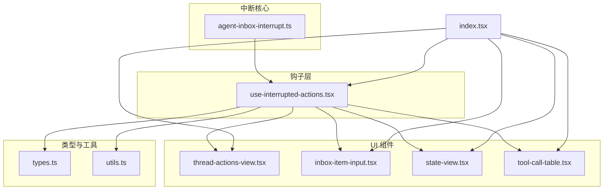
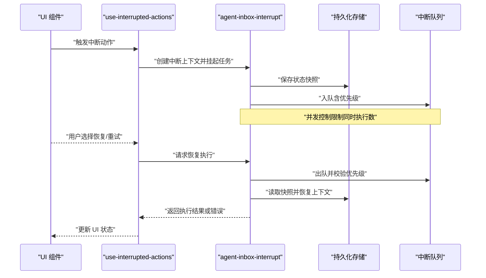
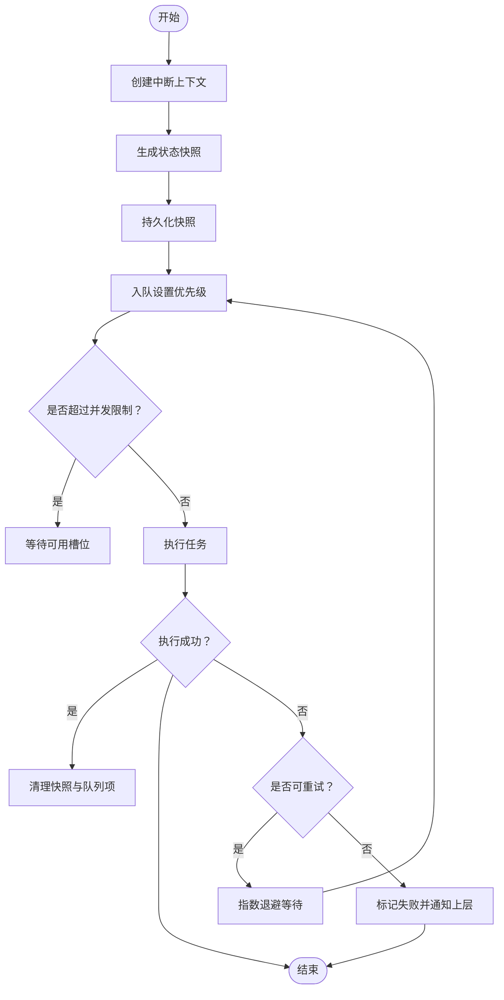
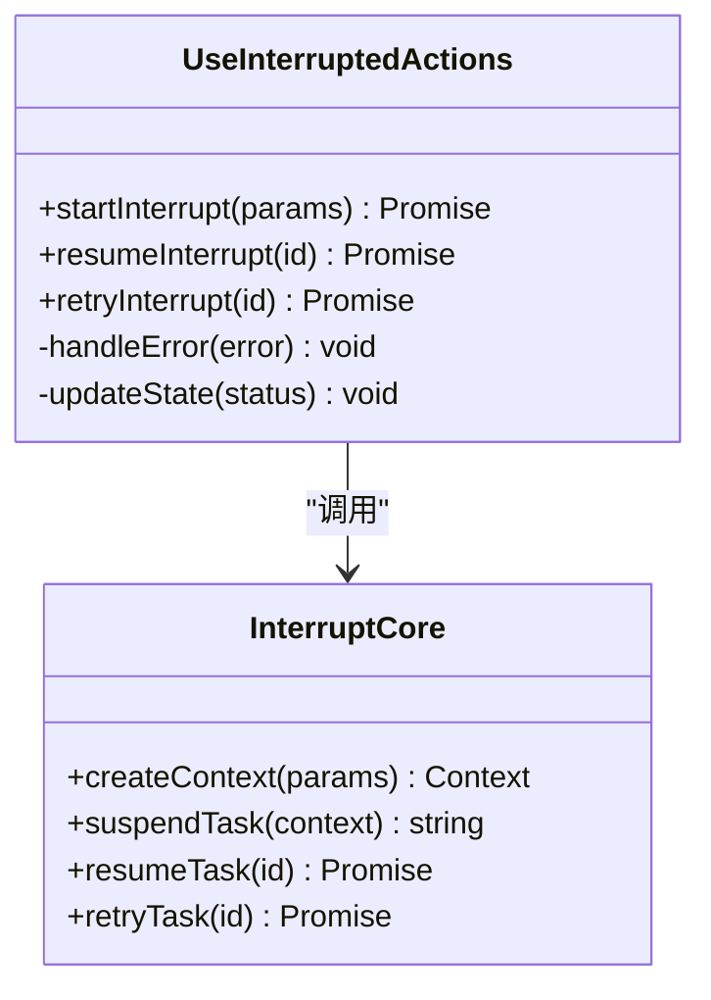
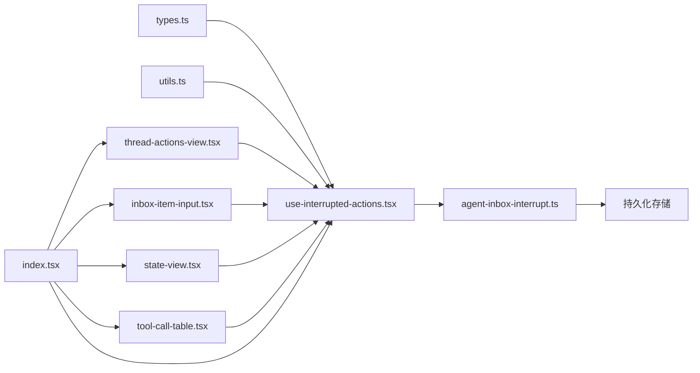

# 中断处理机制

<cite>
**本文引用的文件**   
- [agent-inbox-interrupt.ts](file://apps/web/src/lib/agent-inbox-interrupt.ts)
- [use-interrupted-actions.tsx](file://apps/web/src/components/thread/agent-inbox/hooks/use-interrupted-actions.tsx)
- [thread-actions-view.tsx](file://apps/web/src/components/thread/agent-inbox/components/thread-actions-view.tsx)
- [inbox-item-input.tsx](file://apps/web/src/components/thread/agent-inbox/components/inbox-item-input.tsx)
- [state-view.tsx](file://apps/web/src/components/thread/agent-inbox/components/state-view.tsx)
- [tool-call-table.tsx](file://apps/web/src/components/thread/agent-inbox/components/tool-call-table.tsx)
- [types.ts](file://apps/web/src/components/thread/agent-inbox/types.ts)
- [utils.ts](file://apps/web/src/components/thread/agent-inbox/utils.ts)
- [index.tsx](file://apps/web/src/components/thread/agent-inbox/index.tsx)
</cite>

## 目录
1. [简介](#简介)
2. [项目结构](#项目结构)
3. [核心组件](#核心组件)
4. [架构总览](#架构总览)
5. [详细组件分析](#详细组件分析)
6. [依赖关系分析](#依赖关系分析)
7. [性能考量](#性能考量)
8. [故障排查指南](#故障排查指南)
9. [结论](#结论)
10. [附录](#附录)

## 简介
本技术文档聚焦于前端 Agent Inbox 的中断处理机制，重点解析以下目标：
- 异步操作管理与中断恢复逻辑（以 agent-inbox-interrupt.ts 为核心）
- use-interrupted-actions 钩子的实现原理与使用方式
- 中断状态的持久化、重试机制与错误恢复策略
- 中断队列管理、优先级处理与并发控制
- 最佳实践与调试技巧，覆盖复杂异步工作流的处理

该机制旨在在用户交互或外部事件触发时，安全地暂停当前执行上下文，保存必要状态，并在合适时机恢复执行，确保用户体验一致性与数据一致性。

## 项目结构
Agent Inbox 相关代码位于 apps/web/src/components/thread/agent-inbox 目录下，配套工具与类型定义位于 apps/web/src/lib 与 components/thread/agent-inbox/utils.ts、types.ts。关键文件包括：
- 中断核心库：lib/agent-inbox-interrupt.ts
- 中断动作钩子：components/thread/agent-inbox/hooks/use-interrupted-actions.tsx
- UI 展示与交互：components/thread/agent-inbox/components/*
- 入口与聚合：components/thread/agent-inbox/index.tsx

图表来源
- [agent-inbox-interrupt.ts:1-200](file://apps/web/src/lib/agent-inbox-interrupt.ts#L1-L200)
- [use-interrupted-actions.tsx:1-200](file://apps/web/src/components/thread/agent-inbox/hooks/use-interrupted-actions.tsx#L1-L200)
- [thread-actions-view.tsx:1-200](file://apps/web/src/components/thread/agent-inbox/components/thread-actions-view.tsx#L1-L200)
- [inbox-item-input.tsx:1-200](file://apps/web/src/components/thread/agent-inbox/components/inbox-item-input.tsx#L1-L200)
- [state-view.tsx:1-200](file://apps/web/src/components/thread/agent-inbox/components/state-view.tsx#L1-L200)
- [tool-call-table.tsx:1-200](file://apps/web/src/components/thread/agent-inbox/components/tool-call-table.tsx#L1-L200)
- [types.ts:1-200](file://apps/web/src/components/thread/agent-inbox/types.ts#L1-L200)
- [utils.ts:1-200](file://apps/web/src/components/thread/agent-inbox/utils.ts#L1-L200)
- [index.tsx:1-200](file://apps/web/src/components/thread/agent-inbox/index.tsx#L1-L200)

章节来源
- [agent-inbox-interrupt.ts:1-200](file://apps/web/src/lib/agent-inbox-interrupt.ts#L1-L200)
- [use-interrupted-actions.tsx:1-200](file://apps/web/src/components/thread/agent-inbox/hooks/use-interrupted-actions.tsx#L1-L200)
- [index.tsx:1-200](file://apps/web/src/components/thread/agent-inbox/index.tsx#L1-L200)

## 核心组件
- 中断核心库（agent-inbox-interrupt.ts）
  - 提供中断上下文创建、挂起与恢复的 API
  - 维护中断队列、优先级与并发控制
  - 负责状态快照与持久化（本地存储或会话存储）
  - 实现重试与错误恢复策略（指数退避、最大重试次数）
- 中断动作钩子（use-interrupted-actions.tsx）
  - 暴露统一的“中断-恢复”接口给 UI 组件
  - 封装调用链路的异常捕获与回滚
  - 管理 UI 状态（加载中、成功、失败、可重试）
  - 与中断核心库协作，驱动队列调度与执行

章节来源
- [agent-inbox-interrupt.ts:1-200](file://apps/web/src/lib/agent-inbox-interrupt.ts#L1-L200)
- [use-interrupted-actions.tsx:1-200](file://apps/web/src/components/thread/agent-inbox/hooks/use-interrupted-actions.tsx#L1-L200)

## 架构总览
下图展示了从 UI 到中断核心库的调用序列，以及中断恢复的关键步骤。

图表来源
- [agent-inbox-interrupt.ts:1-200](file://apps/web/src/lib/agent-inbox-interrupt.ts#L1-L200)
- [use-interrupted-actions.tsx:1-200](file://apps/web/src/components/thread/agent-inbox/hooks/use-interrupted-actions.tsx#L1-L200)

## 详细组件分析

### 中断核心库（agent-inbox-interrupt.ts）
职责与要点：
- 中断上下文：封装执行环境、输入参数、回调函数、超时与取消信号
- 挂起与恢复：支持将任务挂起到队列，并在条件满足时恢复执行
- 状态快照：序列化当前执行上下文，写入持久化存储，保证跨页面刷新后仍可恢复
- 队列管理：按优先级排序，限制并发执行数量，避免资源竞争
- 重试与恢复：对失败任务进行指数退避重试，达到上限后标记为不可重试
- 错误处理：统一捕获异常，记录错误信息，提供可恢复与不可恢复的分类

图表来源
- [agent-inbox-interrupt.ts:1-200](file://apps/web/src/lib/agent-inbox-interrupt.ts#L1-L200)

章节来源
- [agent-inbox-interrupt.ts:1-200](file://apps/web/src/lib/agent-inbox-interrupt.ts#L1-L200)

### 中断动作钩子（use-interrupted-actions.tsx）
职责与要点：
- 对外暴露 hook 方法：如 startInterrupt、resumeInterrupt、retryInterrupt
- 管理 UI 状态：loading、error、success、retriable
- 与核心库协作：调用创建/恢复/重试 API，并处理返回值
- 错误边界：捕获未预期异常，降级为友好提示
- 生命周期：组件卸载时自动清理未完成的任务与监听器

图表来源
- [use-interrupted-actions.tsx:1-200](file://apps/web/src/components/thread/agent-inbox/hooks/use-interrupted-actions.tsx#L1-L200)
- [agent-inbox-interrupt.ts:1-200](file://apps/web/src/lib/agent-inbox-interrupt.ts#L1-L200)

章节来源
- [use-interrupted-actions.tsx:1-200](file://apps/web/src/components/thread/agent-inbox/hooks/use-interrupted-actions.tsx#L1-L200)

### UI 组件集成（thread-actions-view.tsx、inbox-item-input.tsx、state-view.tsx、tool-call-table.tsx）
- thread-actions-view.tsx：集中展示可中断的操作列表，并提供“立即执行/稍后恢复”按钮
- inbox-item-input.tsx：用户输入触发中断任务，支持输入校验与即时反馈
- state-view.tsx：可视化显示当前中断状态、进度与错误信息
- tool-call-table.tsx：展示工具调用的历史与结果，便于定位问题

这些组件通过 use-interrupted-actions 钩子与中断核心库交互，形成“输入-中断-恢复-展示”的闭环。

章节来源
- [thread-actions-view.tsx:1-200](file://apps/web/src/components/thread/agent-inbox/components/thread-actions-view.tsx#L1-L200)
- [inbox-item-input.tsx:1-200](file://apps/web/src/components/thread/agent-inbox/components/inbox-item-input.tsx#L1-L200)
- [state-view.tsx:1-200](file://apps/web/src/components/thread/agent-inbox/components/state-view.tsx#L1-L200)
- [tool-call-table.tsx:1-200](file://apps/web/src/components/thread/agent-inbox/components/tool-call-table.tsx#L1-L200)

### 类型与工具（types.ts、utils.ts）
- types.ts：定义中断上下文、队列项、状态枚举、错误码等类型
- utils.ts：提供序列化/反序列化、优先级计算、时间戳与 ID 生成等工具函数

章节来源
- [types.ts:1-200](file://apps/web/src/components/thread/agent-inbox/types.ts#L1-L200)
- [utils.ts:1-200](file://apps/web/src/components/thread/agent-inbox/utils.ts#L1-L200)

## 依赖关系分析
- use-interrupted-actions 依赖 agent-inbox-interrupt 提供的中断能力
- UI 组件依赖 use-interrupted-actions 暴露的统一接口
- 类型与工具被多处复用，降低耦合度
- 入口 index.tsx 聚合各模块，提供对外 API

图表来源
- [types.ts:1-200](file://apps/web/src/components/thread/agent-inbox/types.ts#L1-L200)
- [utils.ts:1-200](file://apps/web/src/components/thread/agent-inbox/utils.ts#L1-L200)
- [use-interrupted-actions.tsx:1-200](file://apps/web/src/components/thread/agent-inbox/hooks/use-interrupted-actions.tsx#L1-L200)
- [agent-inbox-interrupt.ts:1-200](file://apps/web/src/lib/agent-inbox-interrupt.ts#L1-L200)
- [thread-actions-view.tsx:1-200](file://apps/web/src/components/thread/agent-inbox/components/thread-actions-view.tsx#L1-L200)
- [inbox-item-input.tsx:1-200](file://apps/web/src/components/thread/agent-inbox/components/inbox-item-input.tsx#L1-L200)
- [state-view.tsx:1-200](file://apps/web/src/components/thread/agent-inbox/components/state-view.tsx#L1-L200)
- [tool-call-table.tsx:1-200](file://apps/web/src/components/thread/agent-inbox/components/tool-call-table.tsx#L1-L200)
- [index.tsx:1-200](file://apps/web/src/components/thread/agent-inbox/index.tsx#L1-L200)

章节来源
- [index.tsx:1-200](file://apps/web/src/components/thread/agent-inbox/index.tsx#L1-L200)

## 性能考量
- 并发控制：限制同时执行的任务数，避免阻塞主线程与内存泄漏
- 优先级调度：高优先级任务优先执行，提升关键路径响应速度
- 快照优化：仅序列化必要字段，减少存储体积与 IO 开销
- 重试策略：指数退避避免雪崩，设置最大重试次数防止无限循环
- 懒加载：按需初始化中断上下文，减少启动成本

[本节为通用指导，不直接分析具体文件]

## 故障排查指南
常见问题与解决思路：
- 中断无法恢复：检查持久化存储是否完整，确认快照未被覆盖或删除
- 重试风暴：调整退避参数与最大重试次数，观察队列堆积情况
- 并发冲突：增加并发上限或优化任务粒度，避免长耗时操作
- UI 状态不一致：核对钩子状态更新逻辑，确保副作用清理正确
- 错误定位：查看错误分类与日志，区分可恢复与不可恢复错误

章节来源
- [agent-inbox-interrupt.ts:1-200](file://apps/web/src/lib/agent-inbox-interrupt.ts#L1-L200)
- [use-interrupted-actions.tsx:1-200](file://apps/web/src/components/thread/agent-inbox/hooks/use-interrupted-actions.tsx#L1-L200)

## 结论
本机制通过清晰的分层设计与完善的错误恢复策略，实现了稳定可靠的中断处理流程。结合优先级调度、并发控制与持久化快照，能够有效应对复杂的异步工作流，提升用户体验与系统健壮性。建议在实际使用中遵循最佳实践，合理配置重试与并发参数，并结合调试工具持续优化。

[本节为总结，不直接分析具体文件]

## 附录
- 最佳实践
  - 明确任务边界，拆分长耗时操作为多个小任务
  - 为每个中断任务设置合理的超时与取消信号
  - 使用唯一 ID 追踪任务生命周期，便于日志与监控
  - 对用户可见的错误提供明确的提示与下一步指引
- 调试技巧
  - 启用详细日志，记录入队、出队、执行、失败与恢复的关键节点
  - 使用浏览器开发者工具检查本地存储中的快照内容
  - 模拟网络延迟与失败场景，验证重试与恢复逻辑
  - 通过 UI 组件的状态视图快速定位问题阶段

[本节为补充说明，不直接分析具体文件]