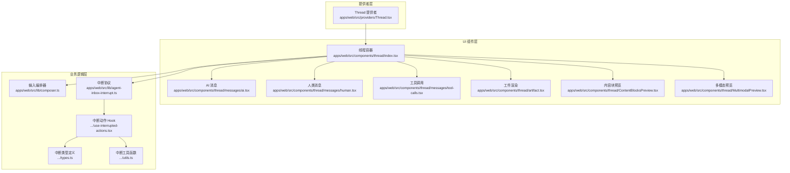
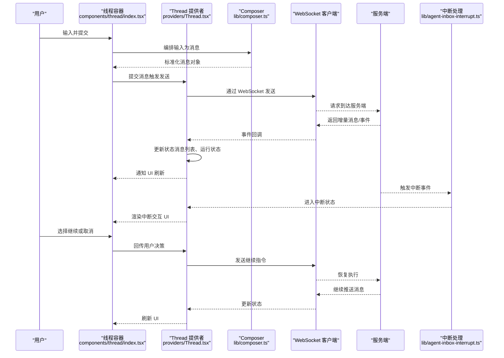
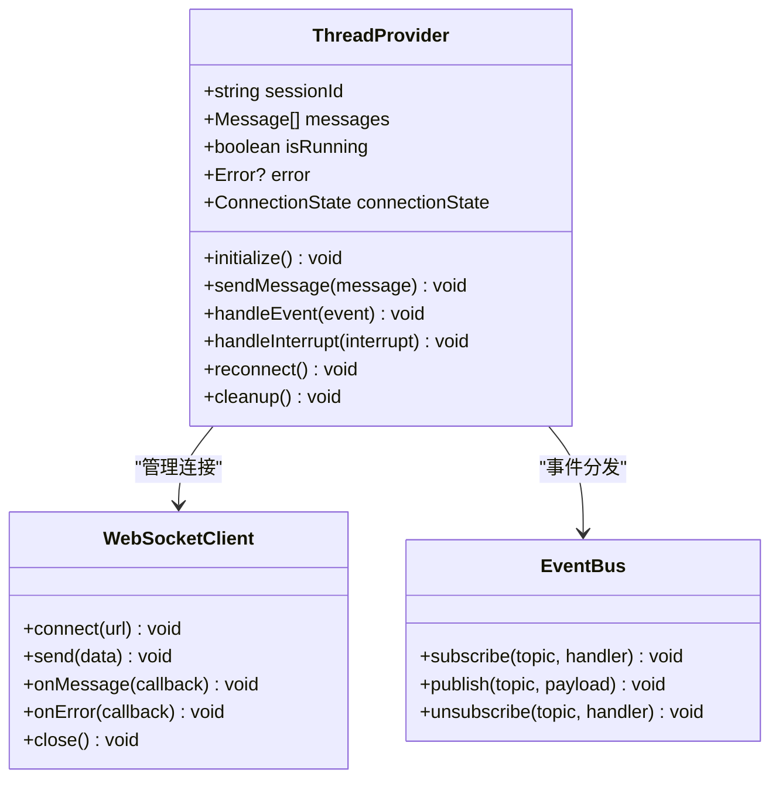
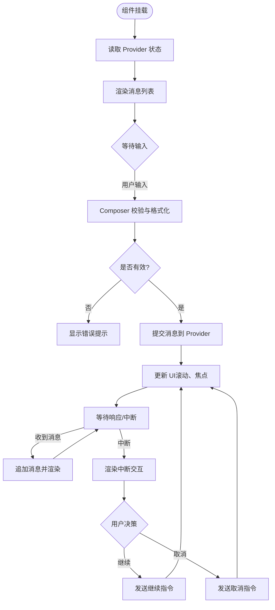
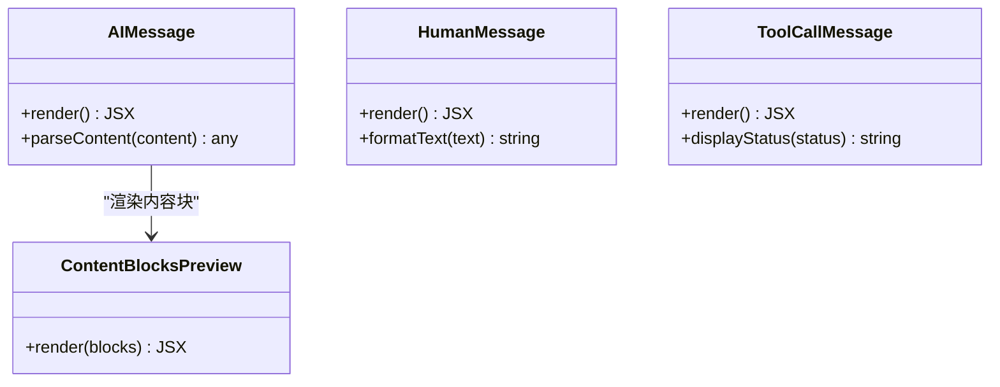
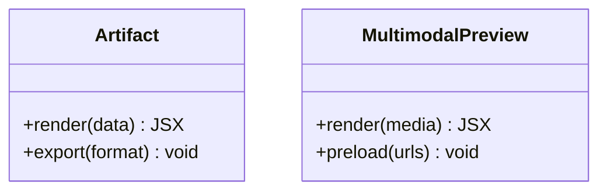
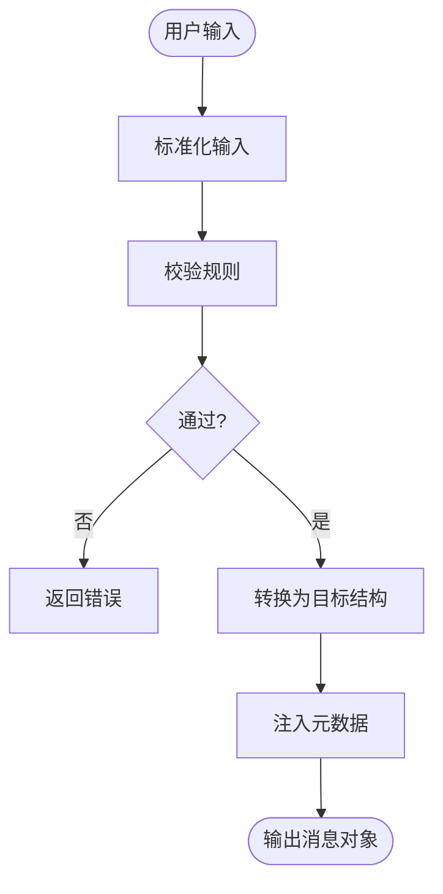
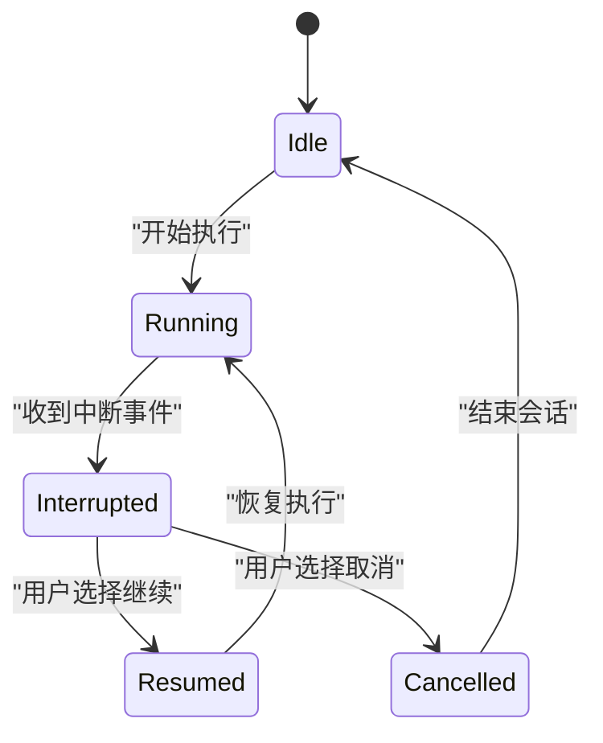
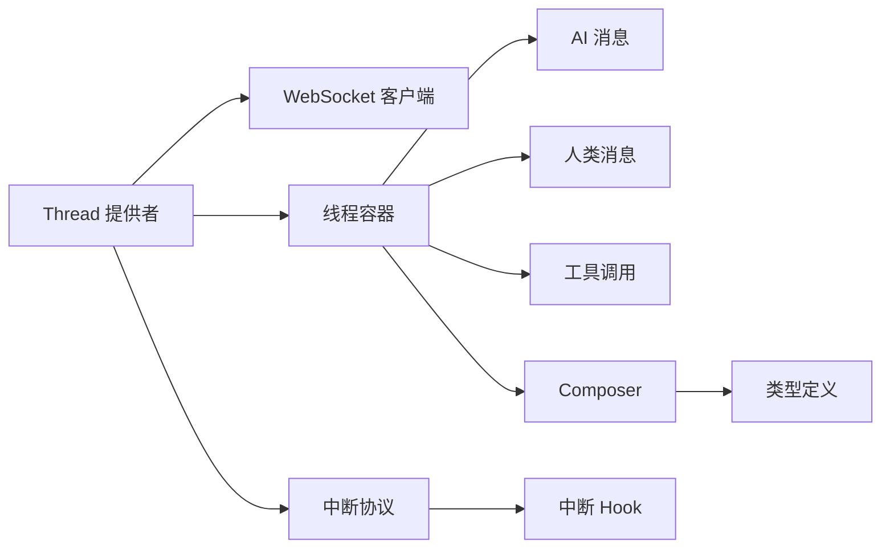

# 核心组件实现

<cite>
**本文引用的文件**   
- [apps/web/src/providers/Thread.tsx](file://apps/web/src/providers/Thread.tsx)
- [apps/web/src/components/thread/index.tsx](file://apps/web/src/components/thread/index.tsx)
- [apps/web/src/components/thread/messages/ai.tsx](file://apps/web/src/components/thread/messages/ai.tsx)
- [apps/web/src/components/thread/messages/human.tsx](file://apps/web/src/components/thread/messages/human.tsx)
- [apps/web/src/components/thread/messages/tool-calls.tsx](file://apps/web/src/components/thread/messages/tool-calls.tsx)
- [apps/web/src/components/thread/artifact.tsx](file://apps/web/src/components/thread/artifact.tsx)
- [apps/web/src/lib/composer.ts](file://apps/web/src/lib/composer.ts)
- [apps/web/src/lib/agent-inbox-interrupt.ts](file://apps/web/src/lib/agent-inbox-interrupt.ts)
- [apps/web/src/components/thread/agent-inbox/hooks/use-interrupted-actions.tsx](file://apps/web/src/components/thread/agent-inbox/hooks/use-interrupted-actions.tsx)
- [apps/web/src/components/thread/agent-inbox/types.ts](file://apps/web/src/components/thread/agent-inbox/types.ts)
- [apps/web/src/components/thread/agent-inbox/utils.ts](file://apps/web/src/components/thread/agent-inbox/utils.ts)
- [apps/web/src/components/thread/ContentBlocksPreview.tsx](file://apps/web/src/components/thread/ContentBlocksPreview.tsx)
- [apps/web/src/components/thread/MultimodalPreview.tsx](file://apps/web/src/components/thread/MultimodalPreview.tsx)
- [apps/web/src/app/error.tsx](file://apps/web/src/app/error.tsx)
</cite>

## 目录
1. [简介](#简介)
2. [项目结构](#项目结构)
3. [核心组件](#核心组件)
4. [架构总览](#架构总览)
5. [详细组件分析](#详细组件分析)
6. [依赖关系分析](#依赖关系分析)
7. [性能考虑](#性能考虑)
8. [故障排查指南](#故障排查指南)
9. [结论](#结论)
10. [附录](#附录)

## 简介
本文件围绕线程（Thread）核心组件进行系统化文档化，重点阐述其架构设计、生命周期管理、状态同步机制与实时通信协议。内容涵盖：
- Thread 提供者如何管理应用级状态、WebSocket 连接与消息流
- 组件间依赖关系与数据流向
- 错误边界处理、性能优化策略与内存管理
- 配置选项与使用示例，展示如何实现自定义线程行为

## 项目结构
本项目采用前后端分离的 Next.js 前端工程组织方式，线程相关代码集中在 apps/web 下：
- providers/Thread.tsx：线程上下文与状态提供者，负责全局状态、连接管理与事件分发
- components/thread/*：UI 层组件，包括消息渲染、工具调用、多模态预览等
- lib/composer.ts：输入编排器，负责用户输入到消息序列的转换与校验
- lib/agent-inbox-interrupt.ts：中断协议与处理逻辑
- components/thread/agent-inbox/*：中断交互相关的类型、工具与 Hook
- app/error.tsx：应用级错误边界

**图表来源** 
- [apps/web/src/providers/Thread.tsx](file://apps/web/src/providers/Thread.tsx)
- [apps/web/src/components/thread/index.tsx](file://apps/web/src/components/thread/index.tsx)
- [apps/web/src/components/thread/messages/ai.tsx](file://apps/web/src/components/thread/messages/ai.tsx)
- [apps/web/src/components/thread/messages/human.tsx](file://apps/web/src/components/thread/messages/human.tsx)
- [apps/web/src/components/thread/messages/tool-calls.tsx](file://apps/web/src/components/thread/messages/tool-calls.tsx)
- [apps/web/src/components/thread/artifact.tsx](file://apps/web/src/components/thread/artifact.tsx)
- [apps/web/src/components/thread/ContentBlocksPreview.tsx](file://apps/web/src/components/thread/ContentBlocksPreview.tsx)
- [apps/web/src/components/thread/MultimodalPreview.tsx](file://apps/web/src/components/thread/MultimodalPreview.tsx)
- [apps/web/src/lib/composer.ts](file://apps/web/src/lib/composer.ts)
- [apps/web/src/lib/agent-inbox-interrupt.ts](file://apps/web/src/lib/agent-inbox-interrupt.ts)
- [apps/web/src/components/thread/agent-inbox/hooks/use-interrupted-actions.tsx](file://apps/web/src/components/thread/agent-inbox/hooks/use-interrupted-actions.tsx)
- [apps/web/src/components/thread/agent-inbox/types.ts](file://apps/web/src/components/thread/agent-inbox/types.ts)
- [apps/web/src/components/thread/agent-inbox/utils.ts](file://apps/web/src/components/thread/agent-inbox/utils.ts)

**章节来源**
- [apps/web/src/providers/Thread.tsx](file://apps/web/src/providers/Thread.tsx)
- [apps/web/src/components/thread/index.tsx](file://apps/web/src/components/thread/index.tsx)

## 核心组件
- Thread 提供者（Provider）
  - 职责：维护线程全局状态（会话 ID、消息列表、运行状态、错误信息）、管理 WebSocket 连接与重连策略、订阅/发布事件、协调中断流程。
  - 关键点：
    - 应用级状态集中管理，避免组件级状态碎片化
    - 连接生命周期：初始化、保活、断线重连、优雅关闭
    - 事件总线：统一消息派发，解耦 UI 与网络层
    - 错误边界：捕获并上报异常，提供降级 UI

- 线程容器（Thread 组件）
  - 职责：消费 Provider 状态，渲染消息列表、输入框、工具调用面板、工件与多模态预览
  - 关键点：
    - 受控输入与提交流程
    - 滚动与虚拟列表优化（按需渲染）
    - 与 Composer 集成，完成输入到消息的转换

- 消息渲染组件
  - AI 消息、人类消息、工具调用消息分别渲染不同内容区块
  - 支持富文本、代码高亮、图片/文件等多模态内容

- 输入编排器（Composer）
  - 职责：将用户输入转换为标准消息结构，执行校验、格式化与扩展字段注入
  - 关键点：幂等性、错误提示、可插拔处理器

- 中断协议与 Hook
  - 职责：处理 Agent 主动中断，驱动用户交互以继续执行
  - 关键点：状态机、超时控制、重试策略、安全校验

**章节来源**
- [apps/web/src/providers/Thread.tsx](file://apps/web/src/providers/Thread.tsx)
- [apps/web/src/components/thread/index.tsx](file://apps/web/src/components/thread/index.tsx)
- [apps/web/src/components/thread/messages/ai.tsx](file://apps/web/src/components/thread/messages/ai.tsx)
- [apps/web/src/components/thread/messages/human.tsx](file://apps/web/src/components/thread/messages/human.tsx)
- [apps/web/src/components/thread/messages/tool-calls.tsx](file://apps/web/src/components/thread/messages/tool-calls.tsx)
- [apps/web/src/lib/composer.ts](file://apps/web/src/lib/composer.ts)
- [apps/web/src/lib/agent-inbox-interrupt.ts](file://apps/web/src/lib/agent-inbox-interrupt.ts)
- [apps/web/src/components/thread/agent-inbox/hooks/use-interrupted-actions.tsx](file://apps/web/src/components/thread/agent-inbox/hooks/use-interrupted-actions.tsx)

## 架构总览
下图展示了 Thread 提供者在整个线程系统中的位置与交互关系，以及消息从输入到渲染的关键路径。

**图表来源** 
- [apps/web/src/components/thread/index.tsx](file://apps/web/src/components/thread/index.tsx)
- [apps/web/src/providers/Thread.tsx](file://apps/web/src/providers/Thread.tsx)
- [apps/web/src/lib/composer.ts](file://apps/web/src/lib/composer.ts)
- [apps/web/src/lib/agent-inbox-interrupt.ts](file://apps/web/src/lib/agent-inbox-interrupt.ts)

## 详细组件分析

### Thread 提供者（Provider）
- 架构要点
  - 应用级状态：会话标识、消息队列、运行标志、错误信息、中断上下文
  - 连接管理：建立、心跳、断线检测、指数退避重连、资源释放
  - 事件分发：内部事件总线，订阅者模式，确保 UI 与网络层解耦
  - 错误处理：捕获网络异常、解析错误、降级策略与用户提示
- 生命周期
  - 初始化：创建连接、注册监听、加载历史消息
  - 运行期：接收增量消息、处理中断、维持心跳
  - 销毁：清理定时器、移除监听、关闭连接
- 状态同步
  - 单向数据流：事件 -> 状态更新 -> UI 重渲染
  - 批量更新：合并多次状态变更，减少重绘
  - 不可变更新：基于快照的消息列表，便于撤销与回放

**图表来源** 
- [apps/web/src/providers/Thread.tsx](file://apps/web/src/providers/Thread.tsx)

**章节来源**
- [apps/web/src/providers/Thread.tsx](file://apps/web/src/providers/Thread.tsx)

### 线程容器（Thread 组件）
- 职责
  - 消费 Provider 状态，渲染消息列表与输入区
  - 与 Composer 协作，完成输入校验与转换
  - 处理中断交互，驱动用户操作
- 渲染优化
  - 虚拟列表：仅渲染可视区域消息
  - 防抖输入：降低频繁状态更新
  - 懒加载媒体：按需加载图片与视频

**图表来源** 
- [apps/web/src/components/thread/index.tsx](file://apps/web/src/components/thread/index.tsx)
- [apps/web/src/lib/composer.ts](file://apps/web/src/lib/composer.ts)

**章节来源**
- [apps/web/src/components/thread/index.tsx](file://apps/web/src/components/thread/index.tsx)
- [apps/web/src/lib/composer.ts](file://apps/web/src/lib/composer.ts)

### 消息渲染组件
- AI 消息（ai.tsx）
  - 支持富文本、代码块、引用、链接等
  - 与 ContentBlocksPreview 集成，渲染结构化内容
- 人类消息（human.tsx）
  - 简单文本与附件展示
- 工具调用（tool-calls.tsx）
  - 展示工具名称、参数、结果与状态
  - 支持展开/折叠与错误详情

**图表来源** 
- [apps/web/src/components/thread/messages/ai.tsx](file://apps/web/src/components/thread/messages/ai.tsx)
- [apps/web/src/components/thread/messages/human.tsx](file://apps/web/src/components/thread/messages/human.tsx)
- [apps/web/src/components/thread/messages/tool-calls.tsx](file://apps/web/src/components/thread/messages/tool-calls.tsx)
- [apps/web/src/components/thread/ContentBlocksPreview.tsx](file://apps/web/src/components/thread/ContentBlocksPreview.tsx)

**章节来源**
- [apps/web/src/components/thread/messages/ai.tsx](file://apps/web/src/components/thread/messages/ai.tsx)
- [apps/web/src/components/thread/messages/human.tsx](file://apps/web/src/components/thread/messages/human.tsx)
- [apps/web/src/components/thread/messages/tool-calls.tsx](file://apps/web/src/components/thread/messages/tool-calls.tsx)
- [apps/web/src/components/thread/ContentBlocksPreview.tsx](file://apps/web/src/components/thread/ContentBlocksPreview.tsx)

### 工件与多模态预览
- 工件（artifact.tsx）
  - 渲染结构化产物（如 JSON、表格、图表）
  - 支持导出与复制
- 多模态预览（MultimodalPreview.tsx）
  - 图片、音频、视频的播放与预览
  - 懒加载与缓存策略

**图表来源** 
- [apps/web/src/components/thread/artifact.tsx](file://apps/web/src/components/thread/artifact.tsx)
- [apps/web/src/components/thread/MultimodalPreview.tsx](file://apps/web/src/components/thread/MultimodalPreview.tsx)

**章节来源**
- [apps/web/src/components/thread/artifact.tsx](file://apps/web/src/components/thread/artifact.tsx)
- [apps/web/src/components/thread/MultimodalPreview.tsx](file://apps/web/src/components/thread/MultimodalPreview.tsx)

### 输入编排器（Composer）
- 职责
  - 将用户输入转换为标准消息结构
  - 执行格式校验、长度限制、敏感词过滤
  - 注入扩展字段（如会话元数据）
- 可扩展性
  - 插件式处理器链，支持自定义转换规则

**图表来源** 
- [apps/web/src/lib/composer.ts](file://apps/web/src/lib/composer.ts)

**章节来源**
- [apps/web/src/lib/composer.ts](file://apps/web/src/lib/composer.ts)

### 中断协议与 Hook
- 中断协议（agent-inbox-interrupt.ts）
  - 定义中断事件结构与处理流程
  - 支持超时、重试、取消
- Hook（use-interrupted-actions.tsx）
  - 暴露中断交互 API，驱动 UI 状态变化
  - 封装常用操作（确认、拒绝、重试）

**图表来源** 
- [apps/web/src/lib/agent-inbox-interrupt.ts](file://apps/web/src/lib/agent-inbox-interrupt.ts)
- [apps/web/src/components/thread/agent-inbox/hooks/use-interrupted-actions.tsx](file://apps/web/src/components/thread/agent-inbox/hooks/use-interrupted-actions.tsx)
- [apps/web/src/components/thread/agent-inbox/types.ts](file://apps/web/src/components/thread/agent-inbox/types.ts)
- [apps/web/src/components/thread/agent-inbox/utils.ts](file://apps/web/src/components/thread/agent-inbox/utils.ts)

**章节来源**
- [apps/web/src/lib/agent-inbox-interrupt.ts](file://apps/web/src/lib/agent-inbox-interrupt.ts)
- [apps/web/src/components/thread/agent-inbox/hooks/use-interrupted-actions.tsx](file://apps/web/src/components/thread/agent-inbox/hooks/use-interrupted-actions.tsx)
- [apps/web/src/components/thread/agent-inbox/types.ts](file://apps/web/src/components/thread/agent-inbox/types.ts)
- [apps/web/src/components/thread/agent-inbox/utils.ts](file://apps/web/src/components/thread/agent-inbox/utils.ts)

## 依赖关系分析
- 组件耦合度
  - Thread 提供者与 WebSocket 客户端强耦合，但通过事件总线解耦 UI 组件
  - 消息渲染组件弱耦合，仅依赖 Provider 暴露的状态与动作
- 外部依赖
  - WebSocket 库用于实时通信
  - 富文本与语法高亮库用于内容渲染
- 潜在循环依赖
  - 通过分层与接口隔离避免循环导入

**图表来源** 
- [apps/web/src/providers/Thread.tsx](file://apps/web/src/providers/Thread.tsx)
- [apps/web/src/components/thread/index.tsx](file://apps/web/src/components/thread/index.tsx)
- [apps/web/src/lib/composer.ts](file://apps/web/src/lib/composer.ts)
- [apps/web/src/lib/agent-inbox-interrupt.ts](file://apps/web/src/lib/agent-inbox-interrupt.ts)
- [apps/web/src/components/thread/agent-inbox/hooks/use-interrupted-actions.tsx](file://apps/web/src/components/thread/agent-inbox/hooks/use-interrupted-actions.tsx)

**章节来源**
- [apps/web/src/providers/Thread.tsx](file://apps/web/src/providers/Thread.tsx)
- [apps/web/src/components/thread/index.tsx](file://apps/web/src/components/thread/index.tsx)
- [apps/web/src/lib/composer.ts](file://apps/web/src/lib/composer.ts)
- [apps/web/src/lib/agent-inbox-interrupt.ts](file://apps/web/src/lib/agent-inbox-interrupt.ts)
- [apps/web/src/components/thread/agent-inbox/hooks/use-interrupted-actions.tsx](file://apps/web/src/components/thread/agent-inbox/hooks/use-interrupted-actions.tsx)

## 性能考虑
- 渲染优化
  - 虚拟列表：仅渲染可视区域，降低 DOM 节点数量
  - 防抖与节流：减少高频状态更新导致的重渲染
  - 懒加载：媒体资源按需加载，预加载关键资源
- 内存管理
  - 及时清理定时器与事件监听
  - 断开连接时释放 WebSocket 资源
  - 大对象引用置空，避免内存泄漏
- 网络优化
  - 指数退避重连，避免雪崩效应
  - 批量消息合并，减少网络开销
  - 压缩传输（如适用）

[本节为通用指导，不直接分析具体文件]

## 故障排查指南
- 常见问题
  - 连接失败：检查网络、代理、证书与跨域设置
  - 消息丢失：确认事件顺序与去重逻辑
  - 中断卡死：检查超时与重试配置
  - 渲染卡顿：检查虚拟列表与懒加载配置
- 调试建议
  - 启用详细日志，记录事件与状态变更
  - 使用浏览器开发者工具监控网络与内存
  - 模拟断网与延迟，验证重连与降级逻辑

**章节来源**
- [apps/web/src/app/error.tsx](file://apps/web/src/app/error.tsx)

## 结论
Thread 核心组件通过清晰的层次划分与事件驱动架构，实现了稳定的线程管理与实时通信能力。Provider 集中管理状态与连接，UI 组件专注渲染与交互，Composer 与中断模块提供可扩展的业务逻辑。通过合理的性能优化与错误处理策略，系统具备良好的可用性与可维护性。

[本节为总结，不直接分析具体文件]

## 附录
- 配置选项（示例）
  - 连接参数：URL、超时、重连次数、心跳间隔
  - 渲染参数：虚拟列表阈值、媒体懒加载开关
  - 中断参数：超时时间、重试策略、用户确认开关
- 使用示例（步骤说明）
  - 在根组件包裹 Thread 提供者，传入配置
  - 在页面中使用线程容器，绑定输入与提交事件
  - 根据需要扩展 Composer 处理器与中断 Hook
  - 自定义消息渲染组件，替换默认实现

[本节为概念性内容，不直接分析具体文件]