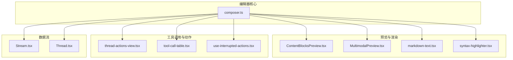
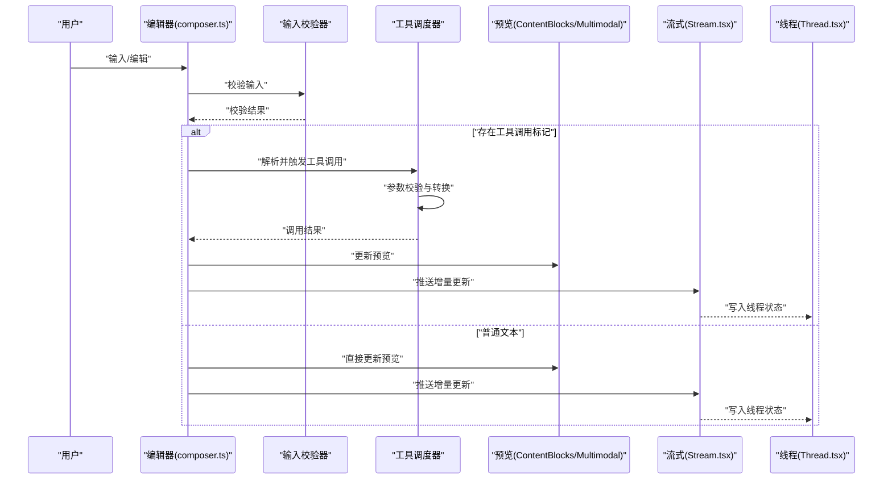
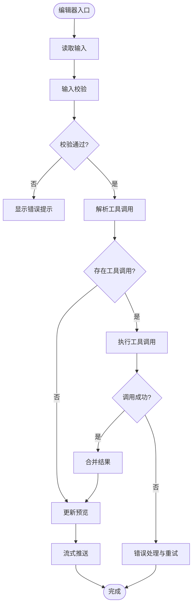
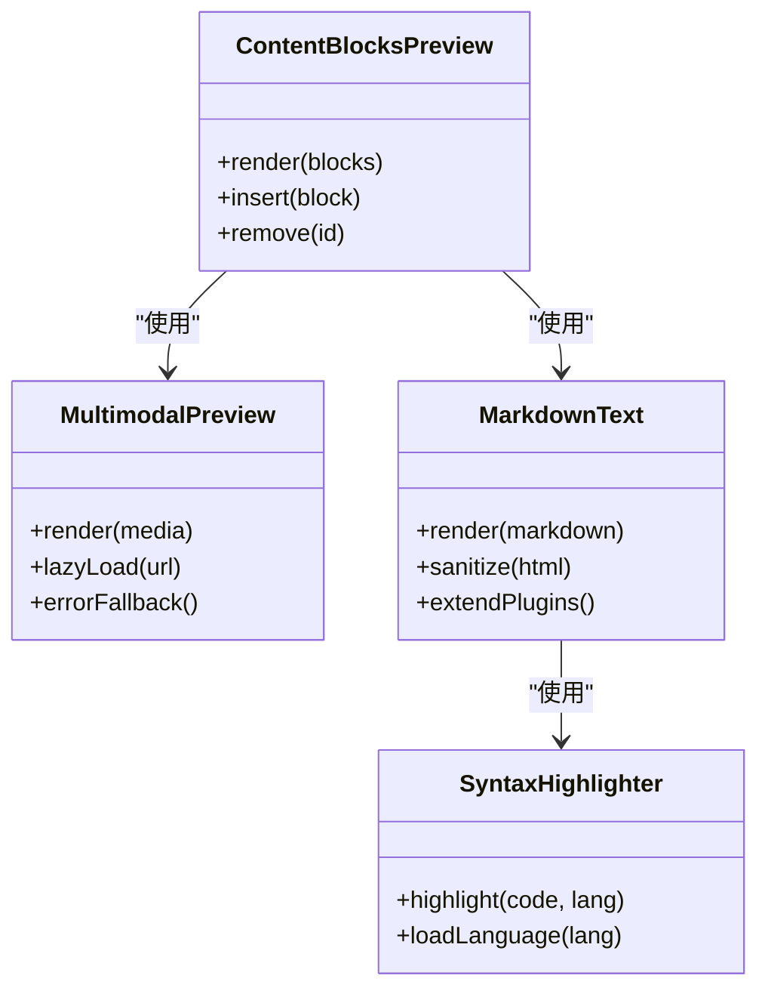
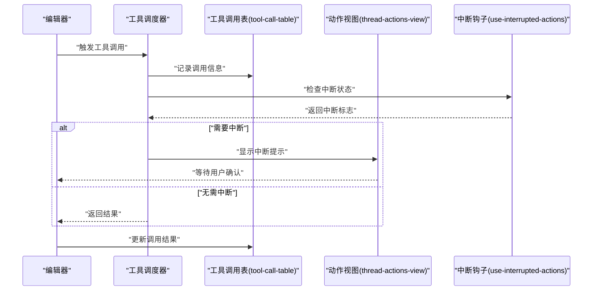
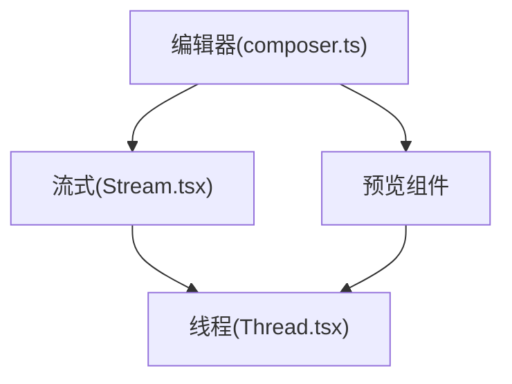
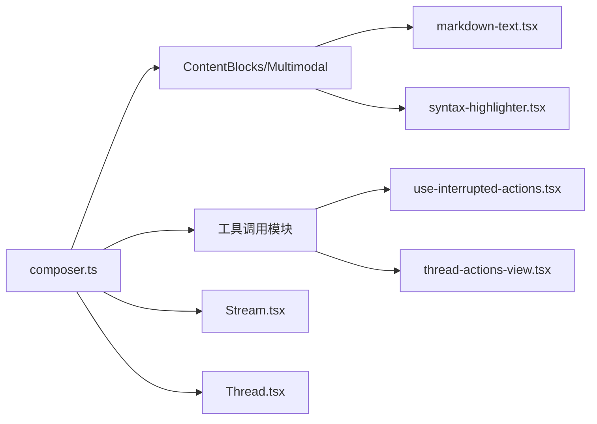

# 消息编辑器

<cite>
**本文引用的文件**   
- [composer.ts](file://apps/web/src/lib/composer.ts)
- [composer.test.ts](file://apps/web/src/lib/composer.test.ts)
- [ContentBlocksPreview.tsx](file://apps/web/src/components/thread/ContentBlocksPreview.tsx)
- [MultimodalPreview.tsx](file://apps/web/src/components/thread/MultimodalPreview.tsx)
- [markdown-text.tsx](file://apps/web/src/components/thread/markdown-text.tsx)
- [syntax-highlighter.tsx](file://apps/web/src/components/thread/syntax-highlighter.tsx)
- [thread-actions-view.tsx](file://apps/web/src/components/thread/agent-inbox/components/thread-actions-view.tsx)
- [tool-call-table.tsx](file://apps/web/src/components/thread/agent-inbox/components/tool-call-table.tsx)
- [use-interrupted-actions.tsx](file://apps/web/src/components/thread/agent-inbox/hooks/use-interrupted-actions.tsx)
- [Stream.tsx](file://apps/web/src/providers/Stream.tsx)
- [Thread.tsx](file://apps/web/src/providers/Thread.tsx)
</cite>

## 目录
1. [简介](#简介)
2. [项目结构](#项目结构)
3. [核心组件](#核心组件)
4. [架构总览](#架构总览)
5. [详细组件分析](#详细组件分析)
6. [依赖关系分析](#依赖关系分析)
7. [性能考量](#性能考量)
8. [故障排查指南](#故障排查指南)
9. [结论](#结论)
10. [附录](#附录)

## 简介
本文件为“消息编辑器系统”的权威技术文档，聚焦于 composer.ts 中的文本编辑器实现。内容涵盖：
- 富文本处理与 Markdown 渲染链路
- 工具调用集成（触发逻辑、参数校验、结果展示）
- 用户输入验证与错误提示
- 编辑器状态管理、撤销重做机制
- 实时预览机制与流式更新
- 自定义工具扩展指南与主题定制
- 复杂消息编辑场景与工具集成的实践示例

## 项目结构
本项目采用前后端分离的前端应用结构，消息编辑器位于 apps/web 前端工程中。关键目录与职责如下：
- apps/web/src/lib/composer.ts：编辑器核心逻辑（状态、撤销重做、工具调用、输入校验、预览联动）
- apps/web/src/components/thread/*：消息渲染与预览相关组件（Markdown、语法高亮、多模态预览等）
- apps/web/src/components/thread/agent-inbox/*：工具调用与中断动作展示
- apps/web/src/providers/*：数据流与上下文提供者（流式响应、线程状态）

图表来源
- [composer.ts](file://apps/web/src/lib/composer.ts)
- [ContentBlocksPreview.tsx](file://apps/web/src/components/thread/ContentBlocksPreview.tsx)
- [MultimodalPreview.tsx](file://apps/web/src/components/thread/MultimodalPreview.tsx)
- [markdown-text.tsx](file://apps/web/src/components/thread/markdown-text.tsx)
- [syntax-highlighter.tsx](file://apps/web/src/components/thread/syntax-highlighter.tsx)
- [thread-actions-view.tsx](file://apps/web/src/components/thread/agent-inbox/components/thread-actions-view.tsx)
- [tool-call-table.tsx](file://apps/web/src/components/thread/agent-inbox/components/tool-call-table.tsx)
- [use-interrupted-actions.tsx](file://apps/web/src/components/thread/agent-inbox/hooks/use-interrupted-actions.tsx)
- [Stream.tsx](file://apps/web/src/providers/Stream.tsx)
- [Thread.tsx](file://apps/web/src/providers/Thread.tsx)

章节来源
- [composer.ts](file://apps/web/src/lib/composer.ts)
- [ContentBlocksPreview.tsx](file://apps/web/src/components/thread/ContentBlocksPreview.tsx)
- [MultimodalPreview.tsx](file://apps/web/src/components/thread/MultimodalPreview.tsx)
- [markdown-text.tsx](file://apps/web/src/components/thread/markdown-text.tsx)
- [syntax-highlighter.tsx](file://apps/web/src/components/thread/syntax-highlighter.tsx)
- [thread-actions-view.tsx](file://apps/web/src/components/thread/agent-inbox/components/thread-actions-view.tsx)
- [tool-call-table.tsx](file://apps/web/src/components/thread/agent-inbox/components/tool-call-table.tsx)
- [use-interrupted-actions.tsx](file://apps/web/src/components/thread/agent-inbox/hooks/use-interrupted-actions.tsx)
- [Stream.tsx](file://apps/web/src/providers/Stream.tsx)
- [Thread.tsx](file://apps/web/src/providers/Thread.tsx)

## 核心组件
- 编辑器核心（composer.ts）
  - 负责编辑器状态建模、撤销重做栈、输入校验、工具调用编排、预览同步与流式更新
- 预览与渲染
  - ContentBlocksPreview.tsx：统一的内容块预览容器
  - MultimodalPreview.tsx：多模态内容（图片、文件等）预览
  - markdown-text.tsx：Markdown 文本渲染
  - syntax-highlighter.tsx：代码语法高亮
- 工具调用与动作
  - thread-actions-view.tsx：线程级动作视图
  - tool-call-table.tsx：工具调用表格展示
  - use-interrupted-actions.tsx：中断动作钩子
- 数据流与上下文
  - Stream.tsx：流式响应处理
  - Thread.tsx：线程状态与上下文

章节来源
- [composer.ts](file://apps/web/src/lib/composer.ts)
- [ContentBlocksPreview.tsx](file://apps/web/src/components/thread/ContentBlocksPreview.tsx)
- [MultimodalPreview.tsx](file://apps/web/src/components/thread/MultimodalPreview.tsx)
- [markdown-text.tsx](file://apps/web/src/components/thread/markdown-text.tsx)
- [syntax-highlighter.tsx](file://apps/web/src/components/thread/syntax-highlighter.tsx)
- [thread-actions-view.tsx](file://apps/web/src/components/thread/agent-inbox/components/thread-actions-view.tsx)
- [tool-call-table.tsx](file://apps/web/src/components/thread/agent-inbox/components/tool-call-table.tsx)
- [use-interrupted-actions.tsx](file://apps/web/src/components/thread/agent-inbox/hooks/use-interrupted-actions.tsx)
- [Stream.tsx](file://apps/web/src/providers/Stream.tsx)
- [Thread.tsx](file://apps/web/src/providers/Thread.tsx)

## 架构总览
编辑器通过 composer.ts 协调输入、校验、工具调用与预览渲染，并与 Stream.tsx、Thread.tsx 进行数据交互。工具调用由编辑器触发，经参数校验后执行，结果回写至预览与表格视图。

图表来源
- [composer.ts](file://apps/web/src/lib/composer.ts)
- [ContentBlocksPreview.tsx](file://apps/web/src/components/thread/ContentBlocksPreview.tsx)
- [MultimodalPreview.tsx](file://apps/web/src/components/thread/MultimodalPreview.tsx)
- [Stream.tsx](file://apps/web/src/providers/Stream.tsx)
- [Thread.tsx](file://apps/web/src/providers/Thread.tsx)

## 详细组件分析

### 编辑器核心（composer.ts）
- 功能要点
  - 编辑器状态建模：当前内容、光标位置、历史栈（撤销/重做）、工具调用队列、预览状态
  - 撤销重做：基于操作序列记录与回放，支持批量合并与边界条件处理
  - 输入验证：对文本长度、格式、特殊字符、工具调用语法等进行校验
  - 工具调用集成：识别工具调用标记，解析参数，执行回调，处理错误与重试
  - 实时预览：将编辑内容与工具调用结果同步到预览组件，支持流式增量更新
- 数据结构与复杂度
  - 历史栈：O(1) 入栈出栈，撤销/重做 O(1)；批量合并可优化至 O(n)
  - 工具调用队列：按优先级与依赖排序，避免并发冲突
  - 预览同步：增量 diff 与虚拟 DOM 更新，降低重绘开销
- 错误处理
  - 输入校验失败：即时提示并阻止提交
  - 工具调用失败：捕获异常、降级显示、提供重试入口
  - 流式更新中断：断线重连与状态恢复

图表来源
- [composer.ts](file://apps/web/src/lib/composer.ts)

章节来源
- [composer.ts](file://apps/web/src/lib/composer.ts)
- [composer.test.ts](file://apps/web/src/lib/composer.test.ts)

### 预览与渲染组件
- ContentBlocksPreview.tsx
  - 统一渲染内容块（文本、图片、文件等），支持动态插入与删除
- MultimodalPreview.tsx
  - 多模态内容预览，包含媒体类型检测与懒加载
- markdown-text.tsx
  - Markdown 转 HTML，支持安全过滤与自定义扩展
- syntax-highlighter.tsx
  - 代码块语法高亮，按需加载语言包

图表来源
- [ContentBlocksPreview.tsx](file://apps/web/src/components/thread/ContentBlocksPreview.tsx)
- [MultimodalPreview.tsx](file://apps/web/src/components/thread/MultimodalPreview.tsx)
- [markdown-text.tsx](file://apps/web/src/components/thread/markdown-text.tsx)
- [syntax-highlighter.tsx](file://apps/web/src/components/thread/syntax-highlighter.tsx)

章节来源
- [ContentBlocksPreview.tsx](file://apps/web/src/components/thread/ContentBlocksPreview.tsx)
- [MultimodalPreview.tsx](file://apps/web/src/components/thread/MultimodalPreview.tsx)
- [markdown-text.tsx](file://apps/web/src/components/thread/markdown-text.tsx)
- [syntax-highlighter.tsx](file://apps/web/src/components/thread/syntax-highlighter.tsx)

### 工具调用与动作
- thread-actions-view.tsx
  - 线程级动作视图，聚合工具调用与用户操作
- tool-call-table.tsx
  - 工具调用表格，展示调用名、参数、状态、结果摘要
- use-interrupted-actions.tsx
  - 中断动作钩子，处理异步中断与恢复

图表来源
- [thread-actions-view.tsx](file://apps/web/src/components/thread/agent-inbox/components/thread-actions-view.tsx)
- [tool-call-table.tsx](file://apps/web/src/components/thread/agent-inbox/components/tool-call-table.tsx)
- [use-interrupted-actions.tsx](file://apps/web/src/components/thread/agent-inbox/hooks/use-interrupted-actions.tsx)

章节来源
- [thread-actions-view.tsx](file://apps/web/src/components/thread/agent-inbox/components/thread-actions-view.tsx)
- [tool-call-table.tsx](file://apps/web/src/components/thread/agent-inbox/components/tool-call-table.tsx)
- [use-interrupted-actions.tsx](file://apps/web/src/components/thread/agent-inbox/hooks/use-interrupted-actions.tsx)

### 数据流与上下文
- Stream.tsx
  - 处理流式响应，增量更新编辑器与预览，支持断线重连
- Thread.tsx
  - 维护线程状态，持久化消息历史与工具调用结果

图表来源
- [Stream.tsx](file://apps/web/src/providers/Stream.tsx)
- [Thread.tsx](file://apps/web/src/providers/Thread.tsx)

章节来源
- [Stream.tsx](file://apps/web/src/providers/Stream.tsx)
- [Thread.tsx](file://apps/web/src/providers/Thread.tsx)

## 依赖关系分析
- 编辑器核心依赖预览组件进行内容渲染，依赖工具调用模块进行功能扩展
- 预览组件依赖 Markdown 与语法高亮进行内容格式化
- 工具调用模块依赖中断钩子与动作视图进行交互控制
- 数据流模块提供跨组件的状态同步与持久化

图表来源
- [composer.ts](file://apps/web/src/lib/composer.ts)
- [ContentBlocksPreview.tsx](file://apps/web/src/components/thread/ContentBlocksPreview.tsx)
- [MultimodalPreview.tsx](file://apps/web/src/components/thread/MultimodalPreview.tsx)
- [markdown-text.tsx](file://apps/web/src/components/thread/markdown-text.tsx)
- [syntax-highlighter.tsx](file://apps/web/src/components/thread/syntax-highlighter.tsx)
- [use-interrupted-actions.tsx](file://apps/web/src/components/thread/agent-inbox/hooks/use-interrupted-actions.tsx)
- [thread-actions-view.tsx](file://apps/web/src/components/thread/agent-inbox/components/thread-actions-view.tsx)
- [Stream.tsx](file://apps/web/src/providers/Stream.tsx)
- [Thread.tsx](file://apps/web/src/providers/Thread.tsx)

章节来源
- [composer.ts](file://apps/web/src/lib/composer.ts)
- [ContentBlocksPreview.tsx](file://apps/web/src/components/thread/ContentBlocksPreview.tsx)
- [MultimodalPreview.tsx](file://apps/web/src/components/thread/MultimodalPreview.tsx)
- [markdown-text.tsx](file://apps/web/src/components/thread/markdown-text.tsx)
- [syntax-highlighter.tsx](file://apps/web/src/components/thread/syntax-highlighter.tsx)
- [use-interrupted-actions.tsx](file://apps/web/src/components/thread/agent-inbox/hooks/use-interrupted-actions.tsx)
- [thread-actions-view.tsx](file://apps/web/src/components/thread/agent-inbox/components/thread-actions-view.tsx)
- [Stream.tsx](file://apps/web/src/providers/Stream.tsx)
- [Thread.tsx](file://apps/web/src/providers/Thread.tsx)

## 性能考量
- 撤销重做栈优化：批量操作合并，减少历史条目数量
- 预览渲染优化：虚拟滚动与懒加载，避免大文档卡顿
- 工具调用节流：防抖与去重，防止重复触发
- 流式更新优化：增量 diff 与最小化重绘
- 内存管理：及时释放不再使用的对象与监听器

## 故障排查指南
- 输入校验失败
  - 检查输入格式与长度限制
  - 查看错误提示与日志定位问题
- 工具调用失败
  - 检查参数校验规则与必填字段
  - 查看调用结果与错误码，必要时重试
- 预览不更新
  - 检查预览组件状态与依赖
  - 确认流式更新是否正常推送
- 撤销重做异常
  - 检查历史栈完整性与操作序列
  - 重置编辑器状态并重新初始化

章节来源
- [composer.ts](file://apps/web/src/lib/composer.ts)
- [composer.test.ts](file://apps/web/src/lib/composer.test.ts)

## 结论
消息编辑器系统以 composer.ts 为核心，整合了富文本处理、工具调用集成、输入验证、撤销重做与实时预览等功能。通过清晰的组件划分与数据流设计，实现了可扩展、高性能且用户体验友好的编辑环境。遵循本文档的扩展指南与最佳实践，可快速集成新工具与定制主题。

## 附录
- 自定义工具扩展指南
  - 定义工具接口与参数校验规则
  - 在编辑器中注册工具处理器
  - 实现工具调用结果的回写与错误处理
- 编辑器主题定制
  - 覆盖样式变量与组件主题配置
  - 支持暗色模式与高对比度主题
- 复杂消息编辑场景示例
  - 多步骤工具调用链
  - 富文本与多媒体混合编辑
  - 实时协作与冲突解决