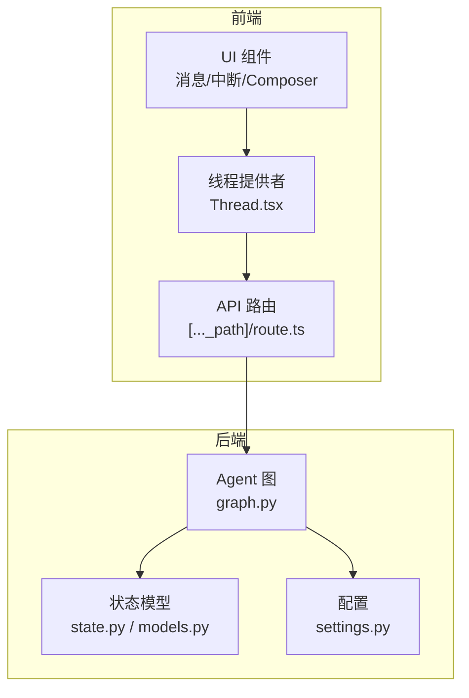
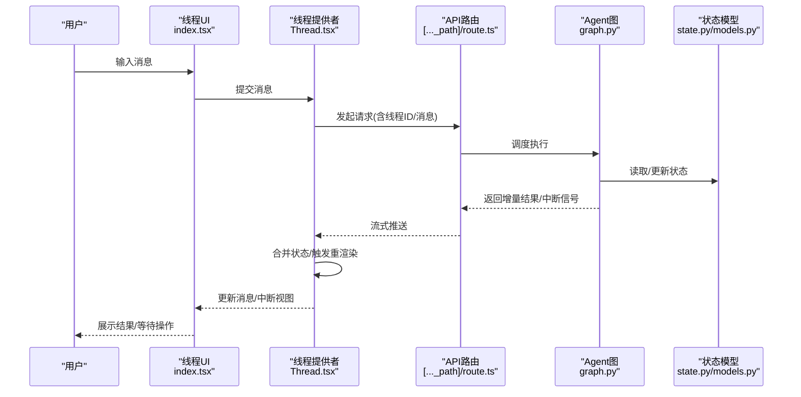
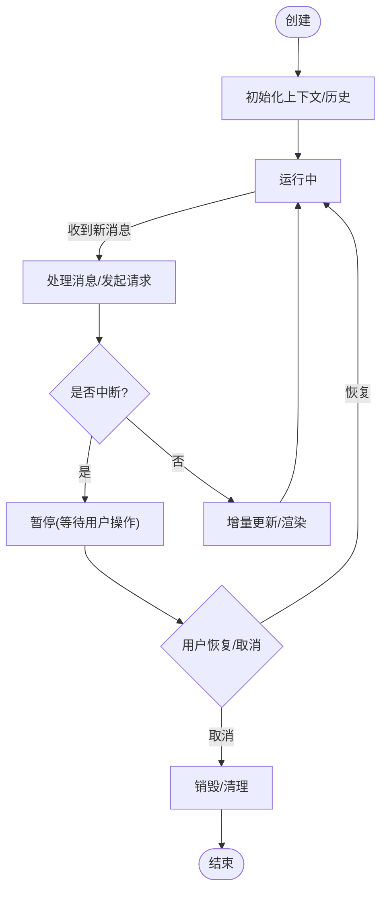
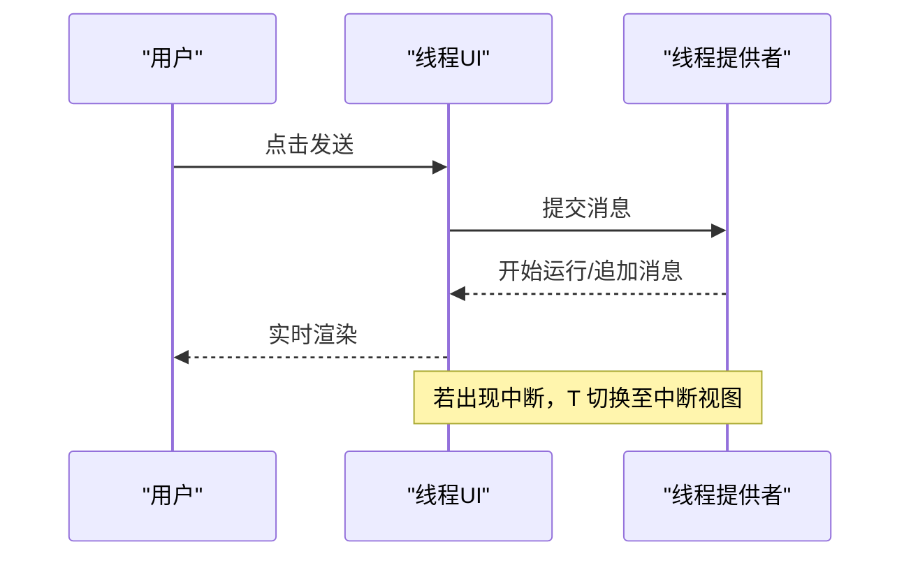
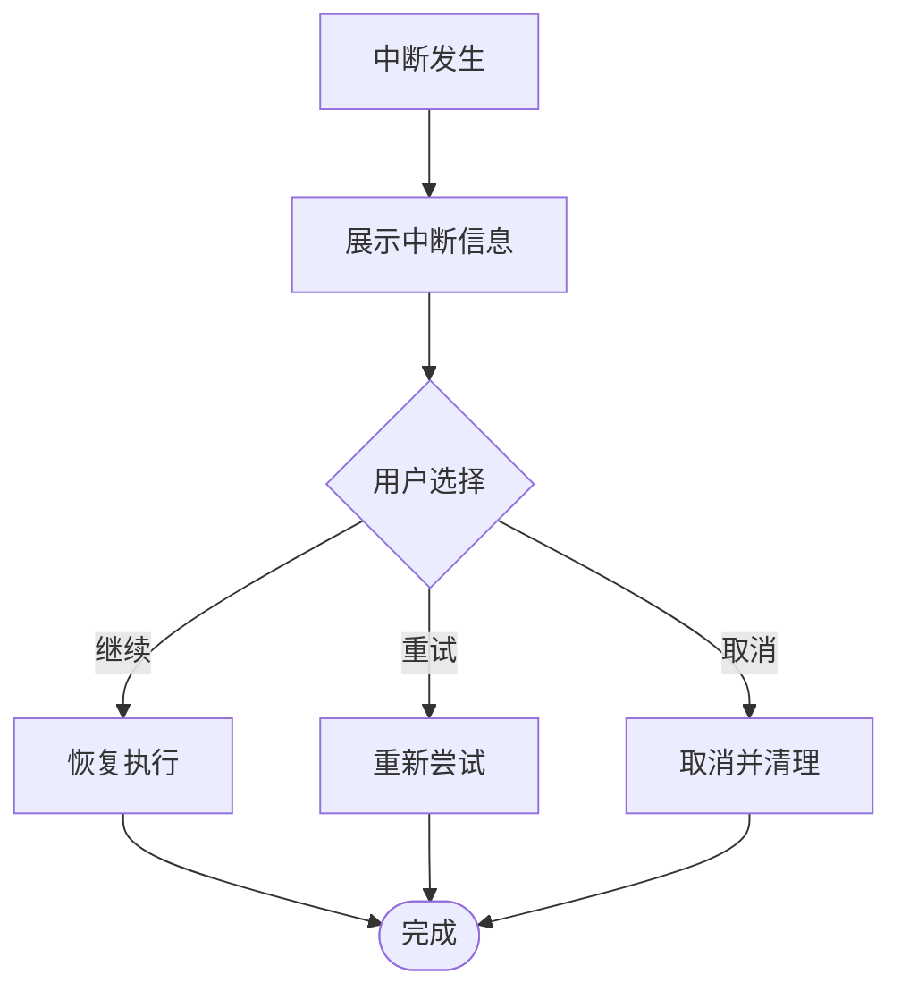
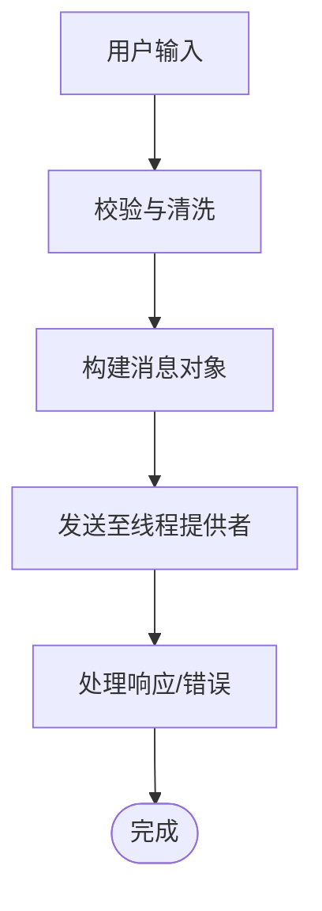
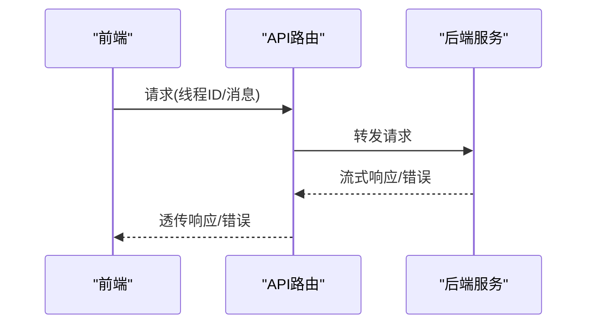
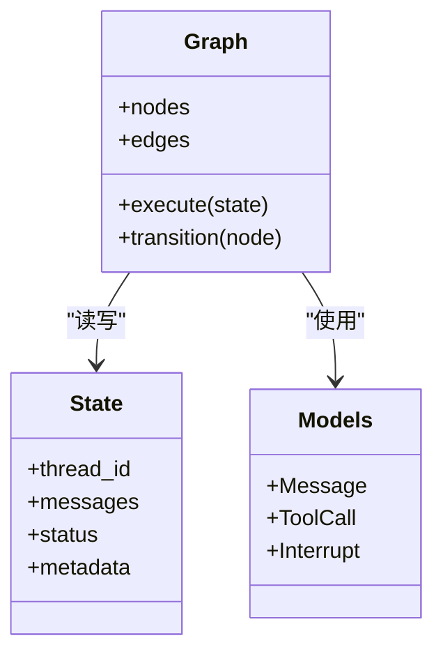
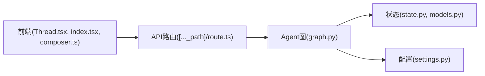

# 线程生命周期管理

<cite>
**本文引用的文件**   
- [apps/web/src/providers/Thread.tsx](file://apps/web/src/providers/Thread.tsx)
- [apps/web/src/components/thread/index.tsx](file://apps/web/src/components/thread/index.tsx)
- [apps/web/src/components/thread/messages/generic-interrupt.tsx](file://apps/web/src/components/thread/messages/generic-interrupt.tsx)
- [apps/web/src/lib/composer.ts](file://apps/web/src/lib/composer.ts)
- [apps/web/src/app/api/[..._path]/route.ts](file://apps/web/src/app/api/[..._path]/route.ts)
- [apps/agent/src/lyl_agent/state.py](file://apps/agent/src/lyl_agent/state.py)
- [apps/agent/src/lyl_agent/graph.py](file://apps/agent/src/lyl_agent/graph.py)
- [apps/agent/src/lyl_agent/models.py](file://apps/agent/src/lyl_agent/models.py)
- [apps/agent/src/lyl_agent/settings.py](file://apps/agent/src/lyl_agent/settings.py)
</cite>

## 目录
1. [引言](#引言)
2. [项目结构](#项目结构)
3. [核心组件](#核心组件)
4. [架构总览](#架构总览)
5. [详细组件分析](#详细组件分析)
6. [依赖分析](#依赖分析)
7. [性能考虑](#性能考虑)
8. [故障排查指南](#故障排查指南)
9. [结论](#结论)
10. [附录](#附录)

## 引言
本文件围绕“线程生命周期管理”展开，结合仓库中的前端线程提供者、消息与中断处理、以及后端 Agent 的状态与图执行，系统化阐述线程的创建、初始化、运行、暂停与销毁等阶段的状态转换；解释线程间通信机制、资源分配与垃圾回收策略；并给出线程池管理、负载均衡与故障转移的实践建议。同时提供性能监控、日志记录与调试工具的使用要点，以及线程安全编程指南和常见问题解决方案，帮助设计与实现高效的线程管理系统。

## 项目结构
本项目采用前后端分离的架构：
- 前端（Next.js）通过 React Provider 管理线程上下文，渲染消息、处理用户输入与中断交互。
- 后端（Python Agent）基于 LangGraph 构建状态机与图执行，负责任务编排、状态持久化与工具调用。

**图表来源** 
- [apps/web/src/providers/Thread.tsx](file://apps/web/src/providers/Thread.tsx)
- [apps/web/src/components/thread/index.tsx](file://apps/web/src/components/thread/index.tsx)
- [apps/web/src/app/api/[..._path]/route.ts](file://apps/web/src/app/api/[..._path]/route.ts)
- [apps/agent/src/lyl_agent/graph.py](file://apps/agent/src/lyl_agent/graph.py)
- [apps/agent/src/lyl_agent/state.py](file://apps/agent/src/lyl_agent/state.py)
- [apps/agent/src/lyl_agent/models.py](file://apps/agent/src/lyl_agent/models.py)
- [apps/agent/src/lyl_agent/settings.py](file://apps/agent/src/lyl_agent/settings.py)

**章节来源**
- [apps/web/src/providers/Thread.tsx](file://apps/web/src/providers/Thread.tsx)
- [apps/web/src/components/thread/index.tsx](file://apps/web/src/components/thread/index.tsx)
- [apps/web/src/app/api/[..._path]/route.ts](file://apps/web/src/app/api/[..._path]/route.ts)
- [apps/agent/src/lyl_agent/graph.py](file://apps/agent/src/lyl_agent/graph.py)
- [apps/agent/src/lyl_agent/state.py](file://apps/agent/src/lyl_agent/state.py)
- [apps/agent/src/lyl_agent/models.py](file://apps/agent/src/lyl_agent/models.py)
- [apps/agent/src/lyl_agent/settings.py](file://apps/agent/src/lyl_agent/settings.py)

## 核心组件
- 线程提供者（Thread.tsx）：维护线程上下文、消息列表、运行状态与事件流，为 UI 提供统一的线程数据访问与更新能力。
- 线程 UI（components/thread/index.tsx）：渲染消息、工具调用、中断提示与 Composer 输入框，驱动用户交互。
- 中断处理（generic-interrupt.tsx）：展示并处理“中断”状态下的用户操作，支持恢复或取消。
- 消息编排（composer.ts）：将用户输入转换为结构化消息，协调发送与响应处理。
- API 路由（[..._path]/route.ts）：统一转发请求到后端服务，承载流式响应与错误透传。
- Agent 图（graph.py）：定义节点与边，驱动状态机流转，协调工具调用与外部服务。
- 状态模型（state.py, models.py）：定义线程状态结构与类型约束，确保跨进程一致性。
- 配置（settings.py）：集中管理运行时参数与开关。

**章节来源**
- [apps/web/src/providers/Thread.tsx](file://apps/web/src/providers/Thread.tsx)
- [apps/web/src/components/thread/index.tsx](file://apps/web/src/components/thread/index.tsx)
- [apps/web/src/components/thread/messages/generic-interrupt.tsx](file://apps/web/src/components/thread/messages/generic-interrupt.tsx)
- [apps/web/src/lib/composer.ts](file://apps/web/src/lib/composer.ts)
- [apps/web/src/app/api/[..._path]/route.ts](file://apps/web/src/app/api/[..._path]/route.ts)
- [apps/agent/src/lyl_agent/graph.py](file://apps/agent/src/lyl_agent/graph.py)
- [apps/agent/src/lyl_agent/state.py](file://apps/agent/src/lyl_agent/state.py)
- [apps/agent/src/lyl_agent/models.py](file://apps/agent/src/lyl_agent/models.py)
- [apps/agent/src/lyl_agent/settings.py](file://apps/agent/src/lyl_agent/settings.py)

## 架构总览
下图展示了从用户输入到 Agent 执行、再到前端渲染的端到端流程，体现线程的生命周期阶段与状态转换。

**图表来源** 
- [apps/web/src/components/thread/index.tsx](file://apps/web/src/components/thread/index.tsx)
- [apps/web/src/providers/Thread.tsx](file://apps/web/src/providers/Thread.tsx)
- [apps/web/src/app/api/[..._path]/route.ts](file://apps/web/src/app/api/[..._path]/route.ts)
- [apps/agent/src/lyl_agent/graph.py](file://apps/agent/src/lyl_agent/graph.py)
- [apps/agent/src/lyl_agent/state.py](file://apps/agent/src/lyl_agent/state.py)
- [apps/agent/src/lyl_agent/models.py](file://apps/agent/src/lyl_agent/models.py)

## 详细组件分析

### 线程提供者（Thread.tsx）
- 职责：封装线程上下文、消息集合、运行状态、事件订阅与派发；在请求/响应过程中维持一致的状态快照。
- 生命周期映射：
  - 创建：初始化线程 ID、空消息集、初始状态。
  - 初始化：加载历史消息、设置默认配置。
  - 运行：接收新消息，发起异步请求，逐步合并增量结果。
  - 暂停：遇到中断时挂起执行，等待用户操作。
  - 销毁：清理订阅、释放引用、重置状态。
- 关键模式：单向数据流、不可变更新、事件驱动渲染。

**图表来源** 
- [apps/web/src/providers/Thread.tsx](file://apps/web/src/providers/Thread.tsx)

**章节来源**
- [apps/web/src/providers/Thread.tsx](file://apps/web/src/providers/Thread.tsx)

### 线程 UI（components/thread/index.tsx）
- 职责：渲染消息列表、工具调用表、中断提示与 Composer 输入框；响应用户操作（发送、恢复、取消）。
- 交互要点：
  - 发送消息：调用线程提供者提交，进入运行态。
  - 中断显示：根据中断类型渲染不同视图，引导用户选择下一步。
  - 流式渲染：增量追加消息片段，提升感知性能。

**图表来源** 
- [apps/web/src/components/thread/index.tsx](file://apps/web/src/components/thread/index.tsx)
- [apps/web/src/providers/Thread.tsx](file://apps/web/src/providers/Thread.tsx)

**章节来源**
- [apps/web/src/components/thread/index.tsx](file://apps/web/src/components/thread/index.tsx)
- [apps/web/src/providers/Thread.tsx](file://apps/web/src/providers/Thread.tsx)

### 中断处理（generic-interrupt.tsx）
- 职责：展示中断原因与可选操作（继续、重试、取消），与线程提供者协作恢复或终止执行。
- 关键点：
  - 明确中断语义（如需要用户确认、外部依赖失败、权限校验未通过）。
  - 保证幂等性：重复恢复不会导致副作用。
  - 超时与降级：长时间无操作自动回退到安全状态。

**图表来源** 
- [apps/web/src/components/thread/messages/generic-interrupt.tsx](file://apps/web/src/components/thread/messages/generic-interrupt.tsx)
- [apps/web/src/providers/Thread.tsx](file://apps/web/src/providers/Thread.tsx)

**章节来源**
- [apps/web/src/components/thread/messages/generic-interrupt.tsx](file://apps/web/src/components/thread/messages/generic-interrupt.tsx)
- [apps/web/src/providers/Thread.tsx](file://apps/web/src/providers/Thread.tsx)

### 消息编排（composer.ts）
- 职责：将用户输入规范化为结构化消息，附加元数据（线程ID、时间戳、来源），协调发送与响应处理。
- 设计要点：
  - 输入校验与清洗，避免非法字符或过大负载。
  - 批量与节流：高频输入合并，降低网络压力。
  - 错误边界：捕获序列化/传输异常，友好提示。

**图表来源** 
- [apps/web/src/lib/composer.ts](file://apps/web/src/lib/composer.ts)
- [apps/web/src/providers/Thread.tsx](file://apps/web/src/providers/Thread.tsx)

**章节来源**
- [apps/web/src/lib/composer.ts](file://apps/web/src/lib/composer.ts)
- [apps/web/src/providers/Thread.tsx](file://apps/web/src/providers/Thread.tsx)

### API 路由（[..._path]/route.ts）
- 职责：统一入口，解析路径与参数，转发到后端服务，处理流式响应与错误透传。
- 关键点：
  - 鉴权与会话：校验 API Key/Token，绑定线程上下文。
  - 流式输出：使用 SSE/WS 推送增量结果，保持前端低延迟。
  - 错误处理：统一包装错误码与消息，便于前端展示。

**图表来源** 
- [apps/web/src/app/api/[..._path]/route.ts](file://apps/web/src/app/api/[..._path]/route.ts)

**章节来源**
- [apps/web/src/app/api/[..._path]/route.ts](file://apps/web/src/app/api/[..._path]/route.ts)

### Agent 图与状态（graph.py, state.py, models.py）
- 职责：定义状态机节点与边，驱动执行流程；维护线程状态结构，确保一致性。
- 关键点：
  - 节点幂等：同一状态可被多次到达而不产生副作用。
  - 状态快照：每次变更生成不可变快照，便于回溯与恢复。
  - 工具调用：隔离外部依赖，失败重试与熔断。

**图表来源** 
- [apps/agent/src/lyl_agent/graph.py](file://apps/agent/src/lyl_agent/graph.py)
- [apps/agent/src/lyl_agent/state.py](file://apps/agent/src/lyl_agent/state.py)
- [apps/agent/src/lyl_agent/models.py](file://apps/agent/src/lyl_agent/models.py)

**章节来源**
- [apps/agent/src/lyl_agent/graph.py](file://apps/agent/src/lyl_agent/graph.py)
- [apps/agent/src/lyl_agent/state.py](file://apps/agent/src/lyl_agent/state.py)
- [apps/agent/src/lyl_agent/models.py](file://apps/agent/src/lyl_agent/models.py)

### 配置（settings.py）
- 职责：集中管理运行时参数（超时、并发、重试、功能开关）。
- 关键点：
  - 环境隔离：区分开发/测试/生产配置。
  - 动态重载：热更新部分参数不影响运行中的线程。
  - 安全敏感项加密存储。

**章节来源**
- [apps/agent/src/lyl_agent/settings.py](file://apps/agent/src/lyl_agent/settings.py)

## 依赖分析
- 前端依赖：React、Next.js 路由与流式 API、状态管理库（如有）。
- 后端依赖：LangGraph（图执行）、状态持久化（数据库/缓存）、工具调用框架。
- 耦合点：
  - 线程 ID 贯穿前后端，作为唯一标识。
  - 消息与中断的 Schema 需严格对齐。
  - 错误码与状态枚举保持一致。

**图表来源** 
- [apps/web/src/providers/Thread.tsx](file://apps/web/src/providers/Thread.tsx)
- [apps/web/src/components/thread/index.tsx](file://apps/web/src/components/thread/index.tsx)
- [apps/web/src/lib/composer.ts](file://apps/web/src/lib/composer.ts)
- [apps/web/src/app/api/[..._path]/route.ts](file://apps/web/src/app/api/[..._path]/route.ts)
- [apps/agent/src/lyl_agent/graph.py](file://apps/agent/src/lyl_agent/graph.py)
- [apps/agent/src/lyl_agent/state.py](file://apps/agent/src/lyl_agent/state.py)
- [apps/agent/src/lyl_agent/models.py](file://apps/agent/src/lyl_agent/models.py)
- [apps/agent/src/lyl_agent/settings.py](file://apps/agent/src/lyl_agent/settings.py)

**章节来源**
- [apps/web/src/providers/Thread.tsx](file://apps/web/src/providers/Thread.tsx)
- [apps/web/src/components/thread/index.tsx](file://apps/web/src/components/thread/index.tsx)
- [apps/web/src/lib/composer.ts](file://apps/web/src/lib/composer.ts)
- [apps/web/src/app/api/[..._path]/route.ts](file://apps/web/src/app/api/[..._path]/route.ts)
- [apps/agent/src/lyl_agent/graph.py](file://apps/agent/src/lyl_agent/graph.py)
- [apps/agent/src/lyl_agent/state.py](file://apps/agent/src/lyl_agent/state.py)
- [apps/agent/src/lyl_agent/models.py](file://apps/agent/src/lyl_agent/models.py)
- [apps/agent/src/lyl_agent/settings.py](file://apps/agent/src/lyl_agent/settings.py)

## 性能考虑
- 前端渲染：
  - 增量更新：仅重渲染变更的消息片段，避免整页刷新。
  - 虚拟滚动：长列表按需渲染，减少 DOM 压力。
  - 防抖与节流：限制高频输入与请求频率。
- 网络传输：
  - 流式响应：降低首字节延迟，提升用户体验。
  - 压缩与分片：大消息分块传输，减少单次负载。
- 后端执行：
  - 图节点并行：无依赖节点并发执行，缩短整体耗时。
  - 缓存热点：对频繁查询的结果进行短期缓存。
  - 资源限流：控制并发度，防止雪崩。
- 内存与 GC：
  - 前端：及时解绑事件监听，避免闭包泄漏。
  - 后端：对象池复用、避免大对象长期驻留。

## 故障排查指南
- 常见问题：
  - 线程卡死：检查中断是否被正确处理，是否存在阻塞调用。
  - 消息丢失：核对消息序列号与去重逻辑，确保幂等写入。
  - 状态不一致：对比前后端状态快照，定位差异点。
  - 性能抖动：监控 CPU/内存/IO 指标，定位瓶颈。
- 调试手段：
  - 前端：浏览器开发者工具的网络面板、控制台日志、React DevTools。
  - 后端：结构化日志（TraceID、SpanID）、分布式追踪、慢查询分析。
  - 集成测试：模拟中断与失败场景，验证恢复路径。
- 恢复策略：
  - 自动重试：指数退避与最大重试次数。
  - 熔断降级：快速失败，返回兜底内容。
  - 人工介入：提供“重试/取消/跳过”选项。

## 结论
通过清晰的状态机设计与严格的线程生命周期管理，结合前后端的协同与一致的协议约定，可实现高可靠、高性能的线程系统。建议在工程实践中强化幂等性、可观测性与容错能力，持续优化资源利用与用户体验。

## 附录
- 术语表：
  - 线程：独立的任务执行单元，具有生命周期与状态。
  - 中断：执行过程中的外部干预点，需用户或系统决策。
  - 幂等：多次执行结果与一次执行相同。
- 最佳实践清单：
  - 始终为线程分配唯一 ID，并在所有层传递。
  - 使用不可变状态更新，便于回溯与调试。
  - 对外部依赖设置超时与重试上限。
  - 记录关键路径的日志与指标，便于问题定位。
  - 定期演练故障恢复流程，确保预案有效。