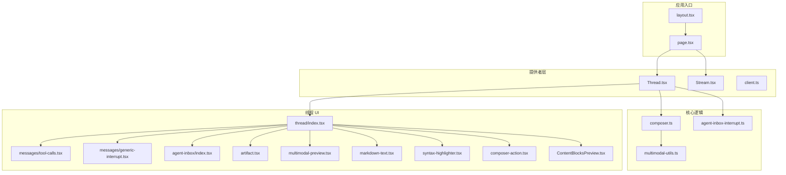
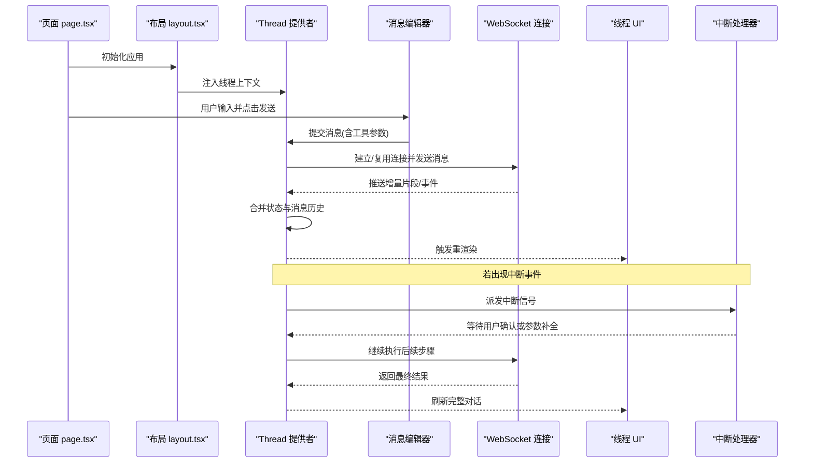
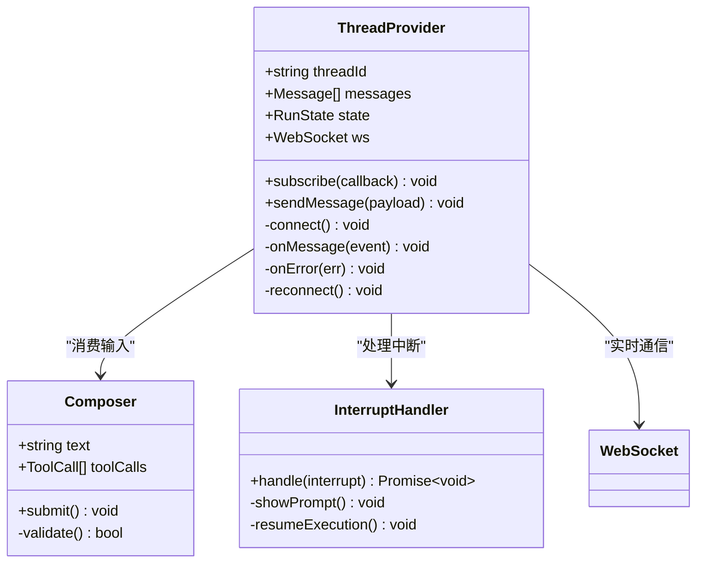
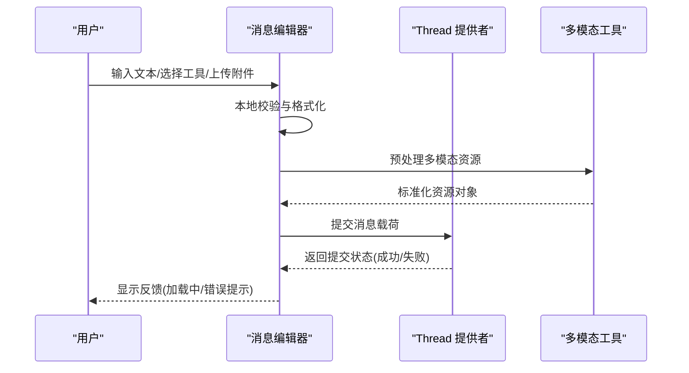
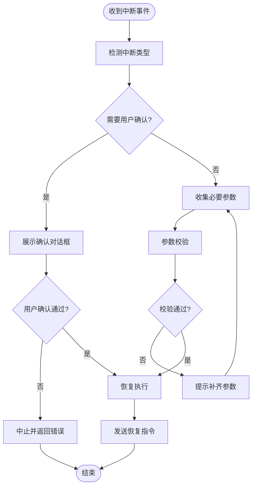
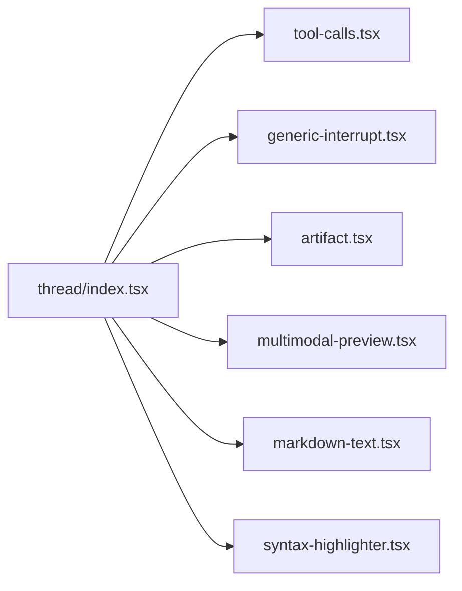
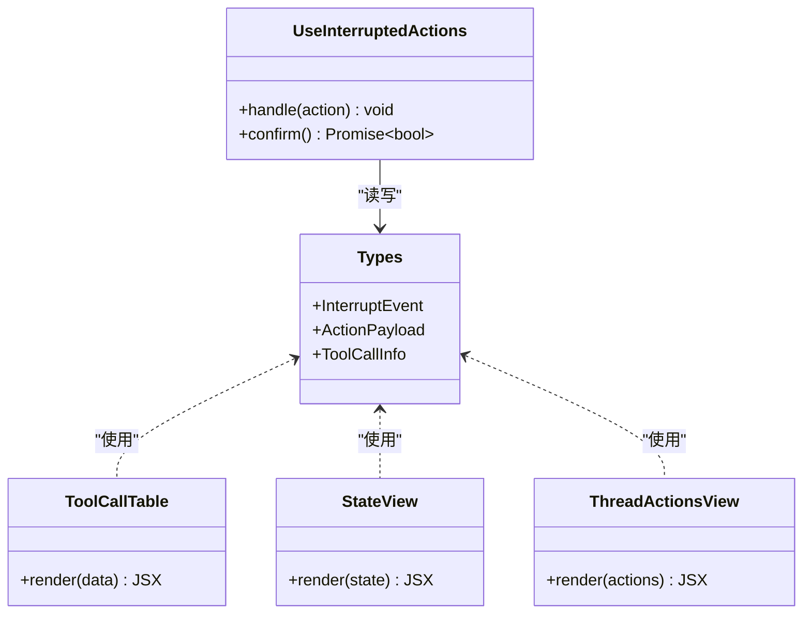
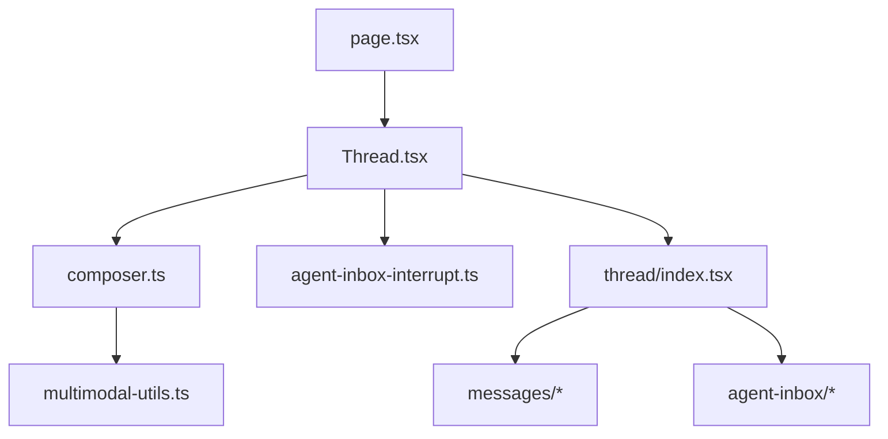

# 线程管理

<cite>
**本文引用的文件**   
- [apps/web/src/providers/Thread.tsx](file://apps/web/src/providers/Thread.tsx)
- [apps/web/src/lib/composer.ts](file://apps/web/src/lib/composer.ts)
- [apps/web/src/lib/agent-inbox-interrupt.ts](file://apps/web/src/lib/agent-inbox-interrupt.ts)
- [apps/web/src/components/thread/index.tsx](file://apps/web/src/components/thread/index.tsx)
- [apps/web/src/components/thread/messages/tool-calls.tsx](file://apps/web/src/components/thread/messages/tool-calls.tsx)
- [apps/web/src/components/thread/messages/generic-interrupt.tsx](file://apps/web/src/components/thread/messages/generic-interrupt.tsx)
- [apps/web/src/components/thread/agent-inbox/index.tsx](file://apps/web/src/components/thread/agent-inbox/index.tsx)
- [apps/web/src/components/thread/agent-inbox/hooks/use-interrupted-actions.tsx](file://apps/web/src/components/thread/agent-inbox/hooks/use-interrupted-actions.tsx)
- [apps/web/src/components/thread/agent-inbox/components/tool-call-table.tsx](file://apps/web/src/components/thread/agent-inbox/components/tool-call-table.tsx)
- [apps/web/src/components/thread/agent-inbox/components/state-view.tsx](file://apps/web/src/components/thread/agent-inbox/components/state-view.tsx)
- [apps/web/src/components/thread/agent-inbox/components/thread-actions-view.tsx](file://apps/web/src/components/thread/agent-inbox/components/thread-actions-view.tsx)
- [apps/web/src/components/thread/agent-inbox/types.ts](file://apps/web/src/components/thread/agent-inbox/types.ts)
- [apps/web/src/components/thread/agent-inbox/utils.ts](file://apps/web/src/components/thread/agent-inbox/utils.ts)
- [apps/web/src/components/thread/artifact.tsx](file://apps/web/src/components/thread/artifact.tsx)
- [apps/web/src/components/thread/multimodal-preview.tsx](file://apps/web/src/components/thread/multimodal-preview.tsx)
- [apps/web/src/components/thread/markdown-text.tsx](file://apps/web/src/components/thread/markdown-text.tsx)
- [apps/web/src/components/thread/syntax-highlighter.tsx](file://apps/web/src/components/thread/syntax-highlighter.tsx)
- [apps/web/src/components/thread/composer-action.tsx](file://apps/web/src/components/thread/composer-action.tsx)
- [apps/web/src/components/thread/ContentBlocksPreview.tsx](file://apps/web/src/components/thread/ContentBlocksPreview.tsx)
- [apps/web/src/components/thread/utils.ts](file://apps/web/src/components/thread/utils.ts)
- [apps/web/src/lib/multimodal-utils.ts](file://apps/web/src/lib/multimodal-utils.ts)
- [apps/web/src/lib/api-key.tsx](file://apps/web/src/lib/api-key.tsx)
- [apps/web/src/app/layout.tsx](file://apps/web/src/app/layout.tsx)
- [apps/web/src/app/page.tsx](file://apps/web/src/app/page.tsx)
</cite>

## 目录
1. [简介](#简介)
2. [项目结构](#项目结构)
3. [核心组件](#核心组件)
4. [架构总览](#架构总览)
5. [详细组件分析](#详细组件分析)
6. [依赖关系分析](#依赖关系分析)
7. [性能考虑](#性能考虑)
8. [故障排查指南](#故障排查指南)
9. [结论](#结论)
10. [附录：扩展自定义线程组件](#附录：扩展自定义线程组件)

## 简介
本文件面向“线程管理系统”的前端实现，聚焦以下目标：
- 深入解释 Thread 组件的核心功能：消息处理、状态管理与用户交互。
- 详细说明 Thread 提供者如何管理应用状态、WebSocket 连接与实时通信。
- 解析 composer.ts 中的消息编辑器实现：文本输入、工具调用与用户反馈。
- 说明 agent-inbox-interrupt.ts 的中断处理机制与异步操作管理。
- 覆盖线程生命周期管理、错误处理与性能优化策略。
- 提供自定义线程组件的扩展指南与最佳实践，并用实际代码示例展示复杂线程交互逻辑的实现路径（以文件路径引用代替直接粘贴代码）。

## 项目结构
前端采用 Next.js 应用组织，线程相关能力集中在 apps/web/src 下：
- providers：全局状态与 WebSocket 连接的提供者（Thread.tsx 等）
- lib：核心业务逻辑（composer.ts、agent-inbox-interrupt.ts、multimodal-utils.ts 等）
- components/thread：UI 层组件（消息渲染、工具调用、中断视图、多模态预览等）
- components/thread/agent-inbox：中断收件箱子模块（类型、工具、钩子与视图）

图表来源
- [apps/web/src/app/layout.tsx](file://apps/web/src/app/layout.tsx)
- [apps/web/src/app/page.tsx](file://apps/web/src/app/page.tsx)
- [apps/web/src/providers/Thread.tsx](file://apps/web/src/providers/Thread.tsx)
- [apps/web/src/lib/composer.ts](file://apps/web/src/lib/composer.ts)
- [apps/web/src/lib/agent-inbox-interrupt.ts](file://apps/web/src/lib/agent-inbox-interrupt.ts)
- [apps/web/src/components/thread/index.tsx](file://apps/web/src/components/thread/index.tsx)

章节来源
- [apps/web/src/app/layout.tsx](file://apps/web/src/app/layout.tsx)
- [apps/web/src/app/page.tsx](file://apps/web/src/app/page.tsx)
- [apps/web/src/providers/Thread.tsx](file://apps/web/src/providers/Thread.tsx)

## 核心组件
- Thread 提供者：集中管理线程上下文、消息列表、运行状态、WebSocket 连接与事件分发；对外暴露订阅与发送接口。
- 消息编辑器（Composer）：负责用户输入、富文本/附件、工具调用参数编辑与提交；与 Thread 提供者协作完成消息入队与流式更新。
- 中断处理器（agent-inbox-interrupt）：封装中断事件的识别、状态同步、用户确认与恢复执行流程。
- 线程 UI：消息渲染、工具调用展示、中断视图、多模态内容预览与 Markdown 高亮。

章节来源
- [apps/web/src/providers/Thread.tsx](file://apps/web/src/providers/Thread.tsx)
- [apps/web/src/lib/composer.ts](file://apps/web/src/lib/composer.ts)
- [apps/web/src/lib/agent-inbox-interrupt.ts](file://apps/web/src/lib/agent-inbox-interrupt.ts)
- [apps/web/src/components/thread/index.tsx](file://apps/web/src/components/thread/index.tsx)

## 架构总览
下图展示了从页面到提供者、核心逻辑与 UI 组件的整体数据流与控制流。

图表来源
- [apps/web/src/app/page.tsx](file://apps/web/src/app/page.tsx)
- [apps/web/src/app/layout.tsx](file://apps/web/src/app/layout.tsx)
- [apps/web/src/providers/Thread.tsx](file://apps/web/src/providers/Thread.tsx)
- [apps/web/src/lib/composer.ts](file://apps/web/src/lib/composer.ts)
- [apps/web/src/lib/agent-inbox-interrupt.ts](file://apps/web/src/lib/agent-inbox-interrupt.ts)

## 详细组件分析

### Thread 提供者：状态、连接与事件总线
职责
- 维护线程 ID、消息历史、运行状态（空闲/运行中/中断/错误）、工具调用上下文。
- 管理 WebSocket 连接的生命周期（创建、心跳、重连、关闭）。
- 统一事件分发：消息增量、工具调用、中断、完成、错误。
- 提供订阅 API 供 UI 消费最新状态。

关键流程
- 初始化：加载线程元信息，建立 WebSocket，注册事件监听。
- 发送消息：校验输入，构造请求，写入消息历史，进入运行状态。
- 接收事件：增量拼接文本、追加工具调用、处理中断、收尾完成。
- 错误处理：网络异常降级、重试策略、用户提示。

图表来源
- [apps/web/src/providers/Thread.tsx](file://apps/web/src/providers/Thread.tsx)
- [apps/web/src/lib/composer.ts](file://apps/web/src/lib/composer.ts)
- [apps/web/src/lib/agent-inbox-interrupt.ts](file://apps/web/src/lib/agent-inbox-interrupt.ts)

章节来源
- [apps/web/src/providers/Thread.tsx](file://apps/web/src/providers/Thread.tsx)

### 消息编辑器（composer.ts）：输入、工具调用与反馈
职责
- 维护编辑器状态（文本、附件、工具参数）。
- 校验与格式化输入，生成结构化消息载荷。
- 与 Thread 提供者协作，提交消息并显示加载/错误反馈。
- 支持多模态内容（图片/文件）预处理与压缩。

交互序列

图表来源
- [apps/web/src/lib/composer.ts](file://apps/web/src/lib/composer.ts)
- [apps/web/src/lib/multimodal-utils.ts](file://apps/web/src/lib/multimodal-utils.ts)
- [apps/web/src/providers/Thread.tsx](file://apps/web/src/providers/Thread.tsx)

章节来源
- [apps/web/src/lib/composer.ts](file://apps/web/src/lib/composer.ts)
- [apps/web/src/lib/multimodal-utils.ts](file://apps/web/src/lib/multimodal-utils.ts)

### 中断处理（agent-inbox-interrupt.ts）：异步与用户确认
职责
- 识别服务端下发的中断事件，映射为前端可理解的状态。
- 暂停当前执行流，收集用户补充信息或确认。
- 将用户响应回写至线程上下文，恢复执行。

流程图

图表来源
- [apps/web/src/lib/agent-inbox-interrupt.ts](file://apps/web/src/lib/agent-inbox-interrupt.ts)

章节来源
- [apps/web/src/lib/agent-inbox-interrupt.ts](file://apps/web/src/lib/agent-inbox-interrupt.ts)

### 线程 UI：消息、工具调用与中断视图
- 消息渲染：区分人类/AI/工具调用/通用中断等类型，统一样式与交互。
- 工具调用：展示调用栈、参数与结果，支持展开/折叠与复制。
- 中断视图：在消息流中插入中断卡片，引导用户完成下一步。
- 多模态预览：图片/文件缩略图与预览。
- Markdown 与语法高亮：提升可读性。

图表来源
- [apps/web/src/components/thread/index.tsx](file://apps/web/src/components/thread/index.tsx)
- [apps/web/src/components/thread/messages/tool-calls.tsx](file://apps/web/src/components/thread/messages/tool-calls.tsx)
- [apps/web/src/components/thread/messages/generic-interrupt.tsx](file://apps/web/src/components/thread/messages/generic-interrupt.tsx)
- [apps/web/src/components/thread/artifact.tsx](file://apps/web/src/components/thread/artifact.tsx)
- [apps/web/src/components/thread/multimodal-preview.tsx](file://apps/web/src/components/thread/multimodal-preview.tsx)
- [apps/web/src/components/thread/markdown-text.tsx](file://apps/web/src/components/thread/markdown-text.tsx)
- [apps/web/src/components/thread/syntax-highlighter.tsx](file://apps/web/src/components/thread/syntax-highlighter.tsx)

章节来源
- [apps/web/src/components/thread/index.tsx](file://apps/web/src/components/thread/index.tsx)
- [apps/web/src/components/thread/messages/tool-calls.tsx](file://apps/web/src/components/thread/messages/tool-calls.tsx)
- [apps/web/src/components/thread/messages/generic-interrupt.tsx](file://apps/web/src/components/thread/messages/generic-interrupt.tsx)
- [apps/web/src/components/thread/artifact.tsx](file://apps/web/src/components/thread/artifact.tsx)
- [apps/web/src/components/thread/multimodal-preview.tsx](file://apps/web/src/components/thread/multimodal-preview.tsx)
- [apps/web/src/components/thread/markdown-text.tsx](file://apps/web/src/components/thread/markdown-text.tsx)
- [apps/web/src/components/thread/syntax-highlighter.tsx](file://apps/web/src/components/thread/syntax-highlighter.tsx)

### 中断收件箱（agent-inbox）：类型、工具与视图
- 类型定义：统一中断与动作的数据模型。
- 工具表格：展示工具调用详情与结果。
- 状态视图：可视化线程状态变化。
- 动作视图：提供用户可执行的下一步操作。
- 钩子：use-interrupted-actions 封装中断后的交互逻辑。

图表来源
- [apps/web/src/components/thread/agent-inbox/types.ts](file://apps/web/src/components/thread/agent-inbox/types.ts)
- [apps/web/src/components/thread/agent-inbox/components/tool-call-table.tsx](file://apps/web/src/components/thread/agent-inbox/components/tool-call-table.tsx)
- [apps/web/src/components/thread/agent-inbox/components/state-view.tsx](file://apps/web/src/components/thread/agent-inbox/components/state-view.tsx)
- [apps/web/src/components/thread/agent-inbox/components/thread-actions-view.tsx](file://apps/web/src/components/thread/agent-inbox/components/thread-actions-view.tsx)
- [apps/web/src/components/thread/agent-inbox/hooks/use-interrupted-actions.tsx](file://apps/web/src/components/thread/agent-inbox/hooks/use-interrupted-actions.tsx)

章节来源
- [apps/web/src/components/thread/agent-inbox/index.tsx](file://apps/web/src/components/thread/agent-inbox/index.tsx)
- [apps/web/src/components/thread/agent-inbox/types.ts](file://apps/web/src/components/thread/agent-inbox/types.ts)
- [apps/web/src/components/thread/agent-inbox/components/tool-call-table.tsx](file://apps/web/src/components/thread/agent-inbox/components/tool-call-table.tsx)
- [apps/web/src/components/thread/agent-inbox/components/state-view.tsx](file://apps/web/src/components/thread/agent-inbox/components/state-view.tsx)
- [apps/web/src/components/thread/agent-inbox/components/thread-actions-view.tsx](file://apps/web/src/components/thread/agent-inbox/components/thread-actions-view.tsx)
- [apps/web/src/components/thread/agent-inbox/hooks/use-interrupted-actions.tsx](file://apps/web/src/components/thread/agent-inbox/hooks/use-interrupted-actions.tsx)
- [apps/web/src/components/thread/agent-inbox/utils.ts](file://apps/web/src/components/thread/agent-inbox/utils.ts)

### 其他辅助组件
- ContentBlocksPreview：统一内容块预览容器。
- ComposerAction：编辑器快捷动作（如插入模板、快速工具）。
- utils：线程 UI 通用工具函数（时间格式化、ID 生成等）。

章节来源
- [apps/web/src/components/thread/ContentBlocksPreview.tsx](file://apps/web/src/components/thread/ContentBlocksPreview.tsx)
- [apps/web/src/components/thread/composer-action.tsx](file://apps/web/src/components/thread/composer-action.tsx)
- [apps/web/src/components/thread/utils.ts](file://apps/web/src/components/thread/utils.ts)

## 依赖关系分析
- 页面与布局：注入 Thread 提供者，确保全局可用。
- 提供者与逻辑：Thread 提供者依赖 composer 与 interrupt 处理器，形成“输入-处理-输出”闭环。
- UI 与逻辑：线程 UI 消费提供者状态，并通过 actions 回调驱动上层逻辑。
- 外部依赖：WebSocket 用于实时通信；多模态工具用于资源预处理。

图表来源
- [apps/web/src/app/page.tsx](file://apps/web/src/app/page.tsx)
- [apps/web/src/providers/Thread.tsx](file://apps/web/src/providers/Thread.tsx)
- [apps/web/src/lib/composer.ts](file://apps/web/src/lib/composer.ts)
- [apps/web/src/lib/agent-inbox-interrupt.ts](file://apps/web/src/lib/agent-inbox-interrupt.ts)
- [apps/web/src/components/thread/index.tsx](file://apps/web/src/components/thread/index.tsx)
- [apps/web/src/lib/multimodal-utils.ts](file://apps/web/src/lib/multimodal-utils.ts)

章节来源
- [apps/web/src/app/page.tsx](file://apps/web/src/app/page.tsx)
- [apps/web/src/providers/Thread.tsx](file://apps/web/src/providers/Thread.tsx)
- [apps/web/src/lib/composer.ts](file://apps/web/src/lib/composer.ts)
- [apps/web/src/lib/agent-inbox-interrupt.ts](file://apps/web/src/lib/agent-inbox-interrupt.ts)
- [apps/web/src/components/thread/index.tsx](file://apps/web/src/components/thread/index.tsx)
- [apps/web/src/lib/multimodal-utils.ts](file://apps/web/src/lib/multimodal-utils.ts)

## 性能考虑
- 增量渲染：WebSocket 推送按片段合并，避免整段重算。
- 去抖与节流：编辑器输入防抖，减少频繁状态更新。
- 虚拟滚动：长对话列表按需渲染，降低内存占用。
- 资源压缩：多模态资源上传前压缩与格式转换。
- 连接优化：WebSocket 心跳保活、指数退避重连、断线自动恢复。
- 缓存策略：工具调用结果与静态内容缓存，减少重复计算。

[本节为通用指导，不直接分析具体文件]

## 故障排查指南
常见问题与定位要点
- 连接失败：检查 WebSocket URL、鉴权头、跨域配置；查看重连日志。
- 消息丢失：核对消息 ID 与顺序，确认增量合并逻辑是否幂等。
- 中断卡住：确认中断类型分支是否正确，用户确认回调是否被触发。
- 工具调用异常：检查参数校验、权限与后端返回码；记录错误上下文。
- 渲染卡顿：检查大文本与多模态渲染，启用虚拟化与懒加载。

建议的调试手段
- 在 Thread 提供者中打印事件流与状态变更。
- 在 composer 提交前后记录载荷差异。
- 在中断处理器中记录用户交互轨迹与恢复指令。
- 对 WebSocket 帧进行抓包与回放。

章节来源
- [apps/web/src/providers/Thread.tsx](file://apps/web/src/providers/Thread.tsx)
- [apps/web/src/lib/composer.ts](file://apps/web/src/lib/composer.ts)
- [apps/web/src/lib/agent-inbox-interrupt.ts](file://apps/web/src/lib/agent-inbox-interrupt.ts)

## 结论
本线程管理系统以 Thread 提供者为核心，结合消息编辑器与中断处理器，构建了完整的“输入-处理-输出-反馈”闭环。通过 WebSocket 实现实时通信，配合完善的 UI 组件与工具链，满足复杂线程交互场景。建议在扩展时遵循现有分层与契约，保持状态一致性与可观测性，以获得更好的性能与可维护性。

[本节为总结性内容，不直接分析具体文件]

## 附录：扩展自定义线程组件
扩展点与最佳实践
- 新增消息类型：在消息渲染层添加新类型分支，保持与提供者数据结构一致。
- 自定义工具面板：基于 tool-calls 模式扩展参数编辑与结果展示。
- 自定义中断流程：在 agent-inbox-interrupt 中添加新的中断类型与交互。
- 主题与样式：通过统一的样式文件与组件库保持一致体验。
- 测试与验证：为新增逻辑编写单元测试与集成测试，覆盖正常与异常路径。

参考实现路径（以文件路径引用代替代码片段）
- 新增消息类型渲染：参见 [apps/web/src/components/thread/messages/tool-calls.tsx](file://apps/web/src/components/thread/messages/tool-calls.tsx)
- 中断交互扩展：参见 [apps/web/src/lib/agent-inbox-interrupt.ts](file://apps/web/src/lib/agent-inbox-interrupt.ts) 与 [apps/web/src/components/thread/agent-inbox/hooks/use-interrupted-actions.tsx](file://apps/web/src/components/thread/agent-inbox/hooks/use-interrupted-actions.tsx)
- 编辑器增强：参见 [apps/web/src/lib/composer.ts](file://apps/web/src/lib/composer.ts) 与 [apps/web/src/components/thread/composer-action.tsx](file://apps/web/src/components/thread/composer-action.tsx)
- 多模态支持：参见 [apps/web/src/lib/multimodal-utils.ts](file://apps/web/src/lib/multimodal-utils.ts) 与 [apps/web/src/components/thread/multimodal-preview.tsx](file://apps/web/src/components/thread/multimodal-preview.tsx)

章节来源
- [apps/web/src/components/thread/messages/tool-calls.tsx](file://apps/web/src/components/thread/messages/tool-calls.tsx)
- [apps/web/src/lib/agent-inbox-interrupt.ts](file://apps/web/src/lib/agent-inbox-interrupt.ts)
- [apps/web/src/components/thread/agent-inbox/hooks/use-interrupted-actions.tsx](file://apps/web/src/components/thread/agent-inbox/hooks/use-interrupted-actions.tsx)
- [apps/web/src/lib/composer.ts](file://apps/web/src/lib/composer.ts)
- [apps/web/src/components/thread/composer-action.tsx](file://apps/web/src/components/thread/composer-action.tsx)
- [apps/web/src/lib/multimodal-utils.ts](file://apps/web/src/lib/multimodal-utils.ts)
- [apps/web/src/components/thread/multimodal-preview.tsx](file://apps/web/src/components/thread/multimodal-preview.tsx)