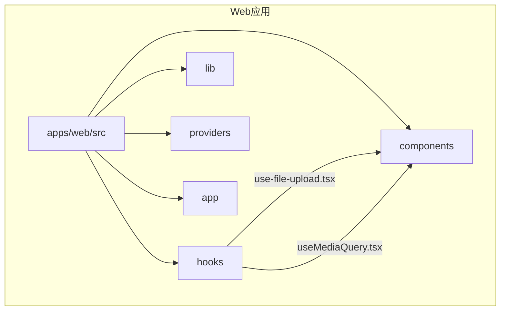
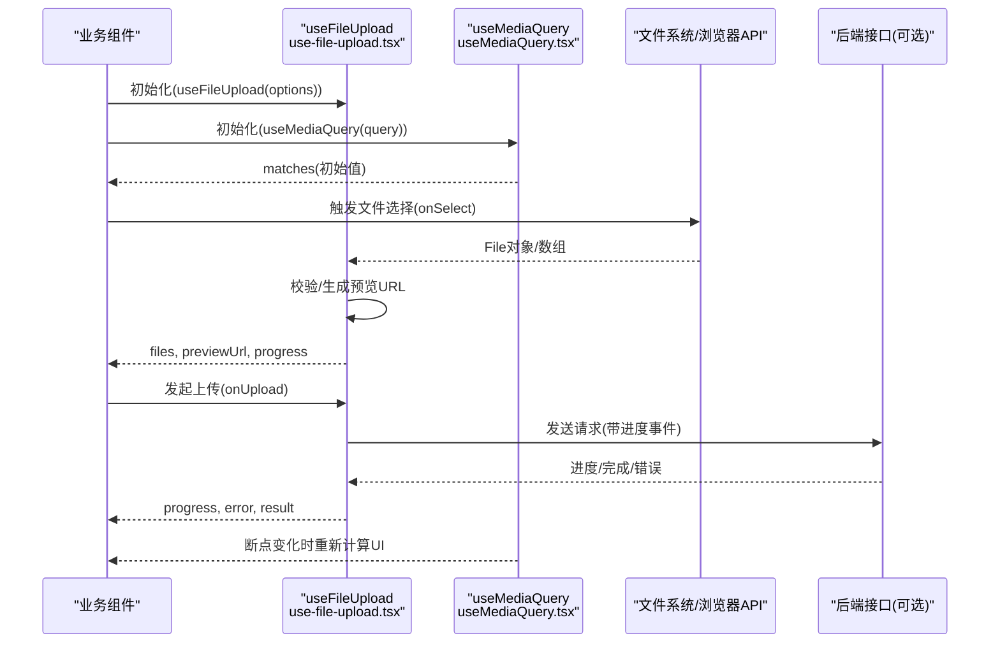
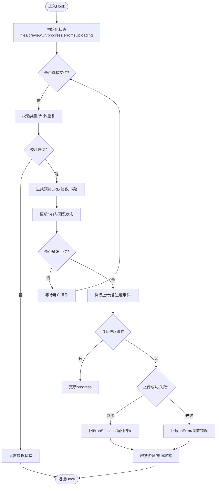
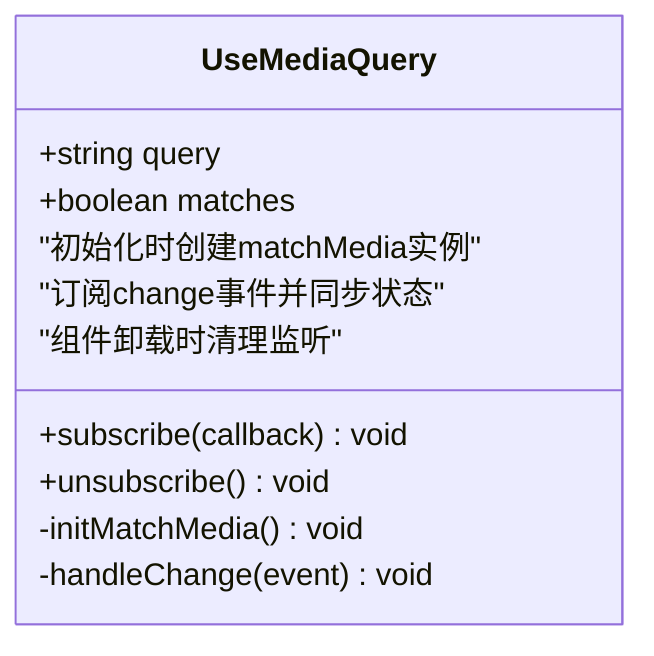
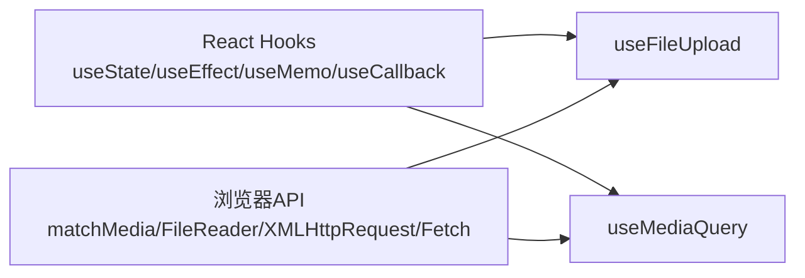

# 自定义Hooks

<cite>
**本文引用的文件**   
- [use-file-upload.tsx](file://apps/web/src/hooks/use-file-upload.tsx)
- [useMediaQuery.tsx](file://apps/web/src/hooks/useMediaQuery.tsx)
</cite>

## 目录
1. [简介](#简介)
2. [项目结构](#项目结构)
3. [核心组件](#核心组件)
4. [架构总览](#架构总览)
5. [详细组件分析](#详细组件分析)
6. [依赖分析](#依赖分析)
7. [性能考虑](#性能考虑)
8. [故障排查指南](#故障排查指南)
9. [结论](#结论)
10. [附录](#附录)

## 简介
本文件为自定义Hooks库的权威文档，聚焦以下两个核心Hook：
- use-file-upload.tsx：实现文件选择、进度跟踪、错误处理与预览能力，适用于图片/媒体类上传场景。
- useMediaQuery.tsx：提供响应式断点检测、状态同步与性能优化，便于在组件中按设备或视口尺寸进行条件渲染与交互控制。

文档将从系统架构、数据流、错误处理、性能特性等维度深入剖析，并提供组合使用、调试技巧、测试策略、类型定义规范以及新Hook开发指南，帮助读者快速上手并高质量扩展。

## 项目结构
本项目采用Next.js应用结构，Hooks位于前端应用的src/hooks目录下，便于被各页面与组件复用。

图表来源
- [use-file-upload.tsx:1-200](file://apps/web/src/hooks/use-file-upload.tsx#L1-L200)
- [useMediaQuery.tsx:1-200](file://apps/web/src/hooks/useMediaQuery.tsx#L1-L200)

章节来源
- [use-file-upload.tsx:1-200](file://apps/web/src/hooks/use-file-upload.tsx#L1-L200)
- [useMediaQuery.tsx:1-200](file://apps/web/src/hooks/useMediaQuery.tsx#L1-L200)

## 核心组件
本节对两个Hook的职责与对外暴露的能力进行概述：
- useFileUpload（基于use-file-upload.tsx）
  - 职责：管理文件选择、校验、预览、上传进度、错误状态及结果回调。
  - 典型返回值：files、previewUrl、progress、error、isUploading、onSelect/onRemove/onUpload等。
- useMediaQuery（基于useMediaQuery.tsx）
  - 职责：监听媒体查询条件变化，返回布尔状态以驱动响应式UI。
  - 典型返回值：matches、query、subscribe/unsubscribe（可选）。

章节来源
- [use-file-upload.tsx:1-200](file://apps/web/src/hooks/use-file-upload.tsx#L1-L200)
- [useMediaQuery.tsx:1-200](file://apps/web/src/hooks/useMediaQuery.tsx#L1-L200)

## 架构总览
下图展示了两个Hook在组件中的调用关系与数据流向，强调副作用管理与状态同步。

图表来源
- [use-file-upload.tsx:1-200](file://apps/web/src/hooks/use-file-upload.tsx#L1-L200)
- [useMediaQuery.tsx:1-200](file://apps/web/src/hooks/useMediaQuery.tsx#L1-L200)

## 详细组件分析

### use-file-upload.tsx：文件上传Hook
该Hook封装了从文件选择到上传完成的完整流程，重点包括：
- 文件选择与校验：支持多文件、类型限制、大小限制、重复检测。
- 预览能力：为图片/视频生成本地预览URL，避免不必要的网络请求。
- 进度跟踪：通过上传事件实时更新进度百分比与状态。
- 错误处理：捕获网络错误、类型错误、大小超限等，并提供可恢复的错误信息。
- 取消与清理：支持中断上传、释放预览URL、解绑事件监听。

图表来源
- [use-file-upload.tsx:1-200](file://apps/web/src/hooks/use-file-upload.tsx#L1-L200)

章节来源
- [use-file-upload.tsx:1-200](file://apps/web/src/hooks/use-file-upload.tsx#L1-L200)

### useMediaQuery.tsx：媒体查询Hook
该Hook用于在React组件中安全地监听媒体查询变化，关键点包括：
- 响应式断点检测：基于matchMedia API，支持任意CSS查询字符串。
- 状态同步：订阅匹配状态变化，自动触发重渲染。
- 性能优化：防抖/节流（可选）、惰性初始化、避免不必要的订阅。
- 服务端兼容：SSR环境下安全降级，避免访问未定义的window对象。

图表来源
- [useMediaQuery.tsx:1-200](file://apps/web/src/hooks/useMediaQuery.tsx#L1-L200)

章节来源
- [useMediaQuery.tsx:1-200](file://apps/web/src/hooks/useMediaQuery.tsx#L1-L200)

### Hook设计模式与状态管理
- 设计模式
  - 组合式Hook：将复杂逻辑拆分为多个小Hook，提高复用性与可测试性。
  - 受控与非受控结合：如文件列表可由外部传入或内部维护，按需切换。
  - 副作用隔离：每个Hook只关注单一职责，减少耦合。
- 状态管理
  - 局部状态：使用useState管理files、progress、error等。
  - 副作用：使用useEffect管理事件订阅、定时器、资源释放。
  - 记忆化：使用useMemo/useCallback缓存计算结果与回调，避免重复渲染。

章节来源
- [use-file-upload.tsx:1-200](file://apps/web/src/hooks/use-file-upload.tsx#L1-L200)
- [useMediaQuery.tsx:1-200](file://apps/web/src/hooks/useMediaQuery.tsx#L1-L200)

### 错误边界与调试技巧
- 错误边界
  - 在组件层包裹Suspense/ErrorBoundary，捕获异步错误。
  - Hook内统一错误分类与提示，避免崩溃。
- 调试技巧
  - 使用console.log或专用日志工具输出关键状态变更。
  - 利用React DevTools观察状态与副作用。
  - 为Hook添加可选的debug选项，便于生产环境关闭。

章节来源
- [use-file-upload.tsx:1-200](file://apps/web/src/hooks/use-file-upload.tsx#L1-L200)
- [useMediaQuery.tsx:1-200](file://apps/web/src/hooks/useMediaQuery.tsx#L1-L200)

### Hook的组合使用示例
- 组合useFileUpload与useMediaQuery
  - 在小屏设备上禁用大文件上传，提升体验。
  - 根据断点动态调整预览布局与按钮文案。
- 与其他Hook组合
  - 与表单Hook（如react-hook-form）集成，实现表单级校验与提交。
  - 与状态管理（如Zustand/Redux）集成，持久化上传历史。

章节来源
- [use-file-upload.tsx:1-200](file://apps/web/src/hooks/use-file-upload.tsx#L1-L200)
- [useMediaQuery.tsx:1-200](file://apps/web/src/hooks/useMediaQuery.tsx#L1-L200)

## 依赖分析
两个Hook均依赖浏览器API与React Hooks生态，无强外部依赖，便于移植与测试。

图表来源
- [use-file-upload.tsx:1-200](file://apps/web/src/hooks/use-file-upload.tsx#L1-L200)
- [useMediaQuery.tsx:1-200](file://apps/web/src/hooks/useMediaQuery.tsx#L1-L200)

章节来源
- [use-file-upload.tsx:1-200](file://apps/web/src/hooks/use-file-upload.tsx#L1-L200)
- [useMediaQuery.tsx:1-200](file://apps/web/src/hooks/useMediaQuery.tsx#L1-L200)

## 性能考虑
- useFileUpload
  - 预览URL仅在必要时生成，避免内存泄漏。
  - 上传时使用分片与并发控制，减少阻塞。
  - 使用useCallback缓存回调，避免子组件不必要重渲染。
- useMediaQuery
  - 惰性初始化matchMedia，避免SSR阶段访问window。
  - 合理设置防抖/节流，降低高频事件影响。
  - 组件卸载时及时解绑事件监听。

章节来源
- [use-file-upload.tsx:1-200](file://apps/web/src/hooks/use-file-upload.tsx#L1-L200)
- [useMediaQuery.tsx:1-200](file://apps/web/src/hooks/useMediaQuery.tsx#L1-L200)

## 故障排查指南
- 常见问题
  - 文件类型/大小校验失败：检查配置参数与提示信息。
  - 预览不显示：确认文件类型与浏览器兼容性。
  - 上传进度不更新：检查网络请求与事件监听是否正确绑定。
  - 媒体查询不生效：确认SSR环境与matchMedia可用性。
- 排查步骤
  - 打开控制台查看错误堆栈与日志。
  - 使用React DevTools检查状态变化与副作用。
  - 逐步注释代码定位问题范围。

章节来源
- [use-file-upload.tsx:1-200](file://apps/web/src/hooks/use-file-upload.tsx#L1-L200)
- [useMediaQuery.tsx:1-200](file://apps/web/src/hooks/useMediaQuery.tsx#L1-L200)

## 结论
use-file-upload.tsx与useMediaQuery.tsx提供了强大且易用的文件上传与响应式能力。通过合理的状态管理、副作用处理与性能优化，它们能够在复杂业务场景中稳定工作。遵循本文档的设计模式与最佳实践，开发者可以快速构建高质量的自定义Hook并融入现有项目。

## 附录

### 测试策略
- 单元测试
  - 模拟浏览器API（matchMedia、FileReader、Fetch）验证Hook行为。
  - 覆盖正常路径与异常分支，确保错误处理正确。
- 集成测试
  - 在真实环境中测试文件选择、预览与上传流程。
  - 验证响应式断点切换对UI的影响。
- 工具推荐
  - Jest/Vitest用于单元与集成测试。
  - Testing Library用于组件交互测试。

章节来源
- [use-file-upload.tsx:1-200](file://apps/web/src/hooks/use-file-upload.tsx#L1-L200)
- [useMediaQuery.tsx:1-200](file://apps/web/src/hooks/useMediaQuery.tsx#L1-L200)

### 类型定义规范
- TypeScript优先：为Hook输入输出定义清晰接口。
- 泛型支持：允许自定义文件类型与结果类型。
- 可选属性：提供默认值与降级方案。

章节来源
- [use-file-upload.tsx:1-200](file://apps/web/src/hooks/use-file-upload.tsx#L1-L200)
- [useMediaQuery.tsx:1-200](file://apps/web/src/hooks/useMediaQuery.tsx#L1-L200)

### 新Hook开发指南
- 需求分析
  - 明确Hook职责与边界，避免过度设计。
  - 识别外部依赖与副作用。
- 实现模式
  - 使用useState管理状态，useEffect处理副作用。
  - 使用useMemo/useCallback优化性能。
  - 提供清晰的API与错误处理。
- 最佳实践
  - 编写详尽的类型定义与JSDoc注释。
  - 提供示例用法与测试用例。
  - 保持向后兼容，谨慎破坏性变更。

章节来源
- [use-file-upload.tsx:1-200](file://apps/web/src/hooks/use-file-upload.tsx#L1-L200)
- [useMediaQuery.tsx:1-200](file://apps/web/src/hooks/useMediaQuery.tsx#L1-L200)