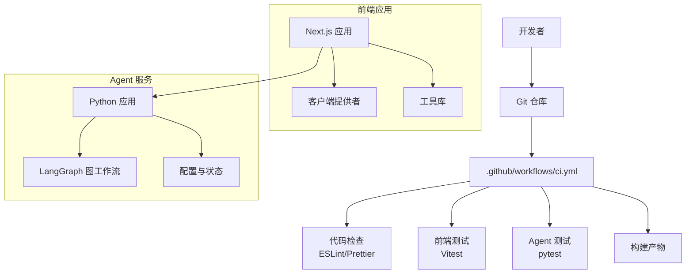
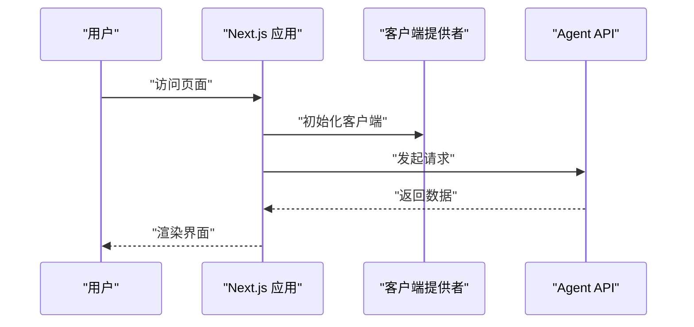
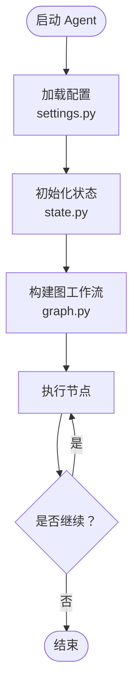
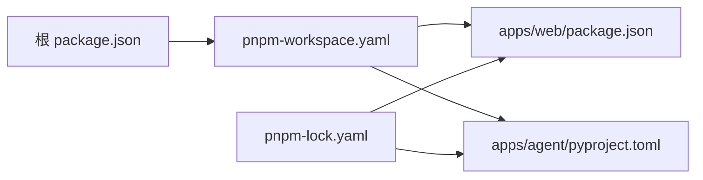

# 开发指南

<cite>
**本文引用的文件**   
- [README.md](file://README.md)
- [package.json](file://package.json)
- [pnpm-workspace.yaml](file://pnpm-workspace.yaml)
- [pnpm-lock.yaml](file://pnpm-lock.yaml)
- [.github/workflows/ci.yml](file://.github/workflows/ci.yml)
- [apps/web/package.json](file://apps/web/package.json)
- [apps/web/next.config.mjs](file://apps/web/next.config.mjs)
- [apps/web/tsconfig.json](file://apps/web/tsconfig.json)
- [apps/web/eslint.config.js](file://apps/web/eslint.config.js)
- [apps/web/prettier.config.js](file://apps/web/prettier.config.js)
- [apps/web/vitest.config.ts](file://apps/web/vitest.config.ts)
- [apps/web/src/app/layout.tsx](file://apps/web/src/app/layout.tsx)
- [apps/web/src/app/page.tsx](file://apps/web/src/app/page.tsx)
- [apps/web/src/providers/client.ts](file://apps/web/src/providers/client.ts)
- [apps/web/src/lib/utils.ts](file://apps/web/src/lib/utils.ts)
- [apps/web/scripts/smoke.mjs](file://apps/web/scripts/smoke.mjs)
- [apps/web/scripts/browser-validation.mjs](file://apps/web/scripts/browser-validation.mjs)
- [apps/agent/pyproject.toml](file://apps/agent/pyproject.toml)
- [apps/agent/langgraph.json](file://apps/agent/langgraph.json)
- [apps/agent/src/lyl_agent/settings.py](file://apps/agent/src/lyl_agent/settings.py)
- [apps/agent/src/lyl_agent/state.py](file://apps/agent/src/lyl_agent/state.py)
- [apps/agent/src/lyl_agent/graph.py](file://apps/agent/src/lyl_agent/graph.py)
- [apps/agent/tests/test_graph.py](file://apps/agent/tests/test_graph.py)
- [apps/agent/tests/test_counsel_graph.py](file://apps/agent/tests/test_counsel_graph.py)
</cite>

## 目录
1. [简介](#简介)
2. [项目结构](#项目结构)
3. [核心组件](#核心组件)
4. [架构总览](#架构总览)
5. [详细组件分析](#详细组件分析)
6. [依赖分析](#依赖分析)
7. [性能考虑](#性能考虑)
8. [故障排查指南](#故障排查指南)
9. [结论](#结论)
10. [附录](#附录)

## 简介
本指南面向参与 COS 项目的开发者，涵盖开发环境搭建、代码规范、Monorepo 结构与包管理策略、Git 工作流与分支策略、调试技巧、性能分析、代码审查流程、新功能开发标准流程与最佳实践、文档编写规范、测试要求、发布流程、团队协作约定与沟通渠道、问题报告流程以及推荐工具与环境配置模板。目标是让新成员快速上手，老成员统一协作方式，保障质量与效率。

## 项目结构
本项目采用 Monorepo 组织方式，使用 pnpm workspace 管理多个子应用与包：
- apps/web：基于 Next.js 的前端应用，包含页面、组件、提供者、工具库与脚本等。
- apps/agent：基于 Python 的 Agent 服务，使用 LangGraph 构建图式工作流，提供 API 能力。
- docs：产品需求与设计规格文档。
- .github/workflows：CI 流水线定义。

```mermaid
graph TB
subgraph "根目录"
Pkg["package.json"]
PnpmWS["pnpm-workspace.yaml"]
CI[".github/workflows/ci.yml"]
end
subgraph "apps/web"
WebPkg["apps/web/package.json"]
NextCfg["apps/web/next.config.mjs"]
TSConf["apps/web/tsconfig.json"]
ESLint["apps/web/eslint.config.js"]
Prettier["apps/web/prettier.config.js"]
Vitest["apps/web/vitest.config.ts"]
AppLayout["apps/web/src/app/layout.tsx"]
AppPage["apps/web/src/app/page.tsx"]
ClientProv["apps/web/src/providers/client.ts"]
UtilsLib["apps/web/src/lib/utils.ts"]
Smoke["apps/web/scripts/smoke.mjs"]
BrowserVal["apps/web/scripts/browser-validation.mjs"]
end
subgraph "apps/agent"
PyProj["apps/agent/pyproject.toml"]
LGConf["apps/agent/langgraph.json"]
Settings["apps/agent/src/lyl_agent/settings.py"]
State["apps/agent/src/lyl_agent/state.py"]
Graph["apps/agent/src/lyl_agent/graph.py"]
TestGraph["apps/agent/tests/test_graph.py"]
TestCounsel["apps/agent/tests/test_counsel_graph.py"]
end
Pkg --> PnpmWS
CI --> Pkg
PnpmWS --> WebPkg
PnpmWS --> PyProj
WebPkg --> NextCfg
WebPkg --> TSConf
WebPkg --> ESLint
WebPkg --> Prettier
WebPkg --> Vitest
WebPkg --> AppLayout
WebPkg --> AppPage
WebPkg --> ClientProv
WebPkg --> UtilsLib
WebPkg --> Smoke
WebPkg --> BrowserVal
PyProj --> LGConf
PyProj --> Settings
PyProj --> State
PyProj --> Graph
PyProj --> TestGraph
PyProj --> TestCounsel
```

**图表来源** 
- [package.json:1-200](file://package.json#L1-L200)
- [pnpm-workspace.yaml:1-200](file://pnpm-workspace.yaml#L1-L200)
- [.github/workflows/ci.yml:1-200](file://.github/workflows/ci.yml#L1-L200)
- [apps/web/package.json:1-200](file://apps/web/package.json#L1-L200)
- [apps/web/next.config.mjs:1-200](file://apps/web/next.config.mjs#L1-L200)
- [apps/web/tsconfig.json:1-200](file://apps/web/tsconfig.json#L1-L200)
- [apps/web/eslint.config.js:1-200](file://apps/web/eslint.config.js#L1-L200)
- [apps/web/prettier.config.js:1-200](file://apps/web/prettier.config.js#L1-L200)
- [apps/web/vitest.config.ts:1-200](file://apps/web/vitest.config.ts#L1-L200)
- [apps/web/src/app/layout.tsx:1-200](file://apps/web/src/app/layout.tsx#L1-L200)
- [apps/web/src/app/page.tsx:1-200](file://apps/web/src/app/page.tsx#L1-L200)
- [apps/web/src/providers/client.ts:1-200](file://apps/web/src/providers/client.ts#L1-L200)
- [apps/web/src/lib/utils.ts:1-200](file://apps/web/src/lib/utils.ts#L1-L200)
- [apps/web/scripts/smoke.mjs:1-200](file://apps/web/scripts/smoke.mjs#L1-L200)
- [apps/web/scripts/browser-validation.mjs:1-200](file://apps/web/scripts/browser-validation.mjs#L1-L200)
- [apps/agent/pyproject.toml:1-200](file://apps/agent/pyproject.toml#L1-L200)
- [apps/agent/langgraph.json:1-200](file://apps/agent/langgraph.json#L1-L200)
- [apps/agent/src/lyl_agent/settings.py:1-200](file://apps/agent/src/lyl_agent/settings.py#L1-L200)
- [apps/agent/src/lyl_agent/state.py:1-200](file://apps/agent/src/lyl_agent/state.py#L1-L200)
- [apps/agent/src/lyl_agent/graph.py:1-200](file://apps/agent/src/lyl_agent/graph.py#L1-L200)
- [apps/agent/tests/test_graph.py:1-200](file://apps/agent/tests/test_graph.py#L1-L200)
- [apps/agent/tests/test_counsel_graph.py:1-200](file://apps/agent/tests/test_counsel_graph.py#L1-L200)

**章节来源**
- [README.md:1-200](file://README.md#L1-L200)
- [package.json:1-200](file://package.json#L1-L200)
- [pnpm-workspace.yaml:1-200](file://pnpm-workspace.yaml#L1-L200)

## 核心组件
- 前端应用（Next.js）
  - 入口布局与页面：layout.tsx、page.tsx
  - 客户端提供者：providers/client.ts
  - 通用工具：lib/utils.ts
  - 构建与运行配置：next.config.mjs、tsconfig.json
  - 代码质量：eslint.config.js、prettier.config.js
  - 测试框架：vitest.config.ts
  - 脚本：scripts/smoke.mjs、scripts/browser-validation.mjs
- Agent 服务（Python + LangGraph）
  - 配置与依赖：pyproject.toml、langgraph.json
  - 运行时设置与状态：settings.py、state.py
  - 图与工作流：graph.py
  - 测试：tests/test_graph.py、tests/test_counsel_graph.py

**章节来源**
- [apps/web/src/app/layout.tsx:1-200](file://apps/web/src/app/layout.tsx#L1-L200)
- [apps/web/src/app/page.tsx:1-200](file://apps/web/src/app/page.tsx#L1-L200)
- [apps/web/src/providers/client.ts:1-200](file://apps/web/src/providers/client.ts#L1-L200)
- [apps/web/src/lib/utils.ts:1-200](file://apps/web/src/lib/utils.ts#L1-L200)
- [apps/web/next.config.mjs:1-200](file://apps/web/next.config.mjs#L1-L200)
- [apps/web/tsconfig.json:1-200](file://apps/web/tsconfig.json#L1-L200)
- [apps/web/eslint.config.js:1-200](file://apps/web/eslint.config.js#L1-L200)
- [apps/web/prettier.config.js:1-200](file://apps/web/prettier.config.js#L1-L200)
- [apps/web/vitest.config.ts:1-200](file://apps/web/vitest.config.ts#L1-L200)
- [apps/web/scripts/smoke.mjs:1-200](file://apps/web/scripts/smoke.mjs#L1-L200)
- [apps/web/scripts/browser-validation.mjs:1-200](file://apps/web/scripts/browser-validation.mjs#L1-L200)
- [apps/agent/pyproject.toml:1-200](file://apps/agent/pyproject.toml#L1-L200)
- [apps/agent/langgraph.json:1-200](file://apps/agent/langgraph.json#L1-L200)
- [apps/agent/src/lyl_agent/settings.py:1-200](file://apps/agent/src/lyl_agent/settings.py#L1-L200)
- [apps/agent/src/lyl_agent/state.py:1-200](file://apps/agent/src/lyl_agent/state.py#L1-L200)
- [apps/agent/src/lyl_agent/graph.py:1-200](file://apps/agent/src/lyl_agent/graph.py#L1-L200)
- [apps/agent/tests/test_graph.py:1-200](file://apps/agent/tests/test_graph.py#L1-L200)
- [apps/agent/tests/test_counsel_graph.py:1-200](file://apps/agent/tests/test_counsel_graph.py#L1-L200)

## 架构总览
整体架构由前端应用与 Agent 服务组成，通过 API 进行交互；CI 流水线负责自动化检查与测试。

**图表来源** 
- [.github/workflows/ci.yml:1-200](file://.github/workflows/ci.yml#L1-L200)
- [apps/web/package.json:1-200](file://apps/web/package.json#L1-L200)
- [apps/web/vitest.config.ts:1-200](file://apps/web/vitest.config.ts#L1-L200)
- [apps/web/eslint.config.js:1-200](file://apps/web/eslint.config.js#L1-L200)
- [apps/web/prettier.config.js:1-200](file://apps/web/prettier.config.js#L1-L200)
- [apps/agent/pyproject.toml:1-200](file://apps/agent/pyproject.toml#L1-L200)
- [apps/agent/langgraph.json:1-200](file://apps/agent/langgraph.json#L1-L200)

## 详细组件分析

### 前端应用（Next.js）
- 入口与路由
  - layout.tsx：全局布局与上下文提供者挂载点
  - page.tsx：首页或默认路由页面
- 客户端提供者
  - providers/client.ts：封装 HTTP 客户端、鉴权与错误处理
- 工具库
  - lib/utils.ts：通用工具函数与格式化逻辑
- 构建与类型
  - next.config.mjs：Next.js 构建配置
  - tsconfig.json：TypeScript 编译选项
- 代码质量
  - eslint.config.js：ESLint 规则与插件
  - prettier.config.js：代码格式化规则
- 测试
  - vitest.config.ts：Vitest 配置与测试环境
- 脚本
  - scripts/smoke.mjs：冒烟测试脚本
  - scripts/browser-validation.mjs：浏览器兼容性校验脚本

**图表来源** 
- [apps/web/src/app/layout.tsx:1-200](file://apps/web/src/app/layout.tsx#L1-L200)
- [apps/web/src/app/page.tsx:1-200](file://apps/web/src/app/page.tsx#L1-L200)
- [apps/web/src/providers/client.ts:1-200](file://apps/web/src/providers/client.ts#L1-L200)

**章节来源**
- [apps/web/src/app/layout.tsx:1-200](file://apps/web/src/app/layout.tsx#L1-L200)
- [apps/web/src/app/page.tsx:1-200](file://apps/web/src/app/page.tsx#L1-L200)
- [apps/web/src/providers/client.ts:1-200](file://apps/web/src/providers/client.ts#L1-L200)
- [apps/web/src/lib/utils.ts:1-200](file://apps/web/src/lib/utils.ts#L1-L200)
- [apps/web/next.config.mjs:1-200](file://apps/web/next.config.mjs#L1-L200)
- [apps/web/tsconfig.json:1-200](file://apps/web/tsconfig.json#L1-L200)
- [apps/web/eslint.config.js:1-200](file://apps/web/eslint.config.js#L1-L200)
- [apps/web/prettier.config.js:1-200](file://apps/web/prettier.config.js#L1-L200)
- [apps/web/vitest.config.ts:1-200](file://apps/web/vitest.config.ts#L1-L200)
- [apps/web/scripts/smoke.mjs:1-200](file://apps/web/scripts/smoke.mjs#L1-L200)
- [apps/web/scripts/browser-validation.mjs:1-200](file://apps/web/scripts/browser-validation.mjs#L1-L200)

### Agent 服务（Python + LangGraph）
- 配置与依赖
  - pyproject.toml：Python 项目元数据与依赖声明
  - langgraph.json：LangGraph 相关配置
- 运行时设置与状态
  - settings.py：环境变量与运行时参数
  - state.py：状态模型与数据结构
- 图与工作流
  - graph.py：LangGraph 图定义与节点编排
- 测试
  - tests/test_graph.py、tests/test_counsel_graph.py：工作流与业务场景测试

**图表来源** 
- [apps/agent/src/lyl_agent/settings.py:1-200](file://apps/agent/src/lyl_agent/settings.py#L1-L200)
- [apps/agent/src/lyl_agent/state.py:1-200](file://apps/agent/src/lyl_agent/state.py#L1-L200)
- [apps/agent/src/lyl_agent/graph.py:1-200](file://apps/agent/src/lyl_agent/graph.py#L1-L200)

**章节来源**
- [apps/agent/pyproject.toml:1-200](file://apps/agent/pyproject.toml#L1-L200)
- [apps/agent/langgraph.json:1-200](file://apps/agent/langgraph.json#L1-L200)
- [apps/agent/src/lyl_agent/settings.py:1-200](file://apps/agent/src/lyl_agent/settings.py#L1-L200)
- [apps/agent/src/lyl_agent/state.py:1-200](file://apps/agent/src/lyl_agent/state.py#L1-L200)
- [apps/agent/src/lyl_agent/graph.py:1-200](file://apps/agent/src/lyl_agent/graph.py#L1-L200)
- [apps/agent/tests/test_graph.py:1-200](file://apps/agent/tests/test_graph.py#L1-L200)
- [apps/agent/tests/test_counsel_graph.py:1-200](file://apps/agent/tests/test_counsel_graph.py#L1-L200)

## 依赖分析
- Monorepo 依赖管理
  - 根 package.json：定义工作区脚本与共享依赖
  - pnpm-workspace.yaml：声明工作区成员
  - pnpm-lock.yaml：锁定依赖版本，保证一致性
- 前端依赖
  - apps/web/package.json：Next.js、TypeScript、ESLint、Prettier、Vitest 等
- Agent 依赖
  - apps/agent/pyproject.toml：Python 依赖与构建配置

**图表来源** 
- [package.json:1-200](file://package.json#L1-L200)
- [pnpm-workspace.yaml:1-200](file://pnpm-workspace.yaml#L1-L200)
- [pnpm-lock.yaml:1-200](file://pnpm-lock.yaml#L1-L200)
- [apps/web/package.json:1-200](file://apps/web/package.json#L1-L200)
- [apps/agent/pyproject.toml:1-200](file://apps/agent/pyproject.toml#L1-L200)

**章节来源**
- [package.json:1-200](file://package.json#L1-L200)
- [pnpm-workspace.yaml:1-200](file://pnpm-workspace.yaml#L1-L200)
- [pnpm-lock.yaml:1-200](file://pnpm-lock.yaml#L1-L200)
- [apps/web/package.json:1-200](file://apps/web/package.json#L1-L200)
- [apps/agent/pyproject.toml:1-200](file://apps/agent/pyproject.toml#L1-L200)

## 性能考虑
- 前端性能
  - 使用 Next.js 内置优化（如按需加载、静态资源优化）
  - 避免不必要的重渲染，合理使用 React Hooks
  - 使用浏览器缓存与 CDN 加速静态资源
- Agent 性能
  - 合理设计图工作流，减少循环与冗余计算
  - 对 I/O 操作进行异步化与批量化处理
  - 监控关键指标（延迟、吞吐、错误率）

[本节为通用指导，不直接分析具体文件]

## 故障排查指南
- 常见问题定位
  - 前端构建失败：检查 TypeScript 与 ESLint 规则，确认依赖版本一致
  - 运行时错误：查看浏览器控制台与网络请求，定位 API 响应异常
  - Agent 启动失败：检查配置文件与环境变量，验证依赖安装
- 调试技巧
  - 前端：使用浏览器开发者工具断点调试，结合日志输出
  - Agent：启用详细日志，逐步执行图节点，观察状态变化
- 测试辅助
  - 使用 smoke.mjs 进行冒烟测试，确保基本功能可用
  - 使用 browser-validation.mjs 检查浏览器兼容性

**章节来源**
- [apps/web/scripts/smoke.mjs:1-200](file://apps/web/scripts/smoke.mjs#L1-L200)
- [apps/web/scripts/browser-validation.mjs:1-200](file://apps/web/scripts/browser-validation.mjs#L1-L200)
- [apps/agent/tests/test_graph.py:1-200](file://apps/agent/tests/test_graph.py#L1-L200)
- [apps/agent/tests/test_counsel_graph.py:1-200](file://apps/agent/tests/test_counsel_graph.py#L1-L200)

## 结论
本指南提供了 COS 项目的开发环境与工作流程说明，涵盖 Monorepo 结构、包管理与依赖策略、代码规范、Git 工作流、调试与性能分析、测试与发布流程、团队协作与沟通约定等。遵循本指南有助于提升团队效率与代码质量，确保项目稳定演进。

[本节为总结性内容，不直接分析具体文件]

## 附录

### 开发环境搭建
- 前置条件
  - Node.js 与 pnpm 安装
  - Python 3.x 与虚拟环境工具
- 克隆与安装
  - 克隆仓库后，在根目录执行依赖安装命令
  - 分别进入 apps/web 与 apps/agent 目录安装各自依赖
- 启动服务
  - 前端：运行开发服务器
  - Agent：根据配置启动服务

**章节来源**
- [package.json:1-200](file://package.json#L1-L200)
- [apps/web/package.json:1-200](file://apps/web/package.json#L1-L200)
- [apps/agent/pyproject.toml:1-200](file://apps/agent/pyproject.toml#L1-L200)

### 代码规范
- 前端
  - 使用 ESLint 与 Prettier 统一代码风格
  - TypeScript 严格模式开启，避免 any 滥用
- Agent
  - 遵循 Python 编码规范，使用类型提示
  - 单元测试覆盖关键路径

**章节来源**
- [apps/web/eslint.config.js:1-200](file://apps/web/eslint.config.js#L1-L200)
- [apps/web/prettier.config.js:1-200](file://apps/web/prettier.config.js#L1-L200)
- [apps/web/tsconfig.json:1-200](file://apps/web/tsconfig.json#L1-L200)

### Git 工作流与分支管理
- 分支策略
  - main：主分支，保持可发布状态
  - develop：开发分支，集成特性
  - feature/*：功能分支
  - hotfix/*：紧急修复分支
- 提交规范
  - 使用语义化提交信息，便于生成变更日志
- 合并流程
  - Pull Request 需经过代码审查与 CI 检查

**章节来源**
- [.github/workflows/ci.yml:1-200](file://.github/workflows/ci.yml#L1-L200)

### 调试技巧
- 前端
  - 使用浏览器开发者工具进行断点调试
  - 启用 Source Map 以便定位源码
- Agent
  - 启用详细日志，记录关键状态与输入输出
  - 使用交互式调试工具逐步执行图节点

**章节来源**
- [apps/web/src/providers/client.ts:1-200](file://apps/web/src/providers/client.ts#L1-L200)
- [apps/agent/src/lyl_agent/graph.py:1-200](file://apps/agent/src/lyl_agent/graph.py#L1-L200)

### 性能分析
- 前端
  - 使用浏览器性能面板分析渲染与网络请求
  - 监控关键指标（FCP、LCP、TBT）
- Agent
  - 使用性能剖析工具定位瓶颈
  - 优化 I/O 与计算密集型任务

[本节为通用指导，不直接分析具体文件]

### 代码审查流程
- 提交前自检
  - 运行本地测试与代码检查
- 审查要点
  - 代码可读性与可维护性
  - 安全性与性能影响
  - 测试覆盖率与边界情况

**章节来源**
- [apps/web/vitest.config.ts:1-200](file://apps/web/vitest.config.ts#L1-L200)
- [apps/agent/tests/test_graph.py:1-200](file://apps/agent/tests/test_graph.py#L1-L200)

### 新功能开发标准流程
- 创建功能分支
- 实现功能与单元测试
- 提交并推送至远程仓库
- 创建 Pull Request 并等待审查
- 合并至目标分支

**章节来源**
- [.github/workflows/ci.yml:1-200](file://.github/workflows/ci.yml#L1-L200)

### 文档编写规范
- 使用 Markdown 格式
- 保持文档与代码同步更新
- 包含必要的使用示例与配置说明

**章节来源**
- [README.md:1-200](file://README.md#L1-L200)

### 测试要求
- 前端
  - 使用 Vitest 编写单元测试与集成测试
- Agent
  - 使用 pytest 编写单元测试与端到端测试

**章节来源**
- [apps/web/vitest.config.ts:1-200](file://apps/web/vitest.config.ts#L1-L200)
- [apps/agent/tests/test_graph.py:1-200](file://apps/agent/tests/test_graph.py#L1-L200)
- [apps/agent/tests/test_counsel_graph.py:1-200](file://apps/agent/tests/test_counsel_graph.py#L1-L200)

### 发布流程
- 版本标记
  - 使用语义化版本号
- 构建与部署
  - 通过 CI 流水线自动构建与部署
- 回滚策略
  - 保留历史版本，支持快速回滚

**章节来源**
- [.github/workflows/ci.yml:1-200](file://.github/workflows/ci.yml#L1-L200)

### 团队协作约定
- 沟通渠道
  - 使用即时通讯工具进行日常沟通
  - 使用 Issue 跟踪问题与需求
- 会议机制
  - 定期站会与回顾会议

[本节为通用指导，不直接分析具体文件]

### 问题报告流程
- 描述问题
  - 复现步骤、预期行为与实际行为
- 提供日志
  - 收集相关日志与截图
- 提交 Issue
  - 标注优先级与标签

[本节为通用指导，不直接分析具体文件]

### 开发工具推荐
- 编辑器
  - VS Code 与插件推荐
- 命令行工具
  - pnpm、git、python 虚拟环境
- 调试工具
  - 浏览器开发者工具、Python 调试器

[本节为通用指导，不直接分析具体文件]

### 环境配置模板
- 前端
  - 环境变量与构建配置
- Agent
  - 配置文件与依赖清单

**章节来源**
- [apps/web/next.config.mjs:1-200](file://apps/web/next.config.mjs#L1-L200)
- [apps/agent/langgraph.json:1-200](file://apps/agent/langgraph.json#L1-L200)
- [apps/agent/pyproject.toml:1-200](file://apps/agent/pyproject.toml#L1-L200)