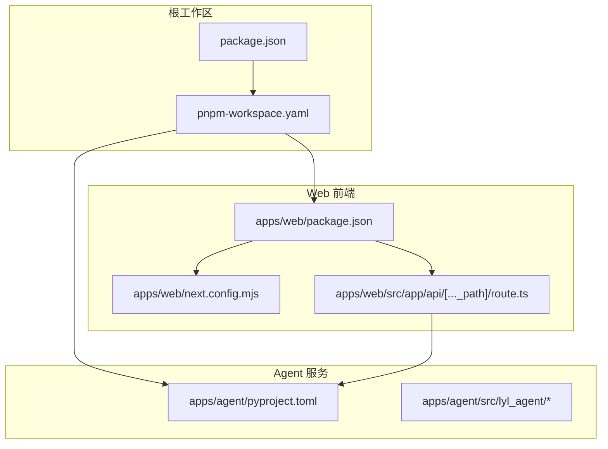
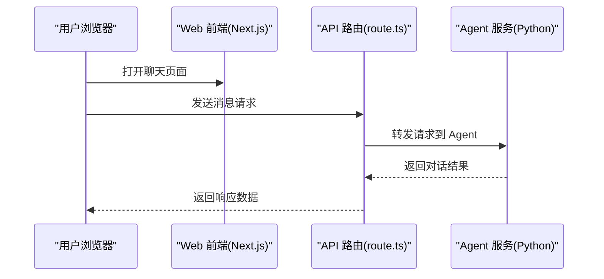
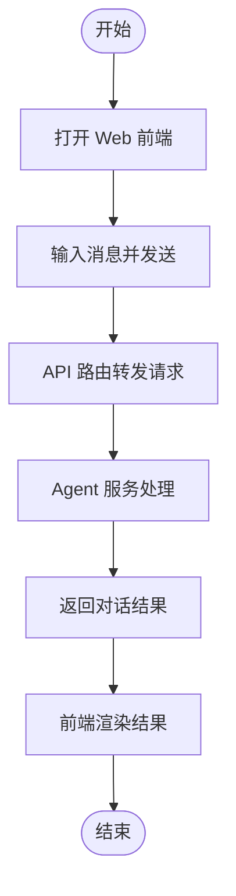
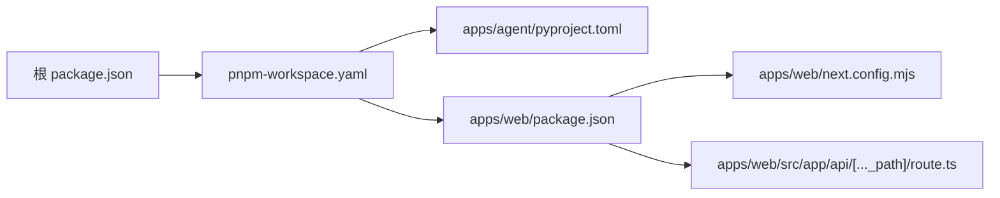

# 快速开始

<cite>
**本文引用的文件**   
- [README.md](file://README.md)
- [package.json](file://package.json)
- [pnpm-workspace.yaml](file://pnpm-workspace.yaml)
- [apps/agent/pyproject.toml](file://apps/agent/pyproject.toml)
- [apps/web/package.json](file://apps/web/package.json)
- [apps/web/next.config.mjs](file://apps/web/next.config.mjs)
- [apps/web/src/app/api/[..._path]/route.ts](file://apps/web/src/app/api/[..._path]/route.ts)
</cite>

## 目录
1. [简介](#简介)
2. [项目结构](#项目结构)
3. [核心组件](#核心组件)
4. [架构总览](#架构总览)
5. [详细组件分析](#详细组件分析)
6. [依赖分析](#依赖分析)
7. [性能考虑](#性能考虑)
8. [故障排除指南](#故障排除指南)
9. [结论](#结论)
10. [附录](#附录)

## 简介
本快速开始指南帮助你从零搭建并运行 COS 项目，包括环境准备、安装依赖、配置环境变量、启动 Agent 服务与 Web 前端，以及验证安装是否成功。内容面向初学者，同时提供必要的技术细节，确保你能顺利运行第一个对话。

## 项目结构
COS 采用多应用（Monorepo）结构：
- apps/agent：Python 实现的 Agent 服务（基于 LangGraph），负责对话图编排与工具调用。
- apps/web：Next.js 实现的前端应用，提供聊天界面并通过 API 路由转发到 Agent 服务。
- 根目录使用 pnpm workspace 管理多个子应用。

图表来源
- [package.json](file://package.json)
- [pnpm-workspace.yaml](file://pnpm-workspace.yaml)
- [apps/agent/pyproject.toml](file://apps/agent/pyproject.toml)
- [apps/web/package.json](file://apps/web/package.json)
- [apps/web/next.config.mjs](file://apps/web/next.config.mjs)
- [apps/web/src/app/api/[..._path]/route.ts](file://apps/web/src/app/api/[..._path]/route.ts)

章节来源
- [README.md](file://README.md)
- [package.json](file://package.json)
- [pnpm-workspace.yaml](file://pnpm-workspace.yaml)

## 核心组件
- Agent 服务（Python/LangGraph）
  - 通过 pyproject.toml 声明 Python 依赖与运行环境。
  - 源码位于 apps/agent/src/lyl_agent，包含图定义、模型、设置与状态管理等模块。
- Web 前端（Next.js）
  - 通过 apps/web/package.json 管理 Node.js 依赖与脚本命令。
  - next.config.mjs 配置 Next.js 行为。
  - API 路由 apps/web/src/app/api/[..._path]/route.ts 将请求转发至 Agent 服务。

章节来源
- [apps/agent/pyproject.toml](file://apps/agent/pyproject.toml)
- [apps/web/package.json](file://apps/web/package.json)
- [apps/web/next.config.mjs](file://apps/web/next.config.mjs)
- [apps/web/src/app/api/[..._path]/route.ts](file://apps/web/src/app/api/[..._path]/route.ts)

## 架构总览
整体架构由“前端 + API 路由 + Agent 服务”组成。浏览器访问 Web 前端，前端通过 API 路由代理到 Agent 服务，完成对话处理与返回。

图表来源
- [apps/web/src/app/api/[..._path]/route.ts](file://apps/web/src/app/api/[..._path]/route.ts)
- [apps/agent/pyproject.toml](file://apps/agent/pyproject.toml)

## 详细组件分析

### 环境准备
- Python
  - 版本要求以 Agent 的 pyproject.toml 为准。建议使用与项目一致的 Python 版本，并使用虚拟环境隔离依赖。
- Node.js
  - 版本要求以 Web 的 package.json 或工作区配置为准。推荐使用长期支持（LTS）版本。
- 包管理器
  - 本项目使用 pnpm 作为包管理器，需全局安装 pnpm。

章节来源
- [apps/agent/pyproject.toml](file://apps/agent/pyproject.toml)
- [apps/web/package.json](file://apps/web/package.json)
- [pnpm-workspace.yaml](file://pnpm-workspace.yaml)

### 安装步骤
1. 克隆仓库
   - 使用 Git 克隆项目到本地。
2. 安装 pnpm
   - 若未安装，请先安装 pnpm。
3. 安装依赖
   - 在项目根目录执行 pnpm install，自动安装所有子应用的依赖。
4. 配置环境变量
   - 根据 Agent 服务的需要创建 .env 文件（例如在 apps/agent 目录下），填入必要的环境变量（如 LLM 提供商密钥、端口等）。具体键名请参考 Agent 的设置模块或 README。
5. 启动 Agent 服务
   - 进入 apps/agent 目录，使用 uv 或 pip 安装 Python 依赖后，按 pyproject.toml 中定义的入口启动服务。
6. 启动 Web 前端
   - 进入 apps/web 目录，使用 pnpm dev 启动开发服务器。

章节来源
- [apps/agent/pyproject.toml](file://apps/agent/pyproject.toml)
- [apps/web/package.json](file://apps/web/package.json)
- [pnpm-workspace.yaml](file://pnpm-workspace.yaml)

### 启动命令
- 启动 Agent 服务
  - 在 apps/agent 目录下，使用 uv run 或 python -m 的方式启动（具体命令以 pyproject.toml 中的 scripts/entry 为准）。
- 启动 Web 前端
  - 在 apps/web 目录下执行 pnpm dev。

章节来源
- [apps/agent/pyproject.toml](file://apps/agent/pyproject.toml)
- [apps/web/package.json](file://apps/web/package.json)

### 基本验证
- 检查 Agent 服务
  - 访问 Agent 健康检查接口（若有）或确认服务日志无报错。
- 检查 Web 前端
  - 打开浏览器访问 http://localhost:3000，确认页面加载正常。
- 测试对话
  - 在前端输入一条消息，观察是否能收到 Agent 的回复。

章节来源
- [apps/web/src/app/api/[..._path]/route.ts](file://apps/web/src/app/api/[..._path]/route.ts)
- [apps/agent/pyproject.toml](file://apps/agent/pyproject.toml)

### 运行第一个对话（示例流程）
- 在前端聊天框输入“你好”，点击发送。
- 前端通过 API 路由转发到 Agent 服务。
- Agent 处理对话并返回结果，前端渲染显示。

[此图为概念流程图，不直接映射具体代码文件]

## 依赖分析
- 工作区依赖
  - 根目录 package.json 与 pnpm-workspace.yaml 定义了工作区结构与子应用引用。
- Agent 依赖
  - apps/agent/pyproject.toml 声明 Python 运行时与第三方库。
- Web 依赖
  - apps/web/package.json 声明 Node.js 运行时与前端依赖；next.config.mjs 配置 Next.js。

图表来源
- [package.json](file://package.json)
- [pnpm-workspace.yaml](file://pnpm-workspace.yaml)
- [apps/agent/pyproject.toml](file://apps/agent/pyproject.toml)
- [apps/web/package.json](file://apps/web/package.json)
- [apps/web/next.config.mjs](file://apps/web/next.config.mjs)
- [apps/web/src/app/api/[..._path]/route.ts](file://apps/web/src/app/api/[..._path]/route.ts)

章节来源
- [package.json](file://package.json)
- [pnpm-workspace.yaml](file://pnpm-workspace.yaml)
- [apps/agent/pyproject.toml](file://apps/agent/pyproject.toml)
- [apps/web/package.json](file://apps/web/package.json)
- [apps/web/next.config.mjs](file://apps/web/next.config.mjs)

## 性能考虑
- 使用 pnpm 缓存与并行安装，提升依赖安装速度。
- 为 Agent 服务启用合适的并发与连接池配置（依据实际部署环境调整）。
- 前端开启 Next.js 优化选项（如图片优化、代码分割）以提升加载性能。

[本节为通用建议，无需特定文件来源]

## 故障排除指南
- 无法找到 pnpm
  - 请确保已全局安装 pnpm，并在终端可用。
- Python 版本不匹配
  - 检查 pyproject.toml 指定的 Python 版本，使用对应版本的解释器或虚拟环境。
- Node.js 版本不匹配
  - 检查 apps/web/package.json 或工作区配置要求的 Node.js 版本，使用 nvm 切换版本。
- 环境变量缺失
  - 在 apps/agent 目录下创建 .env 文件，补充必要的环境变量（如 LLM 密钥、端口等）。
- 端口占用
  - 修改 Agent 或 Web 的端口配置，避免冲突。
- API 路由无法转发
  - 确认 Agent 服务已启动且地址正确，检查 route.ts 中的代理目标与路径。

章节来源
- [apps/agent/pyproject.toml](file://apps/agent/pyproject.toml)
- [apps/web/package.json](file://apps/web/package.json)
- [apps/web/src/app/api/[..._path]/route.ts](file://apps/web/src/app/api/[..._path]/route.ts)

## 结论
通过以上步骤，你应能成功搭建并运行 COS 项目。若遇到问题，可参考故障排除指南逐项排查。建议在首次运行前仔细阅读各子应用的 README 与配置文件，确保环境与依赖满足要求。

## 附录
- 常用命令速查
  - 安装依赖：pnpm install
  - 启动 Agent：在 apps/agent 下按 pyproject.toml 的入口命令运行
  - 启动 Web：在 apps/web 下执行 pnpm dev
- 相关文档
  - 产品需求与架构说明见 docs 目录下的 PRD 与 Spec 文档。

[本节为补充信息，无需特定文件来源]