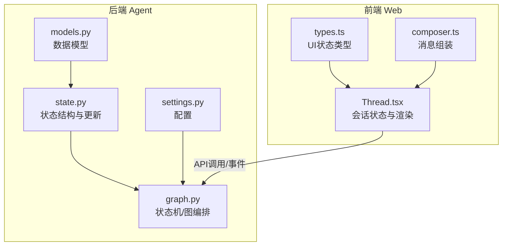
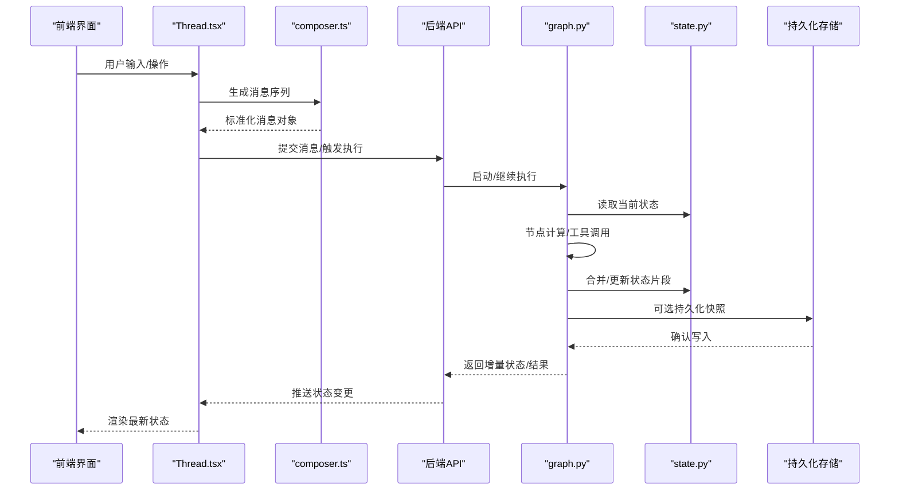
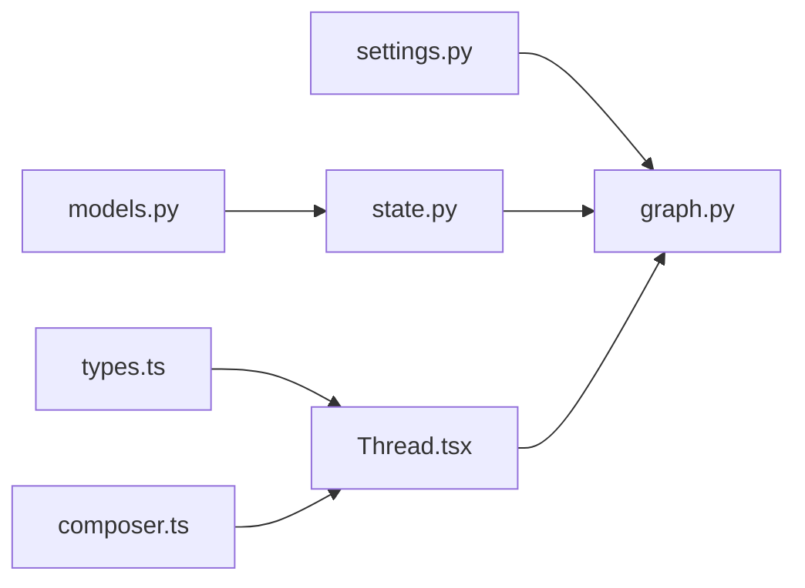

# Agent状态模型

<cite>
**本文档引用的文件**   
- [apps/agent/src/lyl_agent/state.py](file://apps/agent/src/lyl_agent/state.py)
- [apps/agent/src/lyl_agent/models.py](file://apps/agent/src/lyl_agent/models.py)
- [apps/agent/src/lyl_agent/graph.py](file://apps/agent/src/lyl_agent/graph.py)
- [apps/agent/src/lyl_agent/settings.py](file://apps/agent/src/lyl_agent/settings.py)
- [apps/web/src/components/thread/agent-inbox/types.ts](file://apps/web/src/components/thread/agent-inbox/types.ts)
- [apps/web/src/lib/composer.ts](file://apps/web/src/lib/composer.ts)
- [apps/web/src/providers/Thread.tsx](file://apps/web/src/providers/Thread.tsx)
</cite>

## 目录
1. [简介](#简介)
2. [项目结构](#项目结构)
3. [核心组件](#核心组件)
4. [架构总览](#架构总览)
5. [详细组件分析](#详细组件分析)
6. [依赖关系分析](#依赖关系分析)
7. [性能考虑](#性能考虑)
8. [故障排查指南](#故障排查指南)
9. [结论](#结论)
10. [附录](#附录)

## 简介
本文件围绕Agent运行时的“状态模型”进行系统化文档化，覆盖运行时状态结构、字段定义与数据类型、状态转换规则、验证约束与业务逻辑、持久化策略、缓存机制与性能优化、与消息的关联关系及生命周期管理，并给出状态查询、更新与同步的最佳实践，以及错误处理、状态恢复与调试技巧。目标读者包括后端开发者、前端集成者与技术负责人。

## 项目结构
与Agent状态模型直接相关的代码主要位于后端Agent应用与前端线程/收件箱模块中：
- 后端（Python）：state.py定义状态结构与更新操作；models.py定义数据模型；graph.py编排状态流转；settings.py提供配置项。
- 前端（TypeScript/React）：types.ts定义UI侧状态类型；composer.ts负责消息组装；Thread.tsx维护会话级状态与渲染。

图表来源
- [apps/agent/src/lyl_agent/state.py](file://apps/agent/src/lyl_agent/state.py)
- [apps/agent/src/lyl_agent/models.py](file://apps/agent/src/lyl_agent/models.py)
- [apps/agent/src/lyl_agent/graph.py](file://apps/agent/src/lyl_agent/graph.py)
- [apps/agent/src/lyl_agent/settings.py](file://apps/agent/src/lyl_agent/settings.py)
- [apps/web/src/components/thread/agent-inbox/types.ts](file://apps/web/src/components/thread/agent-inbox/types.ts)
- [apps/web/src/lib/composer.ts](file://apps/web/src/lib/composer.ts)
- [apps/web/src/providers/Thread.tsx](file://apps/web/src/providers/Thread.tsx)

章节来源
- [apps/agent/src/lyl_agent/state.py](file://apps/agent/src/lyl_agent/state.py)
- [apps/agent/src/lyl_agent/models.py](file://apps/agent/src/lyl_agent/models.py)
- [apps/agent/src/lyl_agent/graph.py](file://apps/agent/src/lyl_agent/graph.py)
- [apps/agent/src/lyl_agent/settings.py](file://apps/agent/src/lyl_agent/settings.py)
- [apps/web/src/components/thread/agent-inbox/types.ts](file://apps/web/src/components/thread/agent-inbox/types.ts)
- [apps/web/src/lib/composer.ts](file://apps/web/src/lib/composer.ts)
- [apps/web/src/providers/Thread.tsx](file://apps/web/src/providers/Thread.tsx)

## 核心组件
- 状态结构（State Schema）：集中定义Agent运行期所有可变字段的命名空间、默认值与类型约束，确保跨节点一致性与可序列化性。
- 数据模型（Models）：用于输入校验、输出Schema与外部交互的数据契约，通常与状态字段一一对应或作为子结构存在。
- 状态机/图编排（Graph）：基于LangGraph等框架组织节点与边，驱动状态在节点间转换，保证有向无环或受控循环的执行流。
- 配置（Settings）：控制状态持久化开关、重试策略、超时、最大步数、工具调用限制等关键参数。
- 前端状态类型（Types）：与后端状态对齐的UI层类型定义，保障前后端一致性。
- 消息组装（Composer）：将用户输入与上下文组合为Agent可消费的消息序列，影响状态中的消息历史与工具调用记录。
- 会话提供者（Thread Provider）：维护会话级状态、订阅事件、触发更新与渲染。

章节来源
- [apps/agent/src/lyl_agent/state.py](file://apps/agent/src/lyl_agent/state.py)
- [apps/agent/src/lyl_agent/models.py](file://apps/agent/src/lyl_agent/models.py)
- [apps/agent/src/lyl_agent/graph.py](file://apps/agent/src/lyl_agent/graph.py)
- [apps/agent/src/lyl_agent/settings.py](file://apps/agent/src/lyl_agent/settings.py)
- [apps/web/src/components/thread/agent-inbox/types.ts](file://apps/web/src/components/thread/agent-inbox/types.ts)
- [apps/web/src/lib/composer.ts](file://apps/web/src/lib/composer.ts)
- [apps/web/src/providers/Thread.tsx](file://apps/web/src/providers/Thread.tsx)

## 架构总览
下图展示Agent状态从前端到后端的完整链路，包括消息组装、图执行、状态更新与持久化。

图表来源
- [apps/web/src/providers/Thread.tsx](file://apps/web/src/providers/Thread.tsx)
- [apps/web/src/lib/composer.ts](file://apps/web/src/lib/composer.ts)
- [apps/agent/src/lyl_agent/graph.py](file://apps/agent/src/lyl_agent/graph.py)
- [apps/agent/src/lyl_agent/state.py](file://apps/agent/src/lyl_agent/state.py)

## 详细组件分析

### 状态结构（State Schema）
- 职责：定义Agent运行期的全局状态容器，包含消息历史、工具调用记录、中间结果、元数据、错误信息、执行进度等。
- 设计要点：
  - 使用不可变更新模式：每次节点返回“补丁”，由框架按序合并，避免并发写冲突。
  - 字段分片：将大对象拆分为只读与可写分区，减少不必要的重算与传输。
  - 类型安全：严格声明字段类型与可选性，配合校验器在边界处拦截非法输入。
  - 可序列化：所有字段需支持JSON序列化，便于日志、调试与持久化。
- 典型字段类别（示例说明，非具体实现）：
  - 消息历史：列表结构，含角色、内容、时间戳、附件等。
  - 工具调用：调用ID、名称、参数、结果、状态、错误。
  - 执行元数据：会话ID、步骤计数、开始/结束时间、重试次数。
  - 中间结果：缓存的计算产物、检索结果、摘要等。
  - 错误与中断：异常堆栈、中断原因、恢复标记。

章节来源
- [apps/agent/src/lyl_agent/state.py](file://apps/agent/src/lyl_agent/state.py)

### 数据模型（Models）
- 职责：对外暴露的输入/输出契约，常用于API请求体、响应体、工具参数与返回值。
- 设计要点：
  - 与状态字段映射清晰，避免歧义。
  - 使用校验库（如Pydantic/Zod）在边界进行强校验。
  - 版本化：对破坏性变更采用版本号或兼容字段。
- 常见模型：
  - 消息模型：文本、富媒体、结构化数据。
  - 工具调用模型：名称、参数Schema、结果Schema。
  - 会话模型：会话标识、创建时间、状态、权限。

章节来源
- [apps/agent/src/lyl_agent/models.py](file://apps/agent/src/lyl_agent/models.py)
- [apps/web/src/components/thread/agent-inbox/types.ts](file://apps/web/src/components/thread/agent-inbox/types.ts)

### 状态机/图编排（Graph）
- 职责：组织节点与边，定义状态转换规则与条件分支，协调工具调用与外部服务。
- 设计要点：
  - 明确入口与出口节点，保证状态收敛。
  - 条件路由：根据状态字段决定下一步。
  - 容错与重试：失败路径回退、补偿与降级。
  - 可观测性：节点耗时、状态差异、错误上报。
- 典型流程：
  - 接收消息 -> 解析与校验 -> 检索/规划 -> 工具调用 -> 汇总输出 -> 持久化。

章节来源
- [apps/agent/src/lyl_agent/graph.py](file://apps/agent/src/lyl_agent/graph.py)
- [apps/agent/src/lyl_agent/settings.py](file://apps/agent/src/lyl_agent/settings.py)

### 配置（Settings）
- 职责：集中管理状态持久化开关、最大步数、超时、重试、工具限制、日志级别等。
- 关键点：
  - 环境隔离：开发/测试/生产不同配置。
  - 动态生效：热重载或重启策略。
  - 安全敏感项加密存储。

章节来源
- [apps/agent/src/lyl_agent/settings.py](file://apps/agent/src/lyl_agent/settings.py)

### 前端状态类型（Types）
- 职责：定义UI层状态结构，与后端保持一致，支撑渲染与交互。
- 关键点：
  - 与后端模型双向映射。
  - 增量更新：仅渲染变化部分。
  - 乐观更新：先本地更新，再异步确认。

章节来源
- [apps/web/src/components/thread/agent-inbox/types.ts](file://apps/web/src/components/thread/agent-inbox/types.ts)

### 消息组装（Composer）
- 职责：将用户输入与上下文拼装为Agent可消费的消息序列，处理富媒体与工具调用上下文。
- 关键点：
  - 去重与合并：避免重复消息。
  - 截断与压缩：控制消息长度，降低开销。
  - 版本兼容：新旧格式自动适配。

章节来源
- [apps/web/src/lib/composer.ts](file://apps/web/src/lib/composer.ts)

### 会话提供者（Thread Provider）
- 职责：维护会话级状态、订阅事件、触发更新、渲染最新状态。
- 关键点：
  - 事件驱动：增量更新，避免全量刷新。
  - 错误边界：捕获异常并提示用户。
  - 离线与恢复：本地缓存与重试队列。

章节来源
- [apps/web/src/providers/Thread.tsx](file://apps/web/src/providers/Thread.tsx)

## 依赖关系分析
- 耦合关系：
  - graph.py依赖state.py的状态读写与合并策略。
  - models.py为state.py与API层的契约基础。
  - settings.py影响graph.py的执行策略与state.py的持久化行为。
  - 前端types.ts与后端models.py需保持同步。
- 潜在循环依赖：
  - 避免state.py与graph.py互相导入，通过接口或事件解耦。
- 外部依赖：
  - 持久化存储（数据库/对象存储）。
  - 消息总线/事件流（用于增量同步）。

图表来源
- [apps/agent/src/lyl_agent/settings.py](file://apps/agent/src/lyl_agent/settings.py)
- [apps/agent/src/lyl_agent/graph.py](file://apps/agent/src/lyl_agent/graph.py)
- [apps/agent/src/lyl_agent/state.py](file://apps/agent/src/lyl_agent/state.py)
- [apps/agent/src/lyl_agent/models.py](file://apps/agent/src/lyl_agent/models.py)
- [apps/web/src/components/thread/agent-inbox/types.ts](file://apps/web/src/components/thread/agent-inbox/types.ts)
- [apps/web/src/lib/composer.ts](file://apps/web/src/lib/composer.ts)
- [apps/web/src/providers/Thread.tsx](file://apps/web/src/providers/Thread.tsx)

章节来源
- [apps/agent/src/lyl_agent/graph.py](file://apps/agent/src/lyl_agent/graph.py)
- [apps/agent/src/lyl_agent/state.py](file://apps/agent/src/lyl_agent/state.py)
- [apps/agent/src/lyl_agent/models.py](file://apps/agent/src/lyl_agent/models.py)
- [apps/agent/src/lyl_agent/settings.py](file://apps/agent/src/lyl_agent/settings.py)
- [apps/web/src/components/thread/agent-inbox/types.ts](file://apps/web/src/components/thread/agent-inbox/types.ts)
- [apps/web/src/lib/composer.ts](file://apps/web/src/lib/composer.ts)
- [apps/web/src/providers/Thread.tsx](file://apps/web/src/providers/Thread.tsx)

## 性能考虑
- 状态合并策略：
  - 使用增量补丁而非全量替换，减少内存与网络开销。
  - 对大字段采用懒加载与分页。
- 缓存机制：
  - 热点数据（如检索结果、工具输出）短期缓存，设置TTL与失效策略。
  - 前端乐观更新+服务端确认，提升交互流畅度。
- 执行优化：
  - 限制最大步数与工具调用次数，防止无限循环。
  - 并行化独立节点，串行化共享状态节点。
- 序列化与传输：
  - 压缩消息与二进制附件。
  - 使用高效编码（如Protobuf/MessagePack）替代JSON（视需求）。
- 可观测性：
  - 记录关键指标：节点耗时、状态大小、错误率、重试次数。

[本节为通用指导，不直接分析具体文件]

## 故障排查指南
- 常见问题定位：
  - 状态不一致：检查合并策略与并发写保护。
  - 工具调用失败：查看调用记录与错误堆栈，确认参数校验。
  - 持久化失败：检查存储连接、权限与事务回滚。
- 恢复策略：
  - 基于快照恢复最近有效状态。
  - 重放失败节点，幂等处理副作用。
- 调试技巧：
  - 启用详细日志与状态差异对比。
  - 使用回放工具重现问题场景。
  - 前端开启网络面板与状态快照导出。

章节来源
- [apps/agent/src/lyl_agent/graph.py](file://apps/agent/src/lyl_agent/graph.py)
- [apps/agent/src/lyl_agent/state.py](file://apps/agent/src/lyl_agent/state.py)
- [apps/web/src/providers/Thread.tsx](file://apps/web/src/providers/Thread.tsx)

## 结论
Agent状态模型是系统稳定与可扩展的核心。通过清晰的字段定义、严格的类型校验、可控的状态转换与高效的持久化策略，可实现高可靠、高性能的Agent运行环境。建议持续完善可观测性、错误恢复与性能监控，确保在生产环境中稳定运行。

[本节为总结性内容，不直接分析具体文件]

## 附录
- 最佳实践清单：
  - 状态字段最小化与分片。
  - 增量更新与乐观渲染。
  - 幂等工具与补偿机制。
  - 版本化与向后兼容。
  - 全面日志与指标采集。
- 参考实现位置：
  - 状态定义：state.py
  - 数据模型：models.py
  - 状态机：graph.py
  - 配置：settings.py
  - 前端类型：types.ts
  - 消息组装：composer.ts
  - 会话管理：Thread.tsx

[本节为补充信息，不直接分析具体文件]