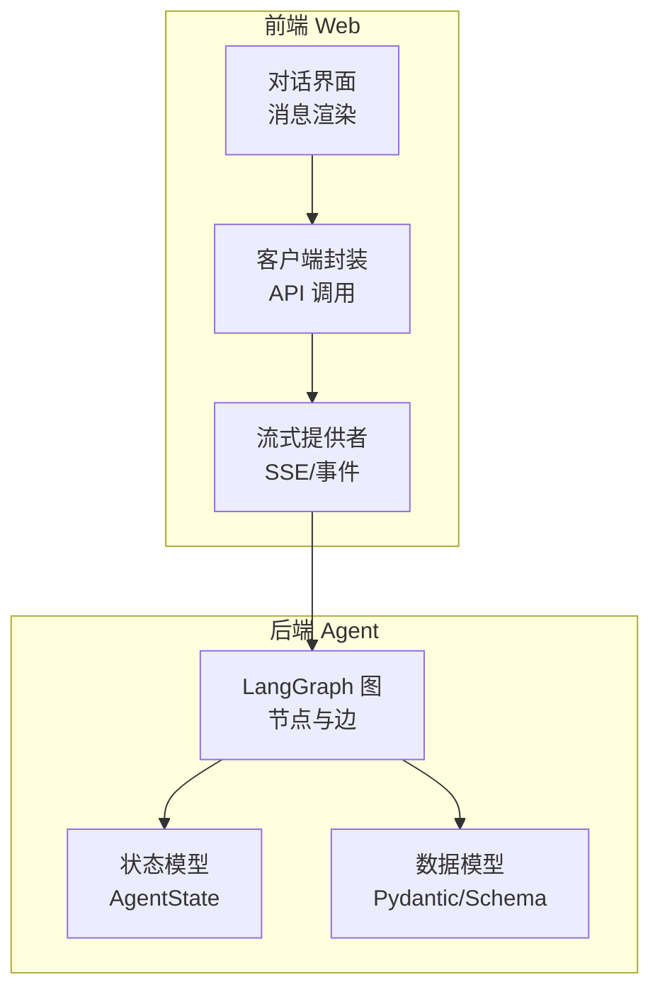
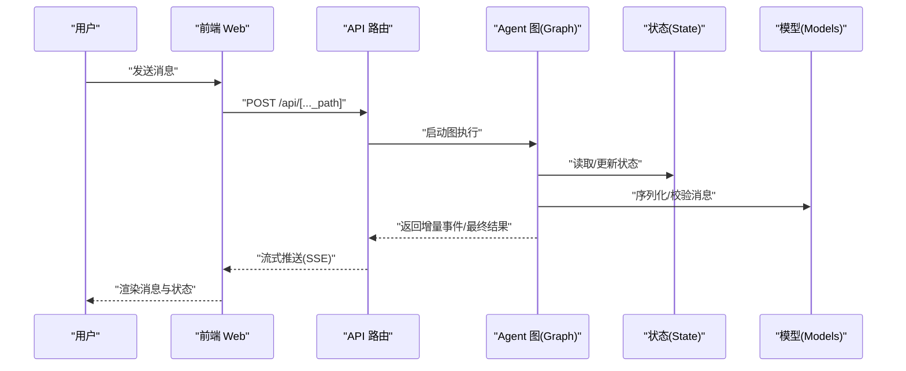
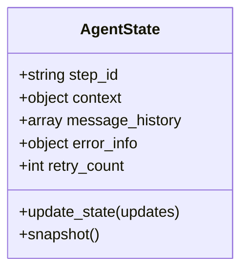
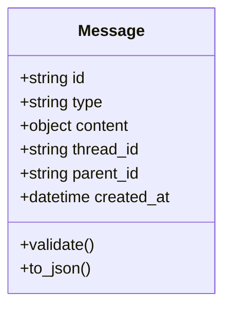
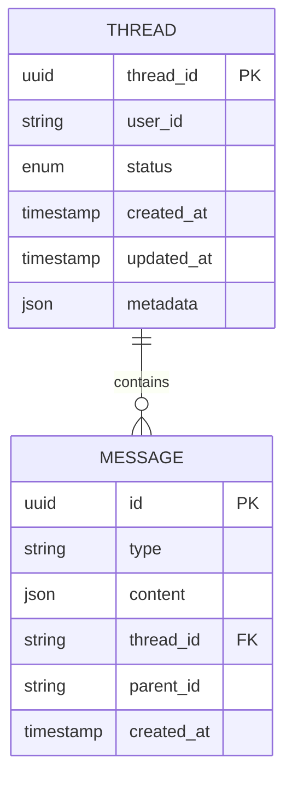
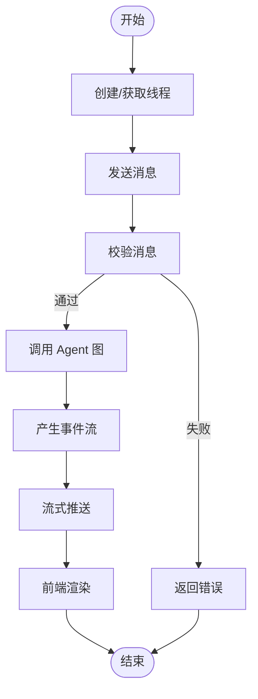
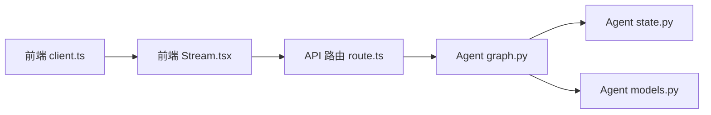

# 数据模型

<cite>
**本文引用的文件**   
- [apps/agent/src/lyl_agent/models.py](file://apps/agent/src/lyl_agent/models.py)
- [apps/agent/src/lyl_agent/state.py](file://apps/agent/src/lyl_agent/state.py)
- [apps/agent/src/lyl_agent/graph.py](file://apps/agent/src/lyl_agent/graph.py)
- [apps/web/src/app/api/[..._path]/route.ts](file://apps/web/src/app/api/[..._path]/route.ts)
- [apps/web/src/components/thread/agent-inbox/types.ts](file://apps/web/src/components/thread/agent-inbox/types.ts)
- [apps/web/src/lib/composer.ts](file://apps/web/src/lib/composer.ts)
- [apps/web/src/providers/Stream.tsx](file://apps/web/src/providers/Stream.tsx)
- [apps/web/src/providers/client.ts](file://apps/web/src/providers/client.ts)
</cite>

## 目录
1. [简介](#简介)
2. [项目结构](#项目结构)
3. [核心组件](#核心组件)
4. [架构总览](#架构总览)
5. [详细组件分析](#详细组件分析)
6. [依赖关系分析](#依赖关系分析)
7. [性能考虑](#性能考虑)
8. [故障排查指南](#故障排查指南)
9. [结论](#结论)
10. [附录](#附录)

## 简介
本文件为项目的数据模型文档，聚焦于 Agent 状态模型、消息模型与用户会话模型的设计与实现。内容涵盖实体关系、字段定义与类型、主键/外键与约束、索引策略、数据验证与业务规则、数据库模式图与示例数据、数据访问模式与缓存策略、性能考量、数据生命周期与归档、迁移路径与版本管理，以及数据安全、隐私与访问控制等。

## 项目结构
本项目采用前后端分离的架构：
- 后端（Agent）：基于 Python 的 LangGraph 工作流，负责状态机、工具调用与消息编排。
- 前端（Web）：Next.js 应用，提供对话界面、消息渲染、中断处理与流式响应展示。

图表来源 
- [apps/web/src/providers/Stream.tsx](file://apps/web/src/providers/Stream.tsx)
- [apps/web/src/providers/client.ts](file://apps/web/src/providers/client.ts)
- [apps/agent/src/lyl_agent/graph.py](file://apps/agent/src/lyl_agent/graph.py)
- [apps/agent/src/lyl_agent/state.py](file://apps/agent/src/lyl_agent/state.py)
- [apps/agent/src/lyl_agent/models.py](file://apps/agent/src/lyl_agent/models.py)

章节来源
- [apps/agent/src/lyl_agent/models.py](file://apps/agent/src/lyl_agent/models.py)
- [apps/agent/src/lyl_agent/state.py](file://apps/agent/src/lyl_agent/state.py)
- [apps/agent/src/lyl_agent/graph.py](file://apps/agent/src/lyl_agent/graph.py)
- [apps/web/src/app/api/[..._path]/route.ts](file://apps/web/src/app/api/[..._path]/route.ts)
- [apps/web/src/components/thread/agent-inbox/types.ts](file://apps/web/src/components/thread/agent-inbox/types.ts)
- [apps/web/src/lib/composer.ts](file://apps/web/src/lib/composer.ts)
- [apps/web/src/providers/Stream.tsx](file://apps/web/src/providers/Stream.tsx)
- [apps/web/src/providers/client.ts](file://apps/web/src/providers/client.ts)

## 核心组件
- Agent 状态模型（AgentState）：描述一次对话或任务执行过程中的全局上下文，包括当前步骤、中间结果、工具调用历史、错误信息等。
- 消息模型（Message）：表示用户输入、系统回复、工具调用请求与响应等结构化消息。
- 会话模型（Thread/Session）：表示一次完整的对话线程，包含消息序列、元数据（创建时间、更新时间、状态）、以及可选的扩展字段。

章节来源
- [apps/agent/src/lyl_agent/state.py](file://apps/agent/src/lyl_agent/state.py)
- [apps/agent/src/lyl_agent/models.py](file://apps/agent/src/lyl_agent/models.py)
- [apps/web/src/components/thread/agent-inbox/types.ts](file://apps/web/src/components/thread/agent-inbox/types.ts)

## 架构总览
下图展示了从前端到后端的端到端数据流，重点体现消息与状态的流转：

图表来源 
- [apps/web/src/app/api/[..._path]/route.ts](file://apps/web/src/app/api/[..._path]/route.ts)
- [apps/agent/src/lyl_agent/graph.py](file://apps/agent/src/lyl_agent/graph.py)
- [apps/agent/src/lyl_agent/state.py](file://apps/agent/src/lyl_agent/state.py)
- [apps/agent/src/lyl_agent/models.py](file://apps/agent/src/lyl_agent/models.py)

## 详细组件分析

### Agent 状态模型（AgentState）
- 设计目标：以不可变或可合并的状态更新方式驱动图执行，确保状态变更可追踪、可回放。
- 关键字段（概念性说明）：
  - 步骤标识：当前执行的节点/阶段
  - 上下文数据：工具调用参数、中间结果、检索结果
  - 消息历史：已生成的消息列表（用于上下文拼接）
  - 错误与重试：异常信息、重试次数、退避策略
- 状态更新策略：
  - 使用函数式更新或合并策略，避免竞态条件
  - 对关键路径进行快照，支持断点恢复
- 复杂度与性能：
  - 状态大小随消息增长线性增长，需分页或裁剪历史
  - 建议对热点字段建立内存缓存（如最近 N 条消息摘要）

图表来源 
- [apps/agent/src/lyl_agent/state.py](file://apps/agent/src/lyl_agent/state.py)

章节来源
- [apps/agent/src/lyl_agent/state.py](file://apps/agent/src/lyl_agent/state.py)

### 消息模型（Message）
- 设计目标：统一表达用户输入、系统输出、工具调用与响应，便于跨端一致渲染与存储。
- 关键字段（概念性说明）：
  - 类型：user、assistant、tool_call、tool_result、system
  - 内容：文本、富媒体、结构化数据
  - 关联：所属线程 ID、父消息 ID、时间戳
  - 元数据：来源、签名、版本
- 验证规则：
  - 必填字段校验（type、content、thread_id）
  - 长度限制与格式校验（如 JSON 结构）
  - 安全过滤（敏感词、注入检测）

图表来源 
- [apps/agent/src/lyl_agent/models.py](file://apps/agent/src/lyl_agent/models.py)
- [apps/web/src/components/thread/agent-inbox/types.ts](file://apps/web/src/components/thread/agent-inbox/types.ts)

章节来源
- [apps/agent/src/lyl_agent/models.py](file://apps/agent/src/lyl_agent/models.py)
- [apps/web/src/components/thread/agent-inbox/types.ts](file://apps/web/src/components/thread/agent-inbox/types.ts)

### 用户会话模型（Thread/Session）
- 设计目标：承载一次完整对话的生命周期，聚合消息与元数据，支持查询、回溯与统计。
- 关键字段（概念性说明）：
  - 标识：thread_id（主键）
  - 状态：active、completed、archived
  - 元数据：用户 ID、标签、语言、来源
  - 时间：created_at、updated_at
- 索引与约束：
  - 主键：thread_id
  - 索引：user_id、created_at、status
  - 唯一性：thread_id 唯一
- 生命周期：
  - 创建：首次消息到达时生成
  - 活跃：持续接收消息并更新 updated_at
  - 归档：达到阈值或手动触发后归档

图表来源 
- [apps/agent/src/lyl_agent/models.py](file://apps/agent/src/lyl_agent/models.py)
- [apps/web/src/components/thread/agent-inbox/types.ts](file://apps/web/src/components/thread/agent-inbox/types.ts)

章节来源
- [apps/agent/src/lyl_agent/models.py](file://apps/agent/src/lyl_agent/models.py)
- [apps/web/src/components/thread/agent-inbox/types.ts](file://apps/web/src/components/thread/agent-inbox/types.ts)

### 数据访问模式与流式处理
- 前端通过 SSE/事件流订阅后端增量输出，降低首屏延迟。
- 后端将状态更新与消息生成拆分为事件，逐步推送。
- 客户端维护本地消息队列，保证顺序与去重。

图表来源 
- [apps/web/src/app/api/[..._path]/route.ts](file://apps/web/src/app/api/[..._path]/route.ts)
- [apps/web/src/providers/Stream.tsx](file://apps/web/src/providers/Stream.tsx)
- [apps/web/src/lib/composer.ts](file://apps/web/src/lib/composer.ts)

章节来源
- [apps/web/src/app/api/[..._path]/route.ts](file://apps/web/src/app/api/[..._path]/route.ts)
- [apps/web/src/providers/Stream.tsx](file://apps/web/src/providers/Stream.tsx)
- [apps/web/src/lib/composer.ts](file://apps/web/src/lib/composer.ts)

## 依赖关系分析
- 前端依赖：
  - 客户端封装（client.ts）负责 API 调用与会话管理
  - 流式提供者（Stream.tsx）处理 SSE/事件解析
  - 组件类型（types.ts）定义消息与 UI 交互结构
- 后端依赖：
  - 图（graph.py）协调状态与模型，执行业务逻辑
  - 状态（state.py）提供状态读写与快照
  - 模型（models.py）定义数据结构与校验

图表来源 
- [apps/web/src/providers/client.ts](file://apps/web/src/providers/client.ts)
- [apps/web/src/providers/Stream.tsx](file://apps/web/src/providers/Stream.tsx)
- [apps/web/src/app/api/[..._path]/route.ts](file://apps/web/src/app/api/[..._path]/route.ts)
- [apps/agent/src/lyl_agent/graph.py](file://apps/agent/src/lyl_agent/graph.py)
- [apps/agent/src/lyl_agent/state.py](file://apps/agent/src/lyl_agent/state.py)
- [apps/agent/src/lyl_agent/models.py](file://apps/agent/src/lyl_agent/models.py)

章节来源
- [apps/web/src/providers/client.ts](file://apps/web/src/providers/client.ts)
- [apps/web/src/providers/Stream.tsx](file://apps/web/src/providers/Stream.tsx)
- [apps/web/src/app/api/[..._path]/route.ts](file://apps/web/src/app/api/[..._path]/route.ts)
- [apps/agent/src/lyl_agent/graph.py](file://apps/agent/src/lyl_agent/graph.py)
- [apps/agent/src/lyl_agent/state.py](file://apps/agent/src/lyl_agent/state.py)
- [apps/agent/src/lyl_agent/models.py](file://apps/agent/src/lyl_agent/models.py)

## 性能考虑
- 状态裁剪：对长历史消息进行摘要或分页加载，减少传输与渲染开销。
- 索引优化：对 thread_id、user_id、created_at 建立索引，提升查询效率。
- 缓存策略：
  - 热数据缓存：最近消息与常用工具结果
  - 反压机制：限制并发与批量提交
- 流式优化：增量事件拆分、去重与合并，避免抖动。

[本节为通用指导，不直接分析具体文件]

## 故障排查指南
- 常见错误：
  - 消息校验失败：检查类型、内容与必填字段
  - 状态不一致：核对快照与更新顺序
  - 流式中断：检查网络与 SSE 连接
- 定位方法：
  - 启用调试日志，记录状态快照与事件序列
  - 前端控制台查看事件流与消息队列
  - 后端监控图执行路径与节点耗时

章节来源
- [apps/agent/src/lyl_agent/state.py](file://apps/agent/src/lyl_agent/state.py)
- [apps/agent/src/lyl_agent/models.py](file://apps/agent/src/lyl_agent/models.py)
- [apps/web/src/providers/Stream.tsx](file://apps/web/src/providers/Stream.tsx)

## 结论
本数据模型围绕 Agent 状态、消息与会话三大核心实体构建，强调一致性、可追溯性与可扩展性。通过流式处理与合理的索引/缓存策略，保障高吞吐与低延迟。后续应完善数据迁移与版本管理，强化安全与隐私控制，以满足生产环境要求。

[本节为总结性内容，不直接分析具体文件]

## 附录

### 数据验证规则与业务规则
- 消息类型枚举：user、assistant、tool_call、tool_result、system
- 内容格式：文本、JSON 对象、富媒体链接
- 业务规则：
  - 同一线程内消息有序
  - 工具调用必须配对请求与响应
  - 错误消息需附带可恢复提示

章节来源
- [apps/agent/src/lyl_agent/models.py](file://apps/agent/src/lyl_agent/models.py)
- [apps/web/src/components/thread/agent-inbox/types.ts](file://apps/web/src/components/thread/agent-inbox/types.ts)

### 数据库模式图与示例数据
- 模式图：见“用户会话模型”中的 ER 图
- 示例数据（概念性）：
  - 线程：thread_id=abc123, user_id=u001, status=active
  - 消息：id=m001, type=user, content="你好", thread_id=abc123

[本节为概念性示例，不直接分析具体文件]

### 数据生命周期、保留策略与归档规则
- 生命周期：创建→活跃→归档
- 保留策略：按用户与合规要求设置保留期
- 归档规则：冷数据压缩与离线存储，支持按需恢复

[本节为通用指导，不直接分析具体文件]

### 数据迁移路径与版本管理
- 迁移策略：向后兼容的增量迁移，保留旧字段映射
- 版本管理：模型版本号与兼容性矩阵
- 回滚方案：快照与回滚脚本

[本节为通用指导，不直接分析具体文件]

### 数据安全、隐私与访问控制
- 加密：传输层 TLS，敏感字段静态加密
- 脱敏：日志与导出中隐藏敏感信息
- 访问控制：基于角色的权限（RBAC），最小权限原则
- 审计：操作日志与访问审计

[本节为通用指导，不直接分析具体文件]