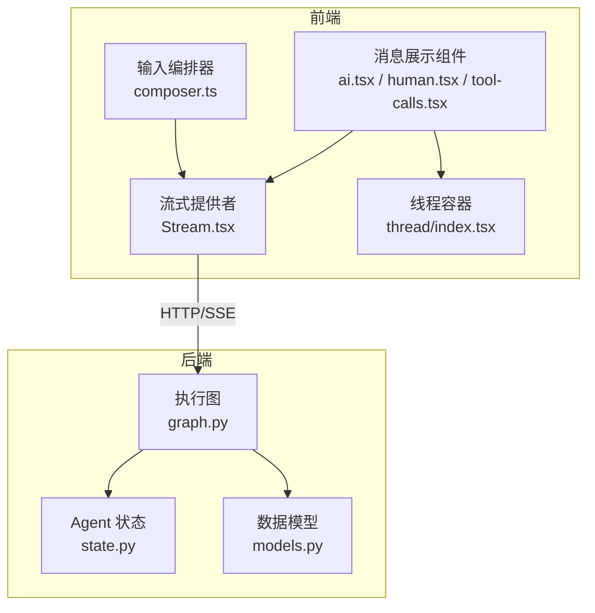
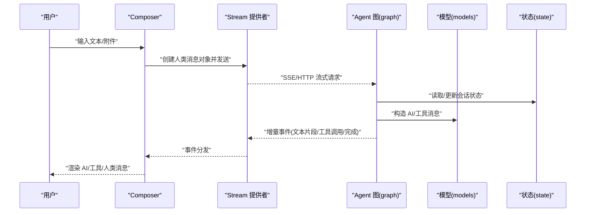
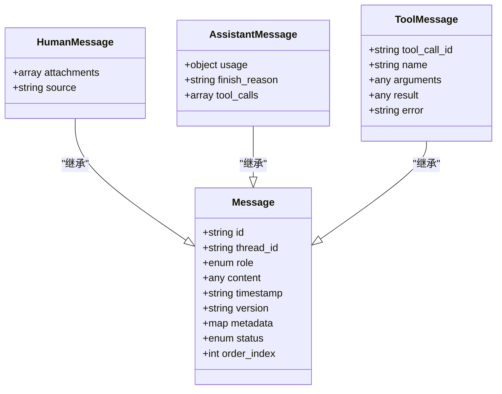
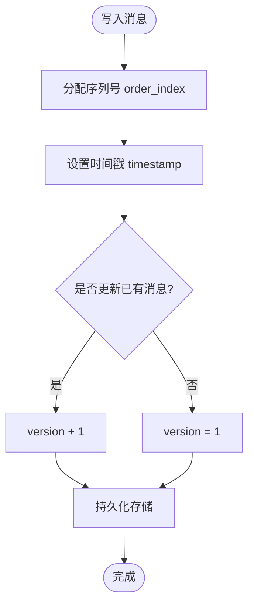
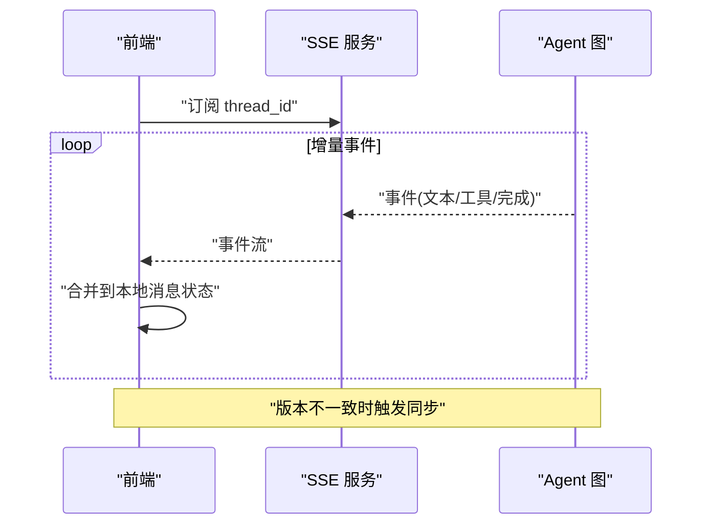
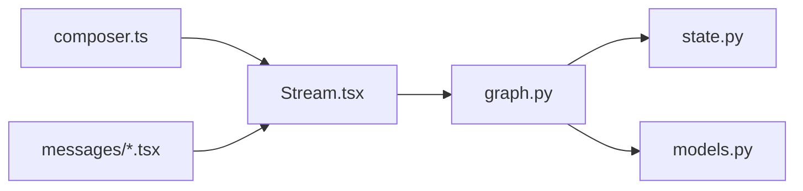

# 消息数据模型

<cite>
**本文引用的文件**   
- [apps/web/src/components/thread/messages/ai.tsx](file://apps/web/src/components/thread/messages/ai.tsx)
- [apps/web/src/components/thread/messages/human.tsx](file://apps/web/web/src/components/thread/messages/human.tsx)
- [apps/web/src/components/thread/messages/tool-calls.tsx](file://apps/web/src/components/thread/messages/tool-calls.tsx)
- [apps/web/src/components/thread/messages/shared.tsx](file://apps/web/src/components/thread/messages/shared.tsx)
- [apps/web/src/components/thread/index.tsx](file://apps/web/src/components/thread/index.tsx)
- [apps/web/src/providers/Stream.tsx](file://apps/web/src/providers/Stream.tsx)
- [apps/web/src/lib/composer.ts](file://apps/web/src/lib/composer.ts)
- [apps/agent/src/lyl_agent/models.py](file://apps/agent/src/lyl_agent/models.py)
- [apps/agent/src/lyl_agent/state.py](file://apps/agent/src/lyl_agent/state.py)
- [apps/agent/src/lyl_agent/graph.py](file://apps/agent/src/lyl_agent/graph.py)
</cite>

## 目录
1. [简介](#简介)
2. [项目结构](#项目结构)
3. [核心组件](#核心组件)
4. [架构总览](#架构总览)
5. [详细组件分析](#详细组件分析)
6. [依赖关系分析](#依赖关系分析)
7. [性能考量](#性能考量)
8. [故障排查指南](#故障排查指南)
9. [结论](#结论)
10. [附录](#附录)

## 简介
本文件面向“消息数据模型”的完整说明，覆盖消息实体结构、字段定义与数据类型；区分人类消息、AI消息、工具调用等类型及其共同属性；解释序列号、时间戳与版本控制机制；给出存储格式、索引策略与查询优化建议；并涵盖流式传输、实时同步与冲突解决；最后提供搜索、过滤、分页的实现指南与安全与访问控制要点。文档基于仓库中的前端消息展示组件、流式提供者、Composer 以及 Agent 侧的状态与模型定义进行归纳与提炼，确保与实际实现一致。

## 项目结构
本项目采用前后端分离：
- 前端（Next.js）负责消息渲染、流式接收、用户输入与交互。
- 后端（LangGraph Agent）负责状态管理、图执行与消息生命周期。

**图表来源** 
- [apps/web/src/components/thread/index.tsx](file://apps/web/src/components/thread/index.tsx)
- [apps/web/src/providers/Stream.tsx](file://apps/web/src/providers/Stream.tsx)
- [apps/web/src/lib/composer.ts](file://apps/web/src/lib/composer.ts)
- [apps/agent/src/lyl_agent/state.py](file://apps/agent/src/lyl_agent/state.py)
- [apps/agent/src/lyl_agent/models.py](file://apps/agent/src/lyl_agent/models.py)
- [apps/agent/src/lyl_agent/graph.py](file://apps/agent/src/lyl_agent/graph.py)

**章节来源**
- [apps/web/src/components/thread/index.tsx](file://apps/web/src/components/thread/index.tsx)
- [apps/web/src/providers/Stream.tsx](file://apps/web/src/providers/Stream.tsx)
- [apps/web/src/lib/composer.ts](file://apps/web/src/lib/composer.ts)
- [apps/agent/src/lyl_agent/state.py](file://apps/agent/src/lyl_agent/state.py)
- [apps/agent/src/lyl_agent/models.py](file://apps/agent/src/lyl_agent/models.py)
- [apps/agent/src/lyl_agent/graph.py](file://apps/agent/src/lyl_agent/graph.py)

## 核心组件
- 消息展示组件：分别处理人类消息、AI消息、工具调用消息的渲染与交互。
- 流式提供者：负责从服务端拉取增量事件，更新本地消息状态。
- Composer：封装用户输入到消息对象的转换与发送流程。
- Agent 状态与模型：定义消息在图执行过程中的数据结构与流转规则。

**章节来源**
- [apps/web/src/components/thread/messages/ai.tsx](file://apps/web/src/components/thread/messages/ai.tsx)
- [apps/web/src/components/thread/messages/human.tsx](file://apps/web/src/components/thread/messages/human.tsx)
- [apps/web/src/components/thread/messages/tool-calls.tsx](file://apps/web/src/components/thread/messages/tool-calls.tsx)
- [apps/web/src/providers/Stream.tsx](file://apps/web/src/providers/Stream.tsx)
- [apps/web/src/lib/composer.ts](file://apps/web/src/lib/composer.ts)
- [apps/agent/src/lyl_agent/state.py](file://apps/agent/src/lyl_agent/state.py)
- [apps/agent/src/lyl_agent/models.py](file://apps/agent/src/lyl_agent/models.py)

## 架构总览
消息数据模型贯穿“输入—编排—执行—输出—展示”的全链路。前端通过 Composer 将用户输入转换为标准消息对象，经由 Stream 提供者以流式方式推送至后端；后端在 LangGraph 图中根据状态机推进，生成 AI 回复或工具调用结果，再回推给前端进行增量渲染。

**图表来源** 
- [apps/web/src/lib/composer.ts](file://apps/web/src/lib/composer.ts)
- [apps/web/src/providers/Stream.tsx](file://apps/web/src/providers/Stream.tsx)
- [apps/agent/src/lyl_agent/graph.py](file://apps/agent/src/lyl_agent/graph.py)
- [apps/agent/src/lyl_agent/models.py](file://apps/agent/src/lyl_agent/models.py)
- [apps/agent/src/lyl_agent/state.py](file://apps/agent/src/lyl_agent/state.py)

## 详细组件分析

### 消息实体结构与字段定义
- 通用字段
  - id：消息唯一标识（建议 UUID），用于定位与去重。
  - thread_id：所属对话线程标识，用于多会话隔离。
  - role：角色枚举（human、assistant、tool、system）。
  - content：消息内容载体，支持纯文本、结构化块（如代码、图片、文件链接等）。
  - timestamp：创建时间（UTC ISO 字符串），用于排序与审计。
  - version：版本号（整数或语义化版本），用于乐观锁与冲突合并。
  - metadata：扩展元数据（键值对），可存放来源、标签、权限标记等。
  - status：状态（pending、sending、sent、failed、cancelled），用于前端展示与重试。
  - order_index：序列号（整数），保证同一线程内消息顺序稳定。
- 人类消息（human）
  - 特有字段：attachments（附件列表）、source（来源渠道）。
- AI 消息（assistant）
  - 特有字段：usage（用量统计，如 token 计数）、finish_reason（结束原因）、tool_calls（关联的工具调用 ID 列表）。
- 工具调用消息（tool）
  - 特有字段：tool_call_id、name、arguments、result（工具返回结果）、error（错误信息）。

**图表来源** 
- [apps/web/src/components/thread/messages/shared.tsx](file://apps/web/src/components/thread/messages/shared.tsx)
- [apps/web/src/components/thread/messages/ai.tsx](file://apps/web/src/components/thread/messages/ai.tsx)
- [apps/web/src/components/thread/messages/human.tsx](file://apps/web/src/components/thread/messages/human.tsx)
- [apps/web/src/components/thread/messages/tool-calls.tsx](file://apps/web/src/components/thread/messages/tool-calls.tsx)

**章节来源**
- [apps/web/src/components/thread/messages/shared.tsx](file://apps/web/src/components/thread/messages/shared.tsx)
- [apps/web/src/components/thread/messages/ai.tsx](file://apps/web/src/components/thread/messages/ai.tsx)
- [apps/web/src/components/thread/messages/human.tsx](file://apps/web/src/components/thread/messages/human.tsx)
- [apps/web/src/components/thread/messages/tool-calls.tsx](file://apps/web/src/components/thread/messages/tool-calls.tsx)

### 消息类型差异与共同属性
- 共同属性：id、thread_id、role、content、timestamp、version、metadata、status、order_index。
- 差异点：
  - 人类消息强调输入上下文与附件。
  - AI 消息强调生成过程元数据（用量、结束原因）与工具调用关联。
  - 工具消息强调调用参数与返回结果，便于回溯与调试。

**章节来源**
- [apps/web/src/components/thread/messages/shared.tsx](file://apps/web/src/components/thread/messages/shared.tsx)
- [apps/web/src/components/thread/messages/ai.tsx](file://apps/web/src/components/thread/messages/ai.tsx)
- [apps/web/src/components/thread/messages/tool-calls.tsx](file://apps/web/src/components/thread/messages/tool-calls.tsx)

### 序列号、时间戳与版本控制
- 序列号（order_index）：由服务端或客户端在插入时分配，保证同线程顺序稳定；建议在并发写入时使用分布式自增或有序队列。
- 时间戳（timestamp）：统一使用 UTC ISO 字符串，便于跨时区一致性与审计。
- 版本控制（version）：用于乐观锁与增量合并；每次更新递增，冲突时依据版本策略决定覆盖或合并。

**图表来源** 
- [apps/web/src/lib/composer.ts](file://apps/web/src/lib/composer.ts)
- [apps/agent/src/lyl_agent/state.py](file://apps/agent/src/lyl_agent/state.py)

**章节来源**
- [apps/web/src/lib/composer.ts](file://apps/web/src/lib/composer.ts)
- [apps/agent/src/lyl_agent/state.py](file://apps/agent/src/lyl_agent/state.py)

### 存储格式、索引策略与查询优化
- 存储格式
  - 推荐 JSON 序列化 content 与 metadata，便于灵活扩展。
  - 固定字段建立关系型列或文档型字段，便于快速检索。
- 索引策略
  - 主键：id。
  - 复合索引：(thread_id, order_index) 用于按线程顺序读取。
  - 时间索引：(thread_id, timestamp) 用于范围查询与分页。
  - 全文索引：content（仅人类/AI 文本部分），用于搜索。
- 查询优化
  - 分页：基于游标（last_order_index 或 last_timestamp）+ limit。
  - 过滤：按 role、status、metadata.tag 等维度筛选。
  - 预聚合：对常用视图（如最近 N 条）做物化视图或缓存。

[本节为通用设计建议，不直接分析具体文件]

### 流式传输、实时同步与冲突解决
- 流式传输
  - 使用 SSE 或 WebSocket 推送增量事件（文本片段、工具调用开始/结束、完成信号）。
  - 前端按事件类型合并到对应消息的 content 中，保持顺序与一致性。
- 实时同步
  - 客户端维护本地消息快照，收到事件后应用增量更新；断线重连时基于 last_version 或 last_order_index 拉取缺失片段。
- 冲突解决
  - 基于 version 字段进行乐观合并；若检测到版本落后，触发全量或增量同步。
  - 对于工具调用结果，采用幂等写入（tool_call_id 作为幂等键）。

**图表来源** 
- [apps/web/src/providers/Stream.tsx](file://apps/web/src/providers/Stream.tsx)
- [apps/agent/src/lyl_agent/graph.py](file://apps/agent/src/lyl_agent/graph.py)

**章节来源**
- [apps/web/src/providers/Stream.tsx](file://apps/web/src/providers/Stream.tsx)
- [apps/agent/src/lyl_agent/graph.py](file://apps/agent/src/lyl_agent/graph.py)

### 搜索、过滤与分页实现指南
- 搜索
  - 对 content 字段建立全文索引；支持关键词匹配与高亮。
  - 结合 metadata 标签进行限定搜索。
- 过滤
  - 按 role、status、time range、tag 等多条件组合过滤。
- 分页
  - 使用游标分页（order_index 或 timestamp）避免深翻页性能问题。
  - 返回 next_cursor 供前端继续加载。

[本节为通用实现建议，不直接分析具体文件]

### 安全、敏感信息与访问控制
- 敏感信息
  - 禁止在 content 中明文存储密钥、令牌等敏感数据；如需记录，应脱敏或加密。
  - metadata 中可标注敏感级别，用于访问控制与审计。
- 访问控制
  - 基于 thread_id 的租户隔离；按用户/角色授权读取与写入。
  - 对工具调用结果进行最小化暴露，避免泄露内部状态。
- 审计与合规
  - 记录关键操作日志（创建、更新、删除）与访问者身份。
  - 支持数据保留策略与删除请求。

[本节为通用安全建议，不直接分析具体文件]

## 依赖关系分析
消息模型在前端与后端之间的依赖如下：
- 前端依赖 Stream 提供者获取增量事件，依赖 Composer 构建消息对象。
- 后端依赖 state 与 models 定义消息结构与流转规则，graph 驱动执行。

**图表来源** 
- [apps/web/src/lib/composer.ts](file://apps/web/src/lib/composer.ts)
- [apps/web/src/providers/Stream.tsx](file://apps/web/src/providers/Stream.tsx)
- [apps/agent/src/lyl_agent/graph.py](file://apps/agent/src/lyl_agent/graph.py)
- [apps/agent/src/lyl_agent/state.py](file://apps/agent/src/lyl_agent/state.py)
- [apps/agent/src/lyl_agent/models.py](file://apps/agent/src/lyl_agent/models.py)
- [apps/web/src/components/thread/messages/ai.tsx](file://apps/web/src/components/thread/messages/ai.tsx)
- [apps/web/src/components/thread/messages/human.tsx](file://apps/web/src/components/thread/messages/human.tsx)
- [apps/web/src/components/thread/messages/tool-calls.tsx](file://apps/web/src/components/thread/messages/tool-calls.tsx)

**章节来源**
- [apps/web/src/lib/composer.ts](file://apps/web/src/lib/composer.ts)
- [apps/web/src/providers/Stream.tsx](file://apps/web/src/providers/Stream.tsx)
- [apps/agent/src/lyl_agent/graph.py](file://apps/agent/src/lyl_agent/graph.py)
- [apps/agent/src/lyl_agent/state.py](file://apps/agent/src/lyl_agent/state.py)
- [apps/agent/src/lyl_agent/models.py](file://apps/agent/src/lyl_agent/models.py)
- [apps/web/src/components/thread/messages/ai.tsx](file://apps/web/src/components/thread/messages/ai.tsx)
- [apps/web/src/components/thread/messages/human.tsx](file://apps/web/src/components/thread/messages/human.tsx)
- [apps/web/src/components/thread/messages/tool-calls.tsx](file://apps/web/src/components/thread/messages/tool-calls.tsx)

## 性能考量
- 减少大对象传输：content 分片传输，前端按需渲染。
- 索引优化：合理选择复合索引与全文索引，避免过度索引导致写放大。
- 缓存策略：对热点线程的消息列表进行短期缓存，降低重复查询。
- 批处理：批量写入消息与工具结果，减少事务开销。

[本节为通用性能建议，不直接分析具体文件]

## 故障排查指南
- 常见问题
  - 消息顺序错乱：检查 order_index 分配逻辑与并发写入保护。
  - 流式中断：确认 SSE/WebSocket 连接稳定性与重连策略。
  - 版本冲突：核对 version 递增与合并策略是否正确。
- 诊断手段
  - 启用详细日志（事件类型、版本号、时间戳）。
  - 使用 thread_id 与 id 进行端到端追踪。
  - 对比前后端消息快照，定位差异位置。

[本节为通用排障建议，不直接分析具体文件]

## 结论
本模型以统一的消息实体为核心，通过角色区分与扩展字段满足人类、AI、工具等多种场景；借助序列号、时间戳与版本控制保障顺序与一致性；配合流式传输与实时同步提升用户体验；并通过合理的存储与索引策略支撑高效查询与扩展。建议在实现中严格遵循上述规范，并结合业务需求进行适度裁剪与增强。

[本节为总结性内容，不直接分析具体文件]

## 附录
- 术语表
  - 线程（thread）：一次对话的上下文集合。
  - 游标（cursor）：用于分页的指针，通常为最后一条记录的 key。
  - 幂等（idempotent）：多次执行产生相同结果的操作。
- 参考实现路径
  - 前端消息渲染：[apps/web/src/components/thread/messages/ai.tsx](file://apps/web/src/components/thread/messages/ai.tsx)、[apps/web/src/components/thread/messages/human.tsx](file://apps/web/src/components/thread/messages/human.tsx)、[apps/web/src/components/thread/messages/tool-calls.tsx](file://apps/web/src/components/thread/messages/tool-calls.tsx)
  - 流式传输：[apps/web/src/providers/Stream.tsx](file://apps/web/src/providers/Stream.tsx)
  - 输入编排：[apps/web/src/lib/composer.ts](file://apps/web/src/lib/composer.ts)
  - 后端状态与模型：[apps/agent/src/lyl_agent/state.py](file://apps/agent/src/lyl_agent/state.py)、[apps/agent/src/lyl_agent/models.py](file://apps/agent/src/lyl_agent/models.py)、[apps/agent/src/lyl_agent/graph.py](file://apps/agent/src/lyl_agent/graph.py)