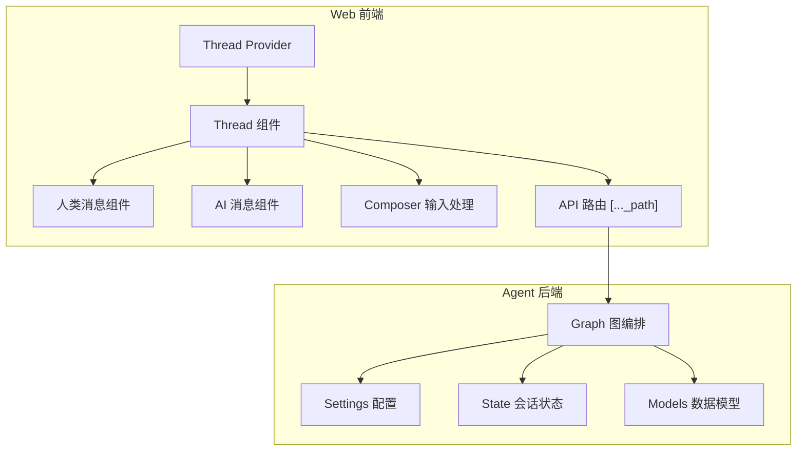
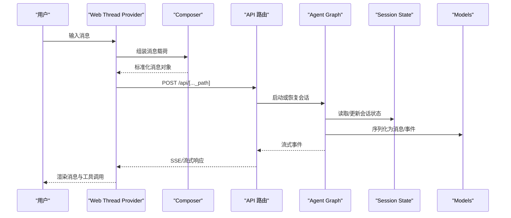
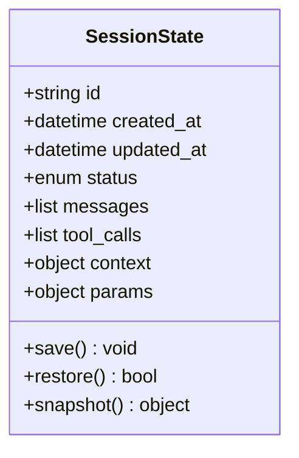
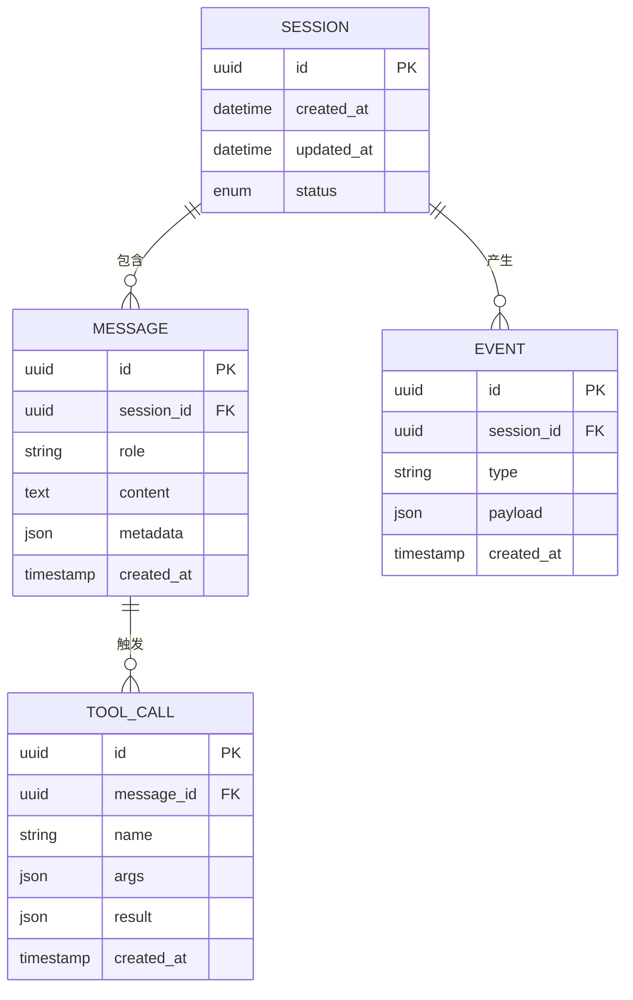
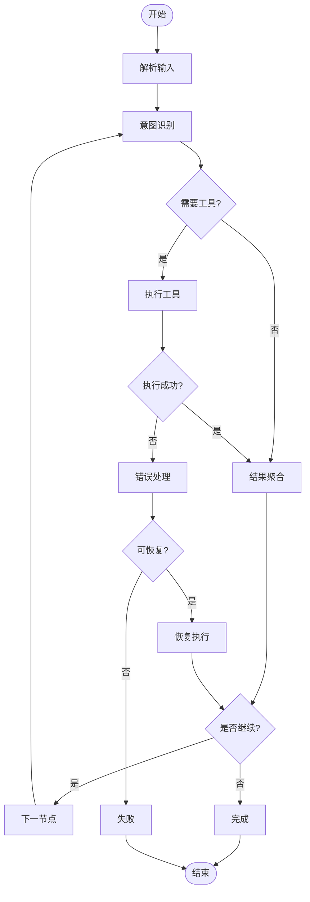
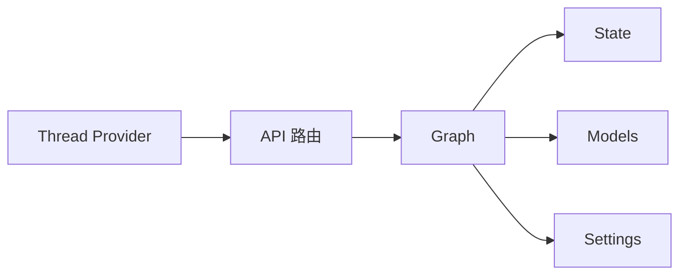

# 线程会话模型

<cite>
**本文引用的文件**   
- [apps/agent/src/lyl_agent/models.py](file://apps/agent/src/lyl_agent/models.py)
- [apps/agent/src/lyl_agent/state.py](file://apps/agent/src/lyl_agent/state.py)
- [apps/agent/src/lyl_agent/graph.py](file://apps/agent/src/lyl_agent/graph.py)
- [apps/agent/src/lyl_agent/settings.py](file://apps/agent/src/lyl_agent/settings.py)
- [apps/web/src/providers/Thread.tsx](file://apps/web/src/providers/Thread.tsx)
- [apps/web/src/components/thread/index.tsx](file://apps/web/src/components/thread/index.tsx)
- [apps/web/src/components/thread/messages/human.tsx](file://apps/web/src/components/thread/messages/human.tsx)
- [apps/web/src/components/thread/messages/ai.tsx](file://apps/web/src/components/thread/messages/ai.tsx)
- [apps/web/src/lib/composer.ts](file://apps/web/src/lib/composer.ts)
- [apps/web/src/app/api/[..._path]/route.ts](file://apps/web/src/app/api/[..._path]/route.ts)
</cite>

## 目录
1. [引言](#引言)
2. [项目结构](#项目结构)
3. [核心组件](#核心组件)
4. [架构总览](#架构总览)
5. [详细组件分析](#详细组件分析)
6. [依赖关系分析](#依赖关系分析)
7. [性能考虑](#性能考虑)
8. [故障排查指南](#故障排查指南)
9. [结论](#结论)
10. [附录](#附录)

## 引言
本文件围绕“线程会话模型”构建完整的数据模型与运行机制文档，覆盖会话实体结构、生命周期管理、状态转换、与消息的关联关系、继承机制、清理策略、配置与上下文传递、参数管理、持久化与恢复、并发控制、监控统计与性能指标，以及创建、维护、销毁的最佳实践与安全权限控制。内容基于仓库中的 Agent 端（Python）与 Web 端（Next.js）代码进行归纳与提炼，力求对技术读者与非技术读者均具备可读性。

## 项目结构
本项目采用前后端分离的架构：
- Agent 端（Python）：定义会话状态、图编排与设置，承载会话执行的核心逻辑。
- Web 端（Next.js）：提供会话 UI、消息渲染、流式交互与 API 路由。

图表来源
- [apps/web/src/providers/Thread.tsx](file://apps/web/src/providers/Thread.tsx)
- [apps/web/src/components/thread/index.tsx](file://apps/web/src/components/thread/index.tsx)
- [apps/web/src/components/thread/messages/human.tsx](file://apps/web/src/components/thread/messages/human.tsx)
- [apps/web/src/components/thread/messages/ai.tsx](file://apps/web/src/components/thread/messages/ai.tsx)
- [apps/web/src/lib/composer.ts](file://apps/web/src/lib/composer.ts)
- [apps/web/src/app/api/[..._path]/route.ts](file://apps/web/src/app/api/[..._path]/route.ts)
- [apps/agent/src/lyl_agent/settings.py](file://apps/agent/src/lyl_agent/settings.py)
- [apps/agent/src/lyl_agent/state.py](file://apps/agent/src/lyl_agent/state.py)
- [apps/agent/src/lyl_agent/models.py](file://apps/agent/src/lyl_agent/models.py)
- [apps/agent/src/lyl_agent/graph.py](file://apps/agent/src/lyl_agent/graph.py)

章节来源
- [apps/agent/src/lyl_agent/settings.py](file://apps/agent/src/lyl_agent/settings.py)
- [apps/agent/src/lyl_agent/state.py](file://apps/agent/src/lyl_agent/state.py)
- [apps/agent/src/lyl_agent/models.py](file://apps/agent/src/lyl_agent/models.py)
- [apps/agent/src/lyl_agent/graph.py](file://apps/agent/src/lyl_agent/graph.py)
- [apps/web/src/providers/Thread.tsx](file://apps/web/src/providers/Thread.tsx)
- [apps/web/src/components/thread/index.tsx](file://apps/web/src/components/thread/index.tsx)
- [apps/web/src/lib/composer.ts](file://apps/web/src/lib/composer.ts)
- [apps/web/src/app/api/[..._path]/route.ts](file://apps/web/src/app/api/[..._path]/route.ts)

## 核心组件
- 会话状态（State）：定义会话的全局状态字段，包括消息集合、工具调用结果、中断信息、上下文等。
- 数据模型（Models）：定义消息、工具调用、事件等数据结构，用于序列化与传输。
- 图编排（Graph）：驱动会话执行流程，包含节点调度、条件分支、错误处理与恢复。
- 配置（Settings）：集中管理会话超时、重试、日志级别、资源限制等。
- Web 线程提供者（Thread Provider）：在浏览器侧维护会话上下文、消息列表与流式更新。
- 消息组件（Human/AI）：负责渲染不同角色的消息与工具调用结果。
- Composer：封装用户输入、富文本与附件处理，生成标准化消息载荷。
- API 路由：统一入口，转发请求到 Agent 图编排，并返回流式响应。

章节来源
- [apps/agent/src/lyl_agent/state.py](file://apps/agent/src/lyl_agent/state.py)
- [apps/agent/src/lyl_agent/models.py](file://apps/agent/src/lyl_agent/models.py)
- [apps/agent/src/lyl_agent/graph.py](file://apps/agent/src/lyl_agent/graph.py)
- [apps/agent/src/lyl_agent/settings.py](file://apps/agent/src/lyl_agent/settings.py)
- [apps/web/src/providers/Thread.tsx](file://apps/web/src/providers/Thread.tsx)
- [apps/web/src/components/thread/messages/human.tsx](file://apps/web/src/components/thread/messages/human.tsx)
- [apps/web/src/components/thread/messages/ai.tsx](file://apps/web/src/components/thread/messages/ai.tsx)
- [apps/web/src/lib/composer.ts](file://apps/web/src/lib/composer.ts)
- [apps/web/src/app/api/[..._path]/route.ts](file://apps/web/src/app/api/[..._path]/route.ts)

## 架构总览
下图展示从 Web 端到 Agent 端的请求-响应流，以及会话状态在图编排中的流转。

图表来源
- [apps/web/src/providers/Thread.tsx](file://apps/web/src/providers/Thread.tsx)
- [apps/web/src/lib/composer.ts](file://apps/web/src/lib/composer.ts)
- [apps/web/src/app/api/[..._path]/route.ts](file://apps/web/src/app/api/[..._path]/route.ts)
- [apps/agent/src/lyl_agent/graph.py](file://apps/agent/src/lyl_agent/graph.py)
- [apps/agent/src/lyl_agent/state.py](file://apps/agent/src/lyl_agent/state.py)
- [apps/agent/src/lyl_agent/models.py](file://apps/agent/src/lyl_agent/models.py)

## 详细组件分析

### 会话状态（State）数据模型
- 字段设计要点
  - 消息集合：按时间顺序存储人类与 AI 消息，支持追加与快照。
  - 工具调用记录：记录工具名称、参数、结果与异常。
  - 中断与恢复：保存中断点、待处理动作与恢复元数据。
  - 上下文与参数：跨节点共享的配置、环境变量、用户标识与权限。
  - 生命周期标记：创建时间、更新时间、状态枚举（运行中、暂停、完成、失败）。
- 复杂度与一致性
  - 消息集合为 O(n) 追加；快照采用不可变副本保证一致性。
  - 工具调用记录需原子写入，避免并发竞争。
- 扩展点
  - 可扩展自定义字段以支持多模态内容与业务上下文。

图表来源
- [apps/agent/src/lyl_agent/state.py](file://apps/agent/src/lyl_agent/state.py)

章节来源
- [apps/agent/src/lyl_agent/state.py](file://apps/agent/src/lyl_agent/state.py)

### 数据模型（Models）与消息关联
- 消息模型
  - 人类消息：包含文本、附件、时间戳与发送者标识。
  - AI 消息：包含文本、结构化输出、引用与工具调用结果。
- 工具调用模型
  - 名称、参数、返回值、错误信息与耗时。
- 事件模型
  - 用于流式传输的状态变更、进度与中间结果。
- 关联关系
  - 会话包含多条消息；每条消息可能关联多个工具调用；事件与消息存在时序关系。

图表来源
- [apps/agent/src/lyl_agent/models.py](file://apps/agent/src/lyl_agent/models.py)

章节来源
- [apps/agent/src/lyl_agent/models.py](file://apps/agent/src/lyl_agent/models.py)

### 图编排（Graph）与生命周期管理
- 节点职责
  - 输入解析、意图识别、工具调度、结果聚合、错误处理。
- 状态转换
  - 运行中→暂停（中断）、运行中→完成（成功）、运行中→失败（异常）。
- 恢复机制
  - 基于检查点与事件日志恢复中断点，支持幂等重放。
- 清理策略
  - 会话结束后的资源释放、临时文件清理、缓存失效。

图表来源
- [apps/agent/src/lyl_agent/graph.py](file://apps/agent/src/lyl_agent/graph.py)

章节来源
- [apps/agent/src/lyl_agent/graph.py](file://apps/agent/src/lyl_agent/graph.py)

### 配置（Settings）与上下文传递
- 配置项
  - 会话超时、重试次数、日志级别、最大消息长度、工具并发度。
- 上下文传递
  - 通过会话上下文字段传递用户身份、租户、权限与区域信息。
- 参数管理
  - 统一参数校验与默认值注入，确保各节点一致性。

章节来源
- [apps/agent/src/lyl_agent/settings.py](file://apps/agent/src/lyl_agent/settings.py)

### Web 线程提供者（Thread Provider）与会话维护
- 职责
  - 维护会话 ID、消息列表、加载状态与错误状态。
  - 订阅流式事件，增量更新 UI。
  - 提供创建、暂停、恢复、销毁会话的方法。
- 最佳实践
  - 使用不可变更新策略避免竞态。
  - 批量合并事件减少重渲染。
  - 错误边界与降级显示。

章节来源
- [apps/web/src/providers/Thread.tsx](file://apps/web/src/providers/Thread.tsx)

### 消息渲染（Human/AI）与继承机制
- Human 消息
  - 渲染文本与附件，支持复制与下载。
- AI 消息
  - 渲染文本、结构化输出与工具调用表格。
- 继承机制
  - 公共样式与行为抽取至基类，子类按需覆盖。

章节来源
- [apps/web/src/components/thread/messages/human.tsx](file://apps/web/src/components/thread/messages/human.tsx)
- [apps/web/src/components/thread/messages/ai.tsx](file://apps/web/src/components/thread/messages/ai.tsx)

### Composer 输入处理与参数管理
- 功能
  - 富文本转义、附件上传、消息模板填充。
- 参数管理
  - 统一校验必填字段、类型转换与默认值。
- 错误处理
  - 捕获解析错误并提示用户修正。

章节来源
- [apps/web/src/lib/composer.ts](file://apps/web/src/lib/composer.ts)

### API 路由与会话持久化
- 路由职责
  - 鉴权、限流、参数校验、转发到 Agent 图编排。
- 持久化
  - 会话状态落库、事件日志归档、快照版本管理。
- 恢复机制
  - 基于会话 ID 与版本号恢复上下文。

章节来源
- [apps/web/src/app/api/[..._path]/route.ts](file://apps/web/src/app/api/[..._path]/route.ts)

## 依赖关系分析
- 耦合与内聚
  - Graph 强依赖 State 与 Models，松耦合 Settings。
  - Web 端通过 API 路由与 Agent 解耦，便于替换实现。
- 外部依赖
  - 数据库（持久化）、消息队列（异步任务）、缓存（热点数据）。
- 循环依赖
  - 通过接口抽象与事件总线避免循环导入。

图表来源
- [apps/web/src/providers/Thread.tsx](file://apps/web/src/providers/Thread.tsx)
- [apps/web/src/app/api/[..._path]/route.ts](file://apps/web/src/app/api/[..._path]/route.ts)
- [apps/agent/src/lyl_agent/graph.py](file://apps/agent/src/lyl_agent/graph.py)
- [apps/agent/src/lyl_agent/state.py](file://apps/agent/src/lyl_agent/state.py)
- [apps/agent/src/lyl_agent/models.py](file://apps/agent/src/lyl_agent/models.py)
- [apps/agent/src/lyl_agent/settings.py](file://apps/agent/src/lyl_agent/settings.py)

章节来源
- [apps/web/src/providers/Thread.tsx](file://apps/web/src/providers/Thread.tsx)
- [apps/web/src/app/api/[..._path]/route.ts](file://apps/web/src/app/api/[..._path]/route.ts)
- [apps/agent/src/lyl_agent/graph.py](file://apps/agent/src/lyl_agent/graph.py)
- [apps/agent/src/lyl_agent/state.py](file://apps/agent/src/lyl_agent/state.py)
- [apps/agent/src/lyl_agent/models.py](file://apps/agent/src/lyl_agent/models.py)
- [apps/agent/src/lyl_agent/settings.py](file://apps/agent/src/lyl_agent/settings.py)

## 性能考虑
- 流式传输
  - 使用 SSE/流式响应降低首屏延迟，增量渲染消息。
- 并发控制
  - 工具调用限流与熔断，避免雪崩。
- 缓存策略
  - 热点配置与只读数据缓存，减少重复计算。
- 内存管理
  - 大消息分块处理，及时释放临时对象。
- 监控指标
  - 会话时长、工具调用成功率、错误率、吞吐与延迟。

[本节为通用指导，不直接分析具体文件]

## 故障排查指南
- 常见问题
  - 会话中断后无法恢复：检查检查点完整性与事件日志连续性。
  - 工具调用超时：调整超时阈值与重试策略，查看下游服务健康状态。
  - 消息渲染异常：校验消息结构与类型，确认组件兼容性。
- 调试建议
  - 开启详细日志，定位节点执行路径。
  - 使用快照对比差异，快速定位状态不一致。
  - 模拟极端负载，验证稳定性与回退策略。

章节来源
- [apps/agent/src/lyl_agent/graph.py](file://apps/agent/src/lyl_agent/graph.py)
- [apps/agent/src/lyl_agent/state.py](file://apps/agent/src/lyl_agent/state.py)
- [apps/web/src/components/thread/messages/human.tsx](file://apps/web/src/components/thread/messages/human.tsx)
- [apps/web/src/components/thread/messages/ai.tsx](file://apps/web/src/components/thread/messages/ai.tsx)

## 结论
线程会话模型以 State-Graph-Models 为核心，结合 Web 端 Thread Provider 与 API 路由，形成高内聚、低耦合的会话执行体系。通过清晰的配置与上下文传递、完善的持久化与恢复机制、严格的并发控制与监控指标，能够支撑复杂的多轮对话与工具调用场景。遵循本文的最佳实践与安全规范，可显著提升系统的稳定性、可维护性与用户体验。

[本节为总结性内容，不直接分析具体文件]

## 附录
- 术语表
  - 会话：一次完整的用户交互上下文。
  - 消息：人类或 AI 的通信单元。
  - 工具调用：对外部能力的调用与结果返回。
  - 事件：会话过程中的状态变更通知。
- 参考文件
  - 会话状态定义：[apps/agent/src/lyl_agent/state.py](file://apps/agent/src/lyl_agent/state.py)
  - 数据模型定义：[apps/agent/src/lyl_agent/models.py](file://apps/agent/src/lyl_agent/models.py)
  - 图编排逻辑：[apps/agent/src/lyl_agent/graph.py](file://apps/agent/src/lyl_agent/graph.py)
  - 配置管理：[apps/agent/src/lyl_agent/settings.py](file://apps/agent/src/lyl_agent/settings.py)
  - Web 线程提供者：[apps/web/src/providers/Thread.tsx](file://apps/web/src/providers/Thread.tsx)
  - 消息组件：[apps/web/src/components/thread/messages/human.tsx](file://apps/web/src/components/thread/messages/human.tsx), [apps/web/src/components/thread/messages/ai.tsx](file://apps/web/src/components/thread/messages/ai.tsx)
  - 输入处理：[apps/web/src/lib/composer.ts](file://apps/web/src/lib/composer.ts)
  - API 路由：[apps/web/src/app/api/[..._path]/route.ts](file://apps/web/src/app/api/[..._path]/route.ts)