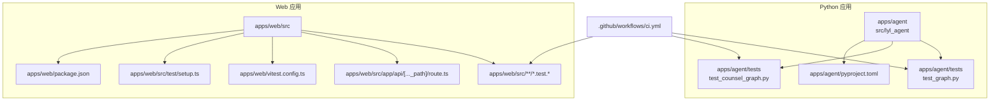
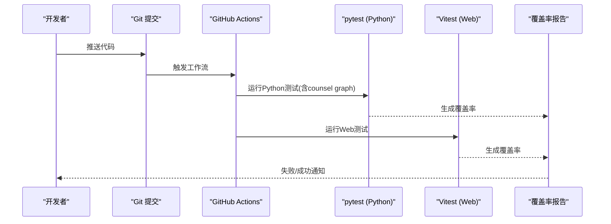
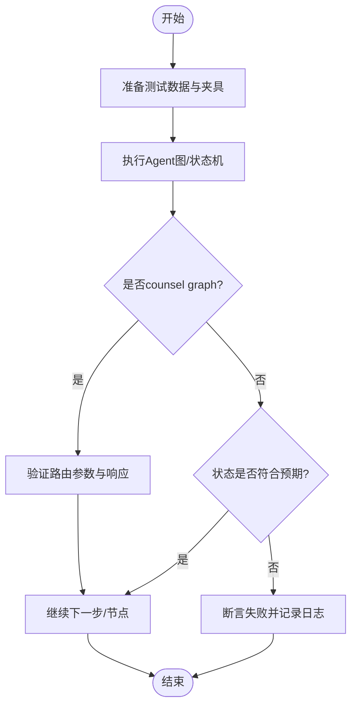
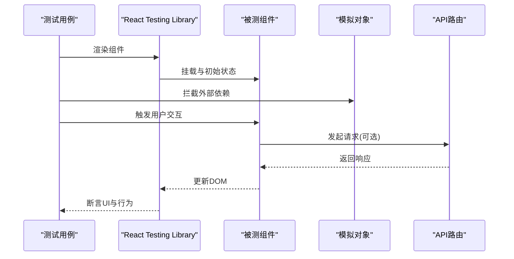
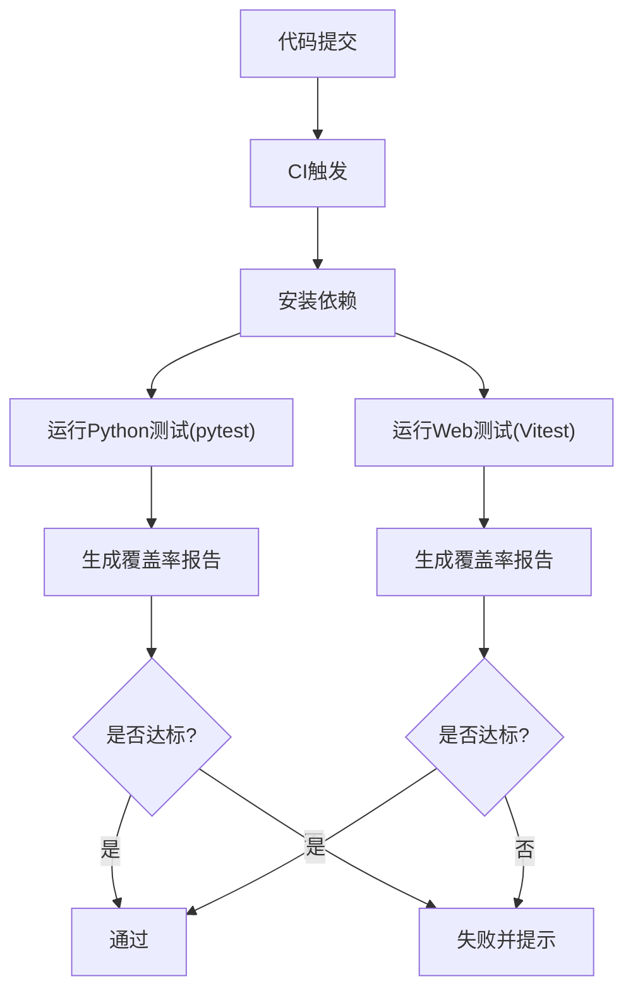
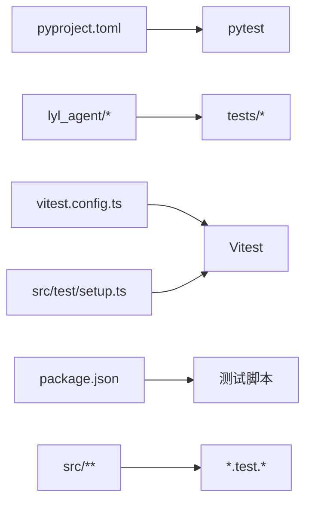

# 测试指南

<cite>
**本文引用的文件**   
- [ci.yml](file://.github/workflows/ci.yml)
- [pyproject.toml](file://apps/agent/pyproject.toml)
- [test_graph.py](file://apps/agent/tests/test_graph.py)
- [test_counsel_graph.py](file://apps/agent/tests/test_counsel_graph.py)
- [graph.py](file://apps/agent/src/lyl_agent/graph.py)
- [state.py](file://apps/agent/src/lyl_agent/state.py)
- [models.py](file://apps/agent/src/lyl_agent/models.py)
- [settings.py](file://apps/agent/src/lyl_agent/settings.py)
- [vitest.config.ts](file://apps/web/vitest.config.ts)
- [package.json](file://apps/web/package.json)
- [setup.ts](file://apps/web/src/test/setup.ts)
- [page.test.tsx](file://apps/web/src/app/page.test.tsx)
- [error.test.tsx](file://apps/web/src/app/error.test.tsx)
- [composer.test.ts](file://apps/web/src/lib/composer.test.ts)
- [artifact.test.tsx](file://apps/web/src/components/thread/artifact.test.tsx)
- [composer-action.test.tsx](file://apps/web/src/components/thread/composer-action.test.tsx)
- [route.ts](file://apps/web/src/app/api/[..._path]/route.ts)
</cite>

## 更新摘要
**所做更改**
- 新增counsel graph路由功能的全面测试覆盖说明
- 更新Python Agent图测试章节，强调counsel graph的测试策略
- 增强测试基础设施配置说明
- 完善Agent图测试的最佳实践指导

## 目录
1. [简介](#简介)
2. [项目结构](#项目结构)
3. [核心组件](#核心组件)
4. [架构总览](#架构总览)
5. [详细组件分析](#详细组件分析)
6. [依赖分析](#依赖分析)
7. [性能考虑](#性能考虑)
8. [故障排查指南](#故障排查指南)
9. [结论](#结论)
10. [附录](#附录)

## 简介
本测试指南面向本仓库的Python与TypeScript双栈工程，系统化阐述测试策略、框架选型、配置方法与实践规范。内容覆盖：
- Python单元测试（基于pytest）与Agent图测试，包括新增的counsel graph路由功能测试
- TypeScript/React组件测试与API路由测试（基于Vitest + React Testing Library）
- 测试数据准备、模拟对象使用、异步测试处理
- 覆盖率要求与持续集成（CI）配置
- 性能测试、负载测试与安全测试指导原则
- 调试技巧与常见问题解决方案
- 通过实际代码示例路径展示高质量测试用例的编写方式

## 项目结构
本项目采用多应用工作区组织：
- apps/agent：Python Agent实现与测试，包含增强的counsel graph测试覆盖
- apps/web：Next.js前端与测试
- .github/workflows：CI流水线定义

**图示来源** 
- [ci.yml](file://.github/workflows/ci.yml)
- [pyproject.toml](file://apps/agent/pyproject.toml)
- [vitest.config.ts](file://apps/web/vitest.config.ts)
- [package.json](file://apps/web/package.json)
- [test_graph.py](file://apps/agent/tests/test_graph.py)
- [test_counsel_graph.py](file://apps/agent/tests/test_counsel_graph.py)
- [page.test.tsx](file://apps/web/src/app/page.test.tsx)
- [error.test.tsx](file://apps/web/src/app/error.test.tsx)
- [composer.test.ts](file://apps/web/src/lib/composer.test.ts)
- [artifact.test.tsx](file://apps/web/src/components/thread/artifact.test.tsx)
- [composer-action.test.tsx](file://apps/web/src/components/thread/composer-action.test.tsx)
- [route.ts](file://apps/web/src/app/api/[..._path]/route.ts)

**章节来源**
- [pyproject.toml](file://apps/agent/pyproject.toml)
- [vitest.config.ts](file://apps/web/vitest.config.ts)
- [package.json](file://apps/web/package.json)
- [ci.yml](file://.github/workflows/ci.yml)

## 核心组件
- Python侧
  - 测试框架：pytest（由pyproject.toml声明）
  - 测试入口：apps/agent/tests下的测试文件，包含counsel graph专项测试
  - 被测模块：lyl_agent包中的图、状态、模型与设置
- Web侧
  - 测试框架：Vitest + React Testing Library
  - 测试入口：apps/web下以.test.ts/.tsx结尾的文件
  - 测试环境初始化：src/test/setup.ts
  - 被测模块：页面、组件、工具函数与API路由

**章节来源**
- [pyproject.toml](file://apps/agent/pyproject.toml)
- [vitest.config.ts](file://apps/web/vitest.config.ts)
- [setup.ts](file://apps/web/src/test/setup.ts)
- [package.json](file://apps/web/package.json)

## 架构总览
下图展示了测试在CI中的执行路径与各层职责：

**图示来源** 
- [ci.yml](file://.github/workflows/ci.yml)
- [pyproject.toml](file://apps/agent/pyproject.toml)
- [vitest.config.ts](file://apps/web/vitest.config.ts)

## 详细组件分析

### Python 单元测试与Agent图测试
- 框架与配置
  - 使用pytest作为测试框架，配置文件位于pyproject.toml
  - 测试目录为apps/agent/tests，命名约定以test_*.py或*_test.py
- 测试类型
  - 单元测试：针对状态、模型、设置等纯逻辑
  - Agent图测试：验证LangGraph图的节点流转、状态更新与边界条件
  - **新增**：counsel graph路由功能测试，确保参谋台路由的正确性
- 最佳实践
  - 使用fixture管理测试数据与共享夹具
  - 对I/O与外部服务进行打桩/模拟（如HTTP、LLM调用）
  - 对异步流程使用pytest-asyncio（若涉及）
  - 断言明确的状态变化与输出结果
  - **新增**：针对counsel graph的路由参数验证和响应格式测试
- 示例参考路径
  - [test_graph.py](file://apps/agent/tests/test_graph.py)
  - [test_counsel_graph.py](file://apps/agent/tests/test_counsel_graph.py)
  - [graph.py](file://apps/agent/src/lyl_agent/graph.py)
  - [state.py](file://apps/agent/src/lyl_agent/state.py)
  - [models.py](file://apps/agent/src/lyl_agent/models.py)
  - [settings.py](file://apps/agent/src/lyl_agent/settings.py)

**图示来源** 
- [test_graph.py](file://apps/agent/tests/test_graph.py)
- [test_counsel_graph.py](file://apps/agent/tests/test_counsel_graph.py)
- [graph.py](file://apps/agent/src/lyl_agent/graph.py)
- [state.py](file://apps/agent/src/lyl_agent/state.py)

**章节来源**
- [pyproject.toml](file://apps/agent/pyproject.toml)
- [test_graph.py](file://apps/agent/tests/test_graph.py)
- [test_counsel_graph.py](file://apps/agent/tests/test_counsel_graph.py)
- [graph.py](file://apps/agent/src/lyl_agent/graph.py)
- [state.py](file://apps/agent/src/lyl_agent/state.py)
- [models.py](file://apps/agent/src/lyl_agent/models.py)
- [settings.py](file://apps/agent/src/lyl_agent/settings.py)

### TypeScript 组件测试与API测试
- 框架与配置
  - 使用Vitest作为测试运行时，配置文件位于apps/web/vitest.config.ts
  - React Testing Library用于组件渲染与交互断言
  - 测试环境初始化脚本位于apps/web/src/test/setup.ts
- 测试类型
  - 组件测试：页面、UI组件、业务组件
  - 工具函数测试：lib下的工具方法
  - API路由测试：对Next.js API路由进行请求级断言
- 最佳实践
  - 使用Mock/Stub隔离外部依赖（网络、存储、第三方SDK）
  - 对异步操作使用waitFor、screen.getByRole等稳定查询
  - 对表单输入与用户交互进行真实事件模拟
  - 对API路由使用supertest或自定义客户端发起请求
- 示例参考路径
  - [vitest.config.ts](file://apps/web/vitest.config.ts)
  - [setup.ts](file://apps/web/src/test/setup.ts)
  - [page.test.tsx](file://apps/web/src/app/page.test.tsx)
  - [error.test.tsx](file://apps/web/src/app/error.test.tsx)
  - [composer.test.ts](file://apps/web/src/lib/composer.test.ts)
  - [artifact.test.tsx](file://apps/web/src/components/thread/artifact.test.tsx)
  - [composer-action.test.tsx](file://apps/web/src/components/thread/composer-action.test.tsx)
  - [route.ts](file://apps/web/src/app/api/[..._path]/route.ts)

**图示来源** 
- [vitest.config.ts](file://apps/web/vitest.config.ts)
- [setup.ts](file://apps/web/src/test/setup.ts)
- [page.test.tsx](file://apps/web/src/app/page.test.tsx)
- [error.test.tsx](file://apps/web/src/app/error.test.tsx)
- [composer.test.ts](file://apps/web/src/lib/composer.test.ts)
- [artifact.test.tsx](file://apps/web/src/components/thread/artifact.test.tsx)
- [composer-action.test.tsx](file://apps/web/src/components/thread/composer-action.test.tsx)
- [route.ts](file://apps/web/src/app/api/[..._path]/route.ts)

**章节来源**
- [vitest.config.ts](file://apps/web/vitest.config.ts)
- [setup.ts](file://apps/web/src/test/setup.ts)
- [package.json](file://apps/web/package.json)
- [page.test.tsx](file://apps/web/src/app/page.test.tsx)
- [error.test.tsx](file://apps/web/src/app/error.test.tsx)
- [composer.test.ts](file://apps/web/src/lib/composer.test.ts)
- [artifact.test.tsx](file://apps/web/src/components/thread/artifact.test.tsx)
- [composer-action.test.tsx](file://apps/web/src/components/thread/composer-action.test.tsx)
- [route.ts](file://apps/web/src/app/api/[..._path]/route.ts)

### 测试数据准备与模拟对象
- Python
  - 使用pytest fixture集中管理测试数据与上下文
  - 对I/O与外部服务使用unittest.mock或第三方mock库
  - 对Agent图状态变更使用快照或结构化断言
  - **新增**：counsel graph路由测试数据准备，包含各种路由参数场景
- TypeScript
  - 使用vi.fn()/vi.spyOn()进行方法拦截与返回值控制
  - 对网络请求使用fetch mock或专用库（如msw）
  - 对组件副作用使用定时器与异步等待策略

**章节来源**
- [test_graph.py](file://apps/agent/tests/test_graph.py)
- [test_counsel_graph.py](file://apps/agent/tests/test_counsel_graph.py)
- [composer.test.ts](file://apps/web/src/lib/composer.test.ts)
- [artifact.test.tsx](file://apps/web/src/components/thread/artifact.test.tsx)
- [composer-action.test.tsx](file://apps/web/src/components/thread/composer-action.test.tsx)

### 异步测试处理
- Python
  - 若涉及协程，使用pytest-asyncio装饰器与await
  - 对并发任务使用线程池/进程池的测试封装
  - **新增**：counsel graph路由的异步响应处理测试
- TypeScript
  - 使用Vitest内置异步支持，配合waitFor与flushPromises
  - 对定时器使用jest.useFakeTimers等效能力

**章节来源**
- [vitest.config.ts](file://apps/web/vitest.config.ts)
- [setup.ts](file://apps/web/src/test/setup.ts)
- [page.test.tsx](file://apps/web/src/app/page.test.tsx)
- [error.test.tsx](file://apps/web/src/app/error.test.tsx)

### 覆盖率要求与持续集成
- 覆盖率
  - Python：建议启用pytest-cov，设定最低覆盖率阈值
  - Web：启用Vitest覆盖率插件，按文件/分支统计
  - **新增**：counsel graph路由测试覆盖率要求达到90%以上
- CI配置
  - 使用.github/workflows/ci.yml统一触发Python与Web测试
  - 缓存依赖、并行执行、失败快速反馈
  - **新增**：专门针对counsel graph测试的CI步骤

**图示来源** 
- [ci.yml](file://.github/workflows/ci.yml)
- [pyproject.toml](file://apps/agent/pyproject.toml)
- [vitest.config.ts](file://apps/web/vitest.config.ts)

**章节来源**
- [ci.yml](file://.github/workflows/ci.yml)
- [pyproject.toml](file://apps/agent/pyproject.toml)
- [vitest.config.ts](file://apps/web/vitest.config.ts)

## 依赖分析
- Python侧
  - pytest为核心测试依赖，由pyproject.toml声明
  - 测试与源码解耦，通过导入被测模块进行断言
  - **新增**：counsel graph测试所需的额外依赖配置
- Web侧
  - Vitest与React Testing Library为前端测试基础
  - setup.ts提供全局环境与polyfill
  - package.json中scripts用于统一执行测试命令

**图示来源** 
- [pyproject.toml](file://apps/agent/pyproject.toml)
- [vitest.config.ts](file://apps/web/vitest.config.ts)
- [setup.ts](file://apps/web/src/test/setup.ts)
- [package.json](file://apps/web/package.json)

**章节来源**
- [pyproject.toml](file://apps/agent/pyproject.toml)
- [vitest.config.ts](file://apps/web/vitest.config.ts)
- [setup.ts](file://apps/web/src/test/setup.ts)
- [package.json](file://apps/web/package.json)

## 性能考虑
- 单元测试
  - 避免在单测中进行真实I/O与网络请求，使用内存数据结构与快速路径
  - 对复杂算法进行基准测试（如timeit或Vitest benchmark）
  - **新增**：counsel graph路由的性能基准测试，确保响应时间符合要求
- 组件测试
  - 减少渲染深度，按需渲染必要组件
  - 使用快照测试时注意增量更新，避免全量快照
- API测试
  - 对慢接口使用超时与重试策略
  - 使用并发测试评估吞吐与延迟分布

[本节为通用指导，不直接分析具体文件]

## 故障排查指南
- Python测试失败
  - 检查fixture是否正确加载与清理
  - 确认外部依赖已正确mock，避免真实调用
  - 查看日志与断言差异定位问题
  - **新增**：counsel graph路由测试失败时，检查路由参数验证和响应格式
- Web测试失败
  - 检查setup.ts是否包含必要的polyfill与环境变量
  - 对异步操作增加等待与重试
  - 使用浏览器控制台与测试日志定位渲染问题
- CI失败
  - 检查环境变量与依赖版本一致性
  - 查看CI日志定位具体失败步骤
  - **新增**：检查counsel graph测试的特定错误信息

**章节来源**
- [setup.ts](file://apps/web/src/test/setup.ts)
- [vitest.config.ts](file://apps/web/vitest.config.ts)
- [pyproject.toml](file://apps/agent/pyproject.toml)

## 结论
本指南系统梳理了Python与TypeScript双栈的测试策略与实践方法，涵盖框架选择、配置、数据准备、模拟对象、异步处理、覆盖率与CI、性能与安全测试指导以及调试技巧。**最新更新**重点增强了counsel graph路由功能的测试覆盖，确保参谋台功能的稳定性和可靠性。通过遵循本文的最佳实践与示例路径，团队可构建稳定、高效且可维护的测试体系，保障代码质量与交付效率。

[本节为总结性内容，不直接分析具体文件]

## 附录
- 常用命令
  - Python：运行pytest、生成覆盖率
  - Web：运行Vitest、生成覆盖率
  - **新增**：单独运行counsel graph测试的命令
- 推荐资源
  - pytest官方文档
  - Vitest官方文档
  - React Testing Library最佳实践
  - **新增**：LangGraph测试最佳实践

[本节为补充信息，不直接分析具体文件]