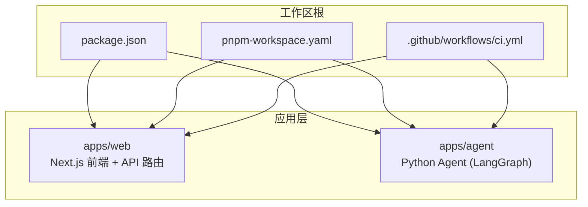
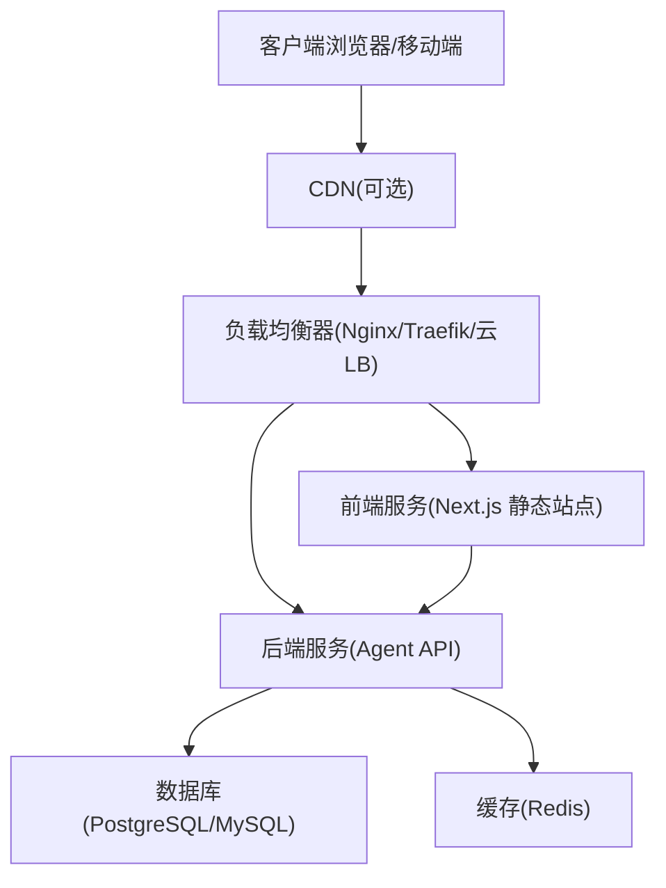
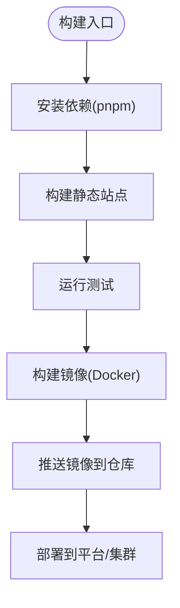
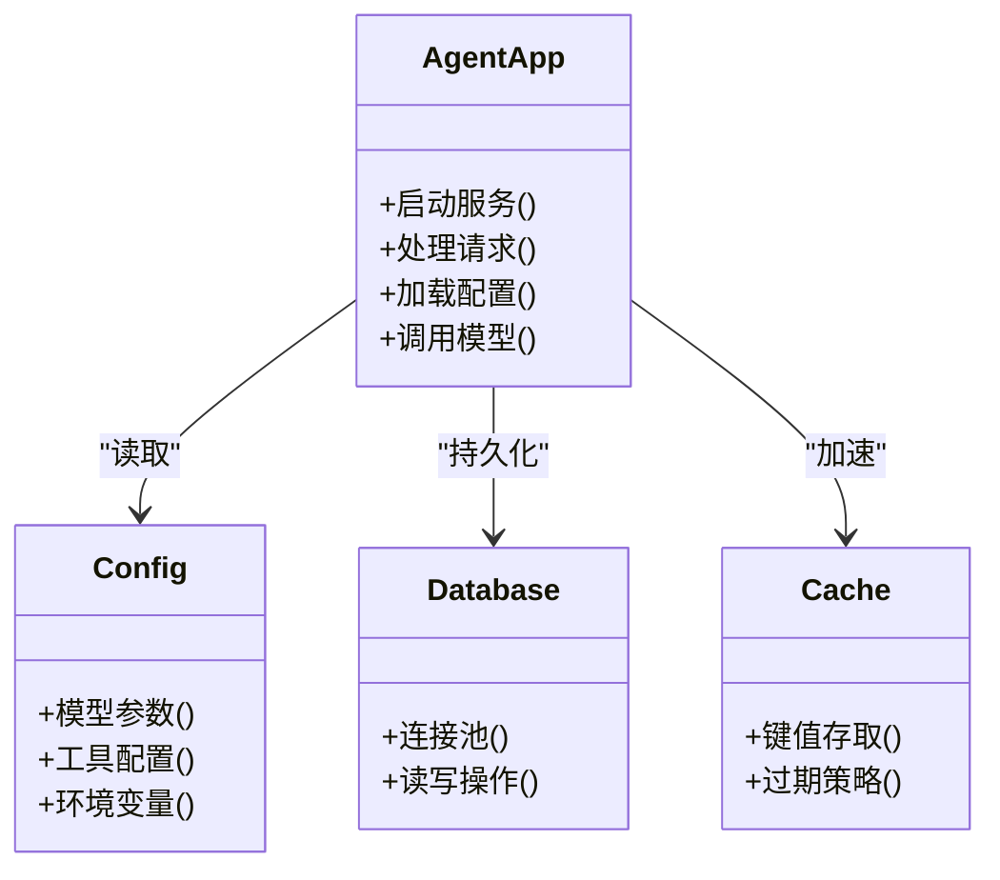
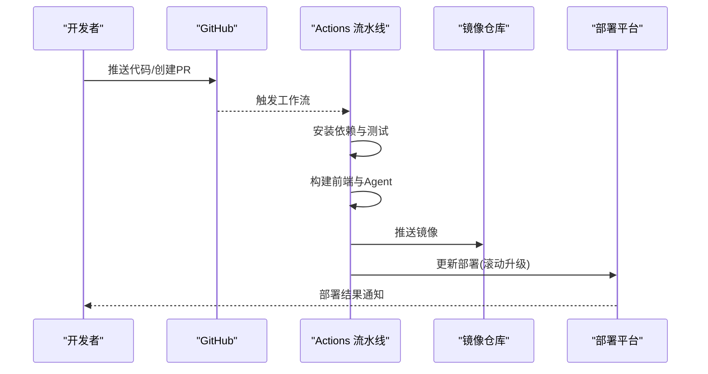
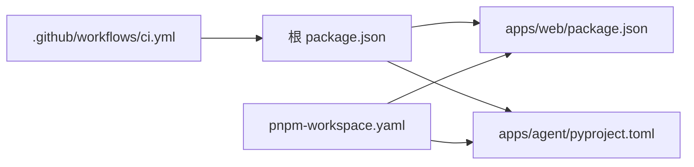

# 部署指南

<cite>
**本文引用的文件**   
- [README.md](file://README.md)
- [package.json](file://package.json)
- [pnpm-workspace.yaml](file://pnpm-workspace.yaml)
- [.github/workflows/ci.yml](file://.github/workflows/ci.yml)
- [apps/web/package.json](file://apps/web/package.json)
- [apps/web/next.config.mjs](file://apps/web/next.config.mjs)
- [apps/web/.dockerignore](file://apps/web/.dockerignore)
- [apps/web/src/app/api/[..._path]/route.ts](file://apps/web/src/app/api/[..._path]/route.ts)
- [apps/agent/pyproject.toml](file://apps/agent/pyproject.toml)
- [apps/agent/langgraph.json](file://apps/agent/langgraph.json)
</cite>

## 目录
1. [简介](#简介)
2. [项目结构](#项目结构)
3. [核心组件](#核心组件)
4. [架构总览](#架构总览)
5. [详细组件分析](#详细组件分析)
6. [依赖关系分析](#依赖关系分析)
7. [性能考虑](#性能考虑)
8. [故障排除指南](#故障排除指南)
9. [结论](#结论)
10. [附录](#附录)

## 简介
本指南面向生产环境，提供端到端的部署方案与运维实践。内容覆盖容器化构建、CI/CD流水线、服务编排与负载均衡、数据库初始化、缓存配置、监控告警、SSL证书与域名绑定、CDN集成、性能调优、资源限制与扩缩容、备份恢复与灾难恢复、安全加固、日志收集与错误监控等。读者可据此完成从开发到生产的完整交付闭环。

## 项目结构
仓库采用多应用工作区组织：
- apps/web：Next.js 前端应用，包含 API 路由与静态资源
- apps/agent：Python Agent 应用（LangGraph）
- .github/workflows：GitHub Actions CI 流水线
- 根级包管理与工作区配置

图表来源
- [package.json](file://package.json)
- [pnpm-workspace.yaml](file://pnpm-workspace.yaml)
- [.github/workflows/ci.yml](file://.github/workflows/ci.yml)
- [apps/web/package.json](file://apps/web/package.json)
- [apps/agent/pyproject.toml](file://apps/agent/pyproject.toml)

章节来源
- [README.md](file://README.md)
- [package.json](file://package.json)
- [pnpm-workspace.yaml](file://pnpm-workspace.yaml)

## 核心组件
- 前端应用（Next.js）
  - 入口与构建配置由 Next.js 管理，API 路由位于应用内
  - 通过环境变量注入后端服务地址与密钥
- Agent 应用（Python/LangGraph）
  - 使用 uv 进行依赖管理，配置文件定义运行参数与模型接入
- CI/CD（GitHub Actions）
  - 统一触发构建、测试与镜像推送流程

章节来源
- [apps/web/package.json](file://apps/web/package.json)
- [apps/web/next.config.mjs](file://apps/web/next.config.mjs)
- [apps/web/src/app/api/[..._path]/route.ts](file://apps/web/src/app/api/[..._path]/route.ts)
- [apps/agent/pyproject.toml](file://apps/agent/pyproject.toml)
- [apps/agent/langgraph.json](file://apps/agent/langgraph.json)
- [.github/workflows/ci.yml](file://.github/workflows/ci.yml)

## 架构总览
生产环境建议采用“前端静态站点 + API 网关/反向代理 + 后端服务”的分离式架构。Agent 作为独立微服务，通过内部网络暴露接口供前端调用。

[此图为概念性架构图，不直接映射具体源码文件]

## 详细组件分析

### 前端应用（Next.js）
- 构建产物为静态站点，适合通过 CDN 分发
- API 路由可作为轻量后端能力或透传到 Agent 服务
- 环境变量用于注入后端地址、鉴权密钥、第三方服务凭据

章节来源
- [apps/web/package.json](file://apps/web/package.json)
- [apps/web/next.config.mjs](file://apps/web/next.config.mjs)
- [apps/web/.dockerignore](file://apps/web/.dockerignore)
- [apps/web/src/app/api/[..._path]/route.ts](file://apps/web/src/app/api/[..._path]/route.ts)

### Agent 应用（Python/LangGraph）
- 依赖管理使用 uv，运行时通过配置文件加载模型与工具
- 建议以无状态容器运行，外部化状态至数据库与缓存

章节来源
- [apps/agent/pyproject.toml](file://apps/agent/pyproject.toml)
- [apps/agent/langgraph.json](file://apps/agent/langgraph.json)

### CI/CD 流水线（GitHub Actions）
- 统一触发条件与并行任务：安装依赖、类型检查、单元测试、构建产物、镜像构建与推送
- 支持多分支策略与发布标签

章节来源
- [.github/workflows/ci.yml](file://.github/workflows/ci.yml)

## 依赖关系分析
- 工作区根 package.json 协调前端与 Agent 的脚本与依赖
- pnpm-workspace.yaml 定义子应用与工作区规则
- CI 依赖 GitHub Secrets 存储敏感信息（如镜像仓库凭据、数据库连接串）

图表来源
- [package.json](file://package.json)
- [pnpm-workspace.yaml](file://pnpm-workspace.yaml)
- [.github/workflows/ci.yml](file://.github/workflows/ci.yml)

章节来源
- [package.json](file://package.json)
- [pnpm-workspace.yaml](file://pnpm-workspace.yaml)
- [.github/workflows/ci.yml](file://.github/workflows/ci.yml)

## 性能考虑
- 前端
  - 启用静态站点生成与增量再生成，结合 CDN 缓存
  - 图片与媒体资源走对象存储与 CDN
- 后端
  - 连接池与超时设置，避免数据库与缓存拥塞
  - 水平扩展无状态实例，配合负载均衡与健康检查
- 缓存
  - 热点数据入缓存，合理设置 TTL 与失效策略
- 资源限制
  - 容器 CPU/Memory 限制与请求限流
- 监控与观测
  - 指标采集、分布式追踪与结构化日志

[本节为通用指导，不直接分析具体文件]

## 故障排除指南
- 构建失败
  - 检查依赖版本与 Node/Python 版本一致性
  - 查看 CI 日志定位缺失环境变量或权限问题
- 服务不可用
  - 健康检查端点返回状态码与探针配置
  - 检查负载均衡转发规则与端口映射
- 数据库连接异常
  - 校验连接串、用户名密码与白名单
  - 检查连接池上限与慢查询
- 缓存异常
  - 验证缓存节点可达性与内存水位
  - 排查键冲突与序列化兼容
- 日志与告警
  - 集中收集日志并设置关键错误阈值告警
  - 建立错误分类与自动恢复策略

[本节为通用指导，不直接分析具体文件]

## 结论
通过容器化与 CI/CD 自动化，结合合理的架构分层与资源配置，可实现稳定、可扩展且易维护的生产部署。建议持续完善监控告警、备份恢复与安全加固，形成完整的运维闭环。

[本节为总结性内容，不直接分析具体文件]

## 附录

### 环境准备清单
- 基础环境
  - 容器运行时（Docker/Containerd）、编排平台（Kubernetes/云平台托管）
  - 域名与 DNS、SSL 证书（Let’s Encrypt/商业证书）
  - 对象存储（静态资源与附件）
- 中间件
  - 数据库（PostgreSQL/MySQL），主备与只读副本
  - 缓存（Redis），集群模式与持久化
- 安全
  - 密钥管理（Secrets/Vault/KMS）
  - 网络隔离（VPC/安全组/防火墙）
- 监控与日志
  - 指标（Prometheus/Grafana）、日志（ELK/Cloud Logging）、追踪（OpenTelemetry）

[本节为通用指导，不直接分析具体文件]

### 容器化与镜像构建
- 前端镜像
  - 多阶段构建：安装依赖 → 构建静态站点 → 最小运行时镜像
  - 使用 .dockerignore 减少镜像体积
- Agent 镜像
  - 基于 Python 精简镜像，仅复制必要文件与依赖
  - 非 root 用户运行，最小权限原则
- 镜像仓库
  - 私有仓库与访问控制，镜像签名与漏洞扫描

章节来源
- [apps/web/.dockerignore](file://apps/web/.dockerignore)
- [apps/agent/pyproject.toml](file://apps/agent/pyproject.toml)

### 服务编排与负载均衡
- 编排
  - Deployment/StatefulSet 管理副本数与滚动更新
  - Service/Ingress 暴露服务与路径路由
- 负载均衡
  - 健康检查与权重分配
  - 会话保持（如需）与灰度发布

[本节为通用指导，不直接分析具体文件]

### 数据库初始化与迁移
- 初始化脚本在首次启动时执行
- 迁移工具按版本顺序执行，确保幂等与回滚策略
- 数据源切换（主/从）与读写分离配置

[本节为通用指导，不直接分析具体文件]

### 缓存配置
- 连接参数（主机、端口、认证、TLS）
- 内存与淘汰策略（LRU/TTI）
- 集群与哨兵/集群模式配置

[本节为通用指导，不直接分析具体文件]

### 监控与告警
- 指标：CPU、内存、QPS、延迟、错误率
- 日志：结构化输出，分级与采样
- 告警：阈值与静默窗口，多渠道通知

[本节为通用指导，不直接分析具体文件]

### SSL 证书与域名绑定
- 证书获取与自动续期
- Ingress/网关配置 HTTPS 与 HSTS
- 域名解析与 CNAME/ALIAS 指向

[本节为通用指导，不直接分析具体文件]

### CDN 集成
- 静态资源与图片优化（压缩、格式转换）
- 缓存策略（Cache-Control、ETag）
- 回源配置与黑名单

[本节为通用指导，不直接分析具体文件]

### 性能调优与扩缩容
- 前端：预渲染、懒加载、资源拆分
- 后端：连接池、线程/进程模型、GC 调优
- 扩缩容：HPA/CPU 与自定义指标、弹性伸缩策略

[本节为通用指导，不直接分析具体文件]

### 备份恢复与灾难恢复
- 全量与增量备份策略
- 跨地域复制与快照
- 演练与恢复时间目标（RTO/RPO）

[本节为通用指导，不直接分析具体文件]

### 安全加固
- 最小权限与网络隔离
- 依赖漏洞扫描与供应链安全
- 审计日志与访问控制

[本节为通用指导，不直接分析具体文件]

### 日志收集与错误监控
- 统一日志格式与采集管道
- 错误分类与堆栈聚合
- 告警联动与自愈脚本

[本节为通用指导，不直接分析具体文件]

### 部署最佳实践
- 蓝绿/金丝雀发布与快速回滚
- 配置与环境分离（ConfigMap/Secret）
- 文档化变更与回滚预案

[本节为通用指导，不直接分析具体文件]