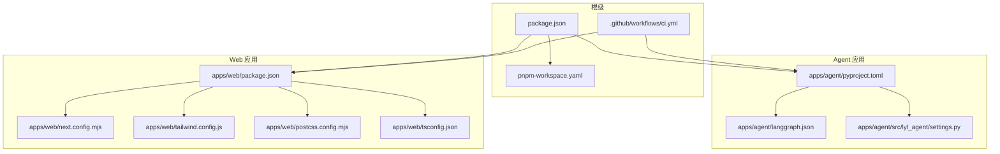
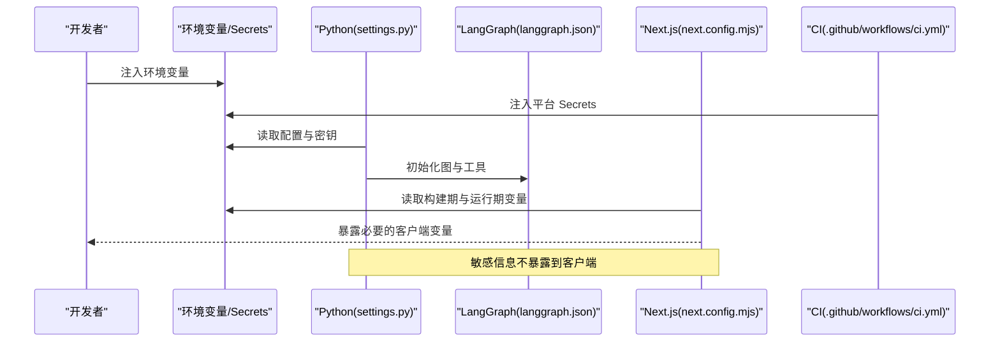
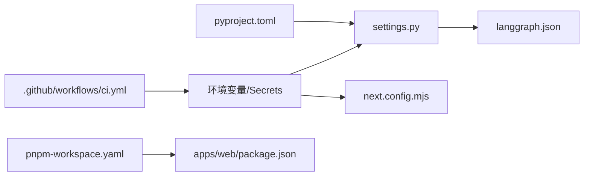

# 配置管理

<cite>
**本文引用的文件**   
- [apps/agent/pyproject.toml](file://apps/agent/pyproject.toml)
- [apps/agent/langgraph.json](file://apps/agent/langgraph.json)
- [apps/agent/src/lyl_agent/settings.py](file://apps/agent/src/lyl_agent/settings.py)
- [apps/web/package.json](file://apps/web/package.json)
- [apps/web/next.config.mjs](file://apps/web/next.config.mjs)
- [apps/web/postcss.config.mjs](file://apps/web/postcss.config.mjs)
- [apps/web/tailwind.config.js](file://apps/web/tailwind.config.js)
- [apps/web/tsconfig.json](file://apps/web/tsconfig.json)
- [package.json](file://package.json)
- [pnpm-workspace.yaml](file://pnpm-workspace.yaml)
- [.github/workflows/ci.yml](file://.github/workflows/ci.yml)
</cite>

## 目录
1. [简介](#简介)
2. [项目结构](#项目结构)
3. [核心组件](#核心组件)
4. [架构总览](#架构总览)
5. [详细组件分析](#详细组件分析)
6. [依赖关系分析](#依赖关系分析)
7. [性能考虑](#性能考虑)
8. [故障排除指南](#故障排除指南)
9. [结论](#结论)
10. [附录](#附录)

## 简介
本文件面向本仓库的配置管理，覆盖以下方面：
- Python 设置与 LangGraph 配置
- Next.js、Tailwind、PostCSS、TypeScript 等前端工程化配置
- 包管理与工作区配置（pnpm）
- 环境变量、数据库连接、API 密钥与第三方服务集成
- 配置验证、默认值管理、热重载机制
- 生产与开发环境差异
- 安全配置与敏感信息管理策略
- 常见问题与排障建议

## 项目结构
本项目采用多应用（monorepo）结构：
- apps/agent：Python Agent 应用，包含 LangGraph 图定义、设置与环境变量加载
- apps/web：Next.js Web 应用，包含构建、样式、类型检查等配置
- 根级 package.json 与 pnpm-workspace.yaml：统一包管理与工作区定义
- .github/workflows/ci.yml：CI 流水线中的配置注入与运行参数

**图示来源** 
- [package.json](file://package.json)
- [pnpm-workspace.yaml](file://pnpm-workspace.yaml)
- [apps/agent/pyproject.toml](file://apps/agent/pyproject.toml)
- [apps/agent/langgraph.json](file://apps/agent/langgraph.json)
- [apps/agent/src/lyl_agent/settings.py](file://apps/agent/src/lyl_agent/settings.py)
- [apps/web/package.json](file://apps/web/package.json)
- [apps/web/next.config.mjs](file://apps/web/next.config.mjs)
- [apps/web/tailwind.config.js](file://apps/web/tailwind.config.js)
- [apps/web/postcss.config.mjs](file://apps/web/postcss.config.mjs)
- [apps/web/tsconfig.json](file://apps/web/tsconfig.json)
- [.github/workflows/ci.yml](file://.github/workflows/ci.yml)

**章节来源**
- [package.json](file://package.json)
- [pnpm-workspace.yaml](file://pnpm-workspace.yaml)
- [apps/agent/pyproject.toml](file://apps/agent/pyproject.toml)
- [apps/agent/langgraph.json](file://apps/agent/langgraph.json)
- [apps/agent/src/lyl_agent/settings.py](file://apps/agent/src/lyl_agent/settings.py)
- [apps/web/package.json](file://apps/web/package.json)
- [apps/web/next.config.mjs](file://apps/web/next.config.mjs)
- [apps/web/tailwind.config.js](file://apps/web/tailwind.config.js)
- [apps/web/postcss.config.mjs](file://apps/web/postcss.config.mjs)
- [apps/web/tsconfig.json](file://apps/web/tsconfig.json)
- [.github/workflows/ci.yml](file://.github/workflows/ci.yml)

## 核心组件
- Python 设置模块（settings.py）：集中读取环境变量、提供默认值与校验入口
- LangGraph 配置（langgraph.json）：定义图运行时参数、工具与模型接入点
- Python 项目元数据（pyproject.toml）：声明依赖、可执行脚本与打包信息
- Next.js 应用（next.config.mjs）：构建、代理、中间件与运行时环境变量暴露
- 样式与类型（tailwind.config.js、postcss.config.mjs、tsconfig.json）：UI 与类型系统约束
- 包管理（package.json、pnpm-workspace.yaml）：工作区、脚本与依赖版本锁定
- CI 配置（ci.yml）：在流水线中注入环境变量并触发构建/测试

**章节来源**
- [apps/agent/src/lyl_agent/settings.py](file://apps/agent/src/lyl_agent/settings.py)
- [apps/agent/langgraph.json](file://apps/agent/langgraph.json)
- [apps/agent/pyproject.toml](file://apps/agent/pyproject.toml)
- [apps/web/next.config.mjs](file://apps/web/next.config.mjs)
- [apps/web/tailwind.config.js](file://apps/web/tailwind.config.js)
- [apps/web/postcss.config.mjs](file://apps/web/postcss.config.mjs)
- [apps/web/tsconfig.json](file://apps/web/tsconfig.json)
- [apps/web/package.json](file://apps/web/package.json)
- [package.json](file://package.json)
- [pnpm-workspace.yaml](file://pnpm-workspace.yaml)
- [.github/workflows/ci.yml](file://.github/workflows/ci.yml)

## 架构总览
下图展示了配置在不同层级的作用域与传递路径：
- 环境变量由运行时注入（本地 .env、CI 平台 Secret、容器编排）
- Python 侧通过 settings.py 读取并校验，供 LangGraph 与业务逻辑使用
- Web 侧通过 next.config.mjs 暴露必要的环境变量给客户端，其余保持服务端
- 包管理器与工作区确保依赖一致性与脚本统一

**图示来源** 
- [apps/agent/src/lyl_agent/settings.py](file://apps/agent/src/lyl_agent/settings.py)
- [apps/agent/langgraph.json](file://apps/agent/langgraph.json)
- [apps/web/next.config.mjs](file://apps/web/next.config.mjs)
- [.github/workflows/ci.yml](file://.github/workflows/ci.yml)

## 详细组件分析

### Python 设置与环境变量（settings.py）
- 职责
  - 集中读取环境变量，提供默认值
  - 对关键配置进行校验（如必填项、格式）
  - 为 LangGraph 与业务模块提供统一的配置对象
- 最佳实践
  - 所有外部依赖的凭据一律通过环境变量注入
  - 区分“构建期”和“运行期”变量，避免将敏感信息打入镜像
  - 提供清晰的错误提示，便于定位缺失或非法配置
- 推荐结构
  - 按模块分组（数据库、LLM、缓存、消息队列、日志等）
  - 提供调试开关与日志级别控制
  - 提供配置导出接口，方便单元测试替换

**章节来源**
- [apps/agent/src/lyl_agent/settings.py](file://apps/agent/src/lyl_agent/settings.py)

### LangGraph 配置（langgraph.json）
- 职责
  - 定义图的节点、边、状态流转与中断处理
  - 指定模型、工具、回调与重试策略
  - 与 settings.py 配合，注入运行时凭据
- 关键点
  - 模型与工具名称应与上游服务保持一致
  - 超时、重试、并发等参数需根据负载调优
  - 敏感信息不要硬编码，应从环境变量注入

**章节来源**
- [apps/agent/langgraph.json](file://apps/agent/langgraph.json)

### Python 项目元数据（pyproject.toml）
- 职责
  - 声明依赖、脚本入口、打包与发布配置
  - 与 uv.lock 协同保证可重复构建
- 注意事项
  - 将运行依赖与开发依赖分离
  - 明确 Python 版本要求与平台兼容性

**章节来源**
- [apps/agent/pyproject.toml](file://apps/agent/pyproject.toml)

### Next.js 应用配置（next.config.mjs）
- 职责
  - 构建优化、路由、中间件、代理与跨域
  - 控制哪些环境变量暴露给客户端（NEXT_PUBLIC_*）
- 安全要点
  - 仅暴露非敏感变量到客户端
  - 服务端 API 调用应通过后端代理或鉴权中间件

**章节来源**
- [apps/web/next.config.mjs](file://apps/web/next.config.mjs)

### 样式与类型（tailwind.config.js、postcss.config.mjs、tsconfig.json）
- Tailwind：主题、插件与响应式断点
- PostCSS：构建链与兼容处理
- TypeScript：严格模式、路径别名与编译目标

**章节来源**
- [apps/web/tailwind.config.js](file://apps/web/tailwind.config.js)
- [apps/web/postcss.config.mjs](file://apps/web/postcss.config.mjs)
- [apps/web/tsconfig.json](file://apps/web/tsconfig.json)

### 包管理与工作区（package.json、pnpm-workspace.yaml）
- 职责
  - 统一脚本命令、依赖版本与工作区规则
  - 支持 monorepo 内共享依赖与独立发布
- 建议
  - 使用 pnpm-lock.yaml 锁定依赖树
  - 在 CI 中复用缓存加速安装

**章节来源**
- [package.json](file://package.json)
- [pnpm-workspace.yaml](file://pnpm-workspace.yaml)
- [apps/web/package.json](file://apps/web/package.json)

### CI 配置（.github/workflows/ci.yml）
- 职责
  - 注入环境变量与 Secrets
  - 触发构建、测试与部署流程
- 建议
  - 使用平台提供的加密变量存储敏感信息
  - 为不同分支/环境准备差异化变量集

**章节来源**
- [.github/workflows/ci.yml](file://.github/workflows/ci.yml)

## 依赖关系分析
- 配置依赖链
  - settings.py 依赖环境变量；langgraph.json 依赖 settings.py 提供的凭据
  - next.config.mjs 依赖环境变量（区分构建期与运行期）
  - pyproject.toml 与 pnpm 工作区共同约束依赖版本
- 潜在循环依赖
  - 避免在 settings.py 中反向导入业务模块导致循环
- 外部依赖
  - LLM、向量库、消息队列、对象存储等凭据均通过环境变量注入

**图示来源** 
- [apps/agent/src/lyl_agent/settings.py](file://apps/agent/src/lyl_agent/settings.py)
- [apps/agent/langgraph.json](file://apps/agent/langgraph.json)
- [apps/web/next.config.mjs](file://apps/web/next.config.mjs)
- [apps/agent/pyproject.toml](file://apps/agent/pyproject.toml)
- [pnpm-workspace.yaml](file://pnpm-workspace.yaml)
- [apps/web/package.json](file://apps/web/package.json)
- [.github/workflows/ci.yml](file://.github/workflows/ci.yml)

**章节来源**
- [apps/agent/src/lyl_agent/settings.py](file://apps/agent/src/lyl_agent/settings.py)
- [apps/agent/langgraph.json](file://apps/agent/langgraph.json)
- [apps/web/next.config.mjs](file://apps/web/next.config.mjs)
- [apps/agent/pyproject.toml](file://apps/agent/pyproject.toml)
- [pnpm-workspace.yaml](file://pnpm-workspace.yaml)
- [apps/web/package.json](file://apps/web/package.json)
- [.github/workflows/ci.yml](file://.github/workflows/ci.yml)

## 性能考虑
- 配置加载
  - 启动时一次性加载并缓存，避免重复 I/O
- 环境变量解析
  - 尽量使用原生解析器，减少第三方库开销
- 构建期优化
  - 按需暴露 NEXT_PUBLIC_*，减小客户端包体积
- 运行时调优
  - 合理设置超时、重试与并发参数，避免雪崩

[本节为通用指导，无需特定文件引用]

## 故障排除指南
- 常见症状与排查步骤
  - 启动报错“缺少环境变量”：检查 .env 与 CI Secrets 是否注入正确
  - 客户端无法访问 API：确认 next.config.mjs 的代理与跨域设置
  - LangGraph 图初始化失败：核对模型名称、工具名与凭据
  - 构建失败：检查依赖版本冲突与 Node/Python 版本
- 快速自检清单
  - 环境变量命名规范与大小写
  - 敏感信息未泄露到客户端
  - 配置文件语法正确（JSON/JS/TOML/YAML）
  - 依赖锁文件与运行环境匹配

**章节来源**
- [apps/web/next.config.mjs](file://apps/web/next.config.mjs)
- [apps/agent/langgraph.json](file://apps/agent/langgraph.json)
- [apps/agent/src/lyl_agent/settings.py](file://apps/agent/src/lyl_agent/settings.py)
- [.github/workflows/ci.yml](file://.github/workflows/ci.yml)

## 结论
- 以环境变量为中心的统一配置策略，结合 settings.py 与 next.config.mjs 的分层暴露，能有效平衡灵活性与安全性
- 通过 pyproject.toml 与 pnpm 工作区确保依赖一致性，CI 注入 Secrets 保障多环境安全
- 建议在项目中引入配置校验与默认值管理，提升健壮性与可维护性

[本节为总结性内容，无需特定文件引用]

## 附录

### 环境变量与配置项参考
- 通用建议
  - 使用 .env 模板文件说明必填项与示例值
  - 区分开发、测试、预发、生产四套变量集
  - 对密钥类变量启用轮换与最小权限原则
- 分类建议
  - 数据库：连接串、用户名、密码、池大小、超时
  - LLM/第三方服务：API Key、Base URL、模型名、速率限制
  - 缓存/消息队列：地址、端口、认证、VPC 白名单
  - 日志与监控：采样率、上报端点、告警阈值

[本节为通用指导，无需特定文件引用]

### 配置验证与默认值管理
- 验证策略
  - 启动时校验必填项与格式，失败即中止进程
  - 提供“只读配置快照”，便于调试与审计
- 默认值策略
  - 非敏感配置提供合理默认值，降低本地开发门槛
  - 敏感配置不提供默认值，强制显式注入

[本节为通用指导，无需特定文件引用]

### 配置热重载机制
- 开发环境
  - 使用监听器在 .env 变更时重启服务或刷新配置
- 生产环境
  - 不建议热重载敏感配置，采用滚动更新或优雅重启
  - 若必须热重载，需实现配置版本与回滚能力

[本节为通用指导，无需特定文件引用]

### 生产与开发环境差异
- 开发
  - 开启详细日志与调试开关
  - 允许本地绕过部分鉴权（仅限本地）
- 生产
  - 关闭调试输出，启用结构化日志
  - 启用限流、熔断与审计
  - 使用最小权限账号与网络隔离

[本节为通用指导，无需特定文件引用]

### 安全配置与敏感信息管理
- 存储
  - 使用平台 Secrets 管理（CI、云平台、KMS）
  - 禁止将密钥提交至代码仓库
- 传输
  - 强制 HTTPS，启用 HSTS
  - 内部服务间通信使用 mTLS
- 访问控制
  - 最小权限原则，定期轮换密钥
  - 记录访问审计日志

[本节为通用指导，无需特定文件引用]