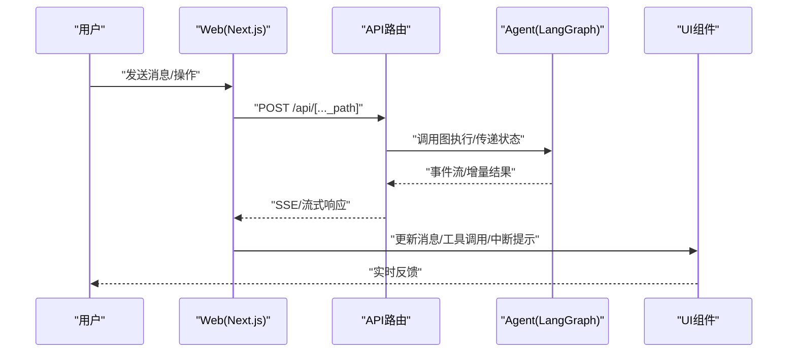
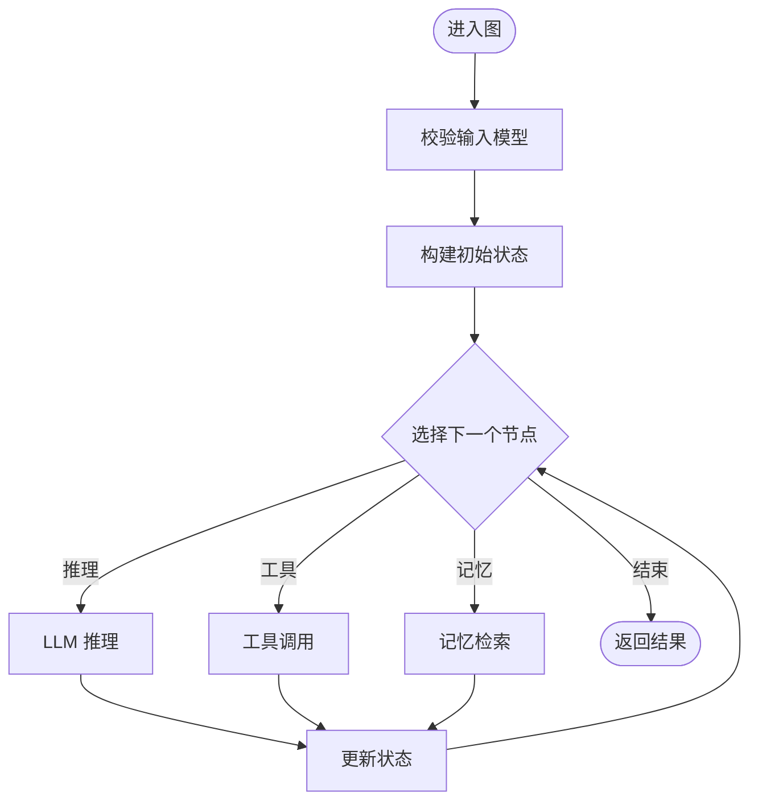
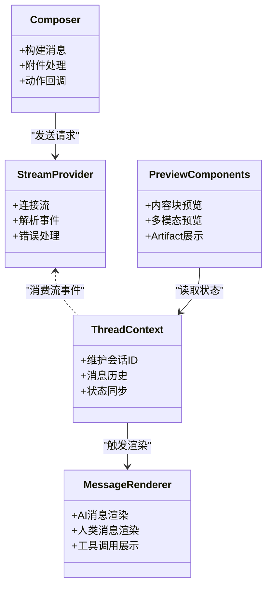
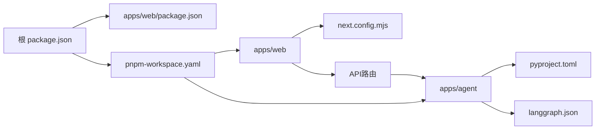

# 项目概览

<cite>
**本文引用的文件**   
- [README.md](file://README.md)
- [package.json](file://package.json)
- [pnpm-workspace.yaml](file://pnpm-workspace.yaml)
- [apps/agent/pyproject.toml](file://apps/agent/pyproject.toml)
- [apps/agent/langgraph.json](file://apps/agent/langgraph.json)
- [apps/agent/src/lyl_agent/graph.py](file://apps/agent/src/lyl_agent/graph.py)
- [apps/agent/src/lyl_agent/state.py](file://apps/agent/src/lyl_agent/state.py)
- [apps/agent/src/lyl_agent/models.py](file://apps/agent/src/lyl_agent/models.py)
- [apps/agent/src/lyl_agent/settings.py](file://apps/agent/src/lyl_agent/settings.py)
- [apps/web/package.json](file://apps/web/package.json)
- [apps/web/next.config.mjs](file://apps/web/next.config.mjs)
- [apps/web/src/app/api/[..._path]/route.ts](file://apps/web/src/app/api/[..._path]/route.ts)
- [apps/web/src/providers/Stream.tsx](file://apps/web/src/providers/Stream.tsx)
- [apps/web/src/providers/Thread.tsx](file://apps/web/src/providers/Thread.tsx)
- [apps/web/src/lib/composer.ts](file://apps/web/src/lib/composer.ts)
- [apps/web/src/components/thread/index.tsx](file://apps/web/src/components/thread/index.tsx)
- [apps/web/src/components/thread/messages/ai.tsx](file://apps/web/src/components/thread/messages/ai.tsx)
- [apps/web/src/components/thread/messages/human.tsx](file://apps/web/src/components/thread/messages/human.tsx)
- [apps/web/src/components/thread/artifact.tsx](file://apps/web/src/components/thread/artifact.tsx)
- [apps/web/src/components/thread/ContentBlocksPreview.tsx](file://apps/web/src/components/thread/ContentBlocksPreview.tsx)
- [apps/web/src/components/thread/MultimodalPreview.tsx](file://apps/web/src/components/thread/MultimodalPreview.tsx)
- [apps/web/src/components/thread/composer-action.tsx](file://apps/web/src/components/thread/composer-action.tsx)
- [apps/web/src/hooks/use-file-upload.tsx](file://apps/web/src/hooks/use-file-upload.tsx)
- [apps/web/src/lib/multimodal-utils.ts](file://apps/web/src/lib/multimodal-utils.ts)
- [apps/web/src/lib/agent-inbox-interrupt.ts](file://apps/web/src/lib/agent-inbox-interrupt.ts)
- [apps/web/src/lib/utils.ts](file://apps/web/src/lib/utils.ts)
- [.github/workflows/ci.yml](file://.github/workflows/ci.yml)
</cite>

## 目录
1. [简介](#简介)
2. [项目结构](#项目结构)
3. [核心组件](#核心组件)
4. [架构总览](#架构总览)
5. [详细组件分析](#详细组件分析)
6. [依赖关系分析](#依赖关系分析)
7. [性能考量](#性能考量)
8. [故障排查指南](#故障排查指南)
9. [结论](#结论)
10. [附录：快速开始](#附录快速开始)

## 简介
COS 是一个基于 LangGraph 的 AI 代理系统，采用前后端分离架构。后端 agent 模块使用 Python + LangGraph 构建可编排、可中断、可扩展的智能体工作流；前端 web 模块基于 TypeScript/Next.js，提供对话线程、消息渲染、工具调用展示与多模态预览等能力。整体目标是为用户提供“对话即服务”的交互体验，并通过 Agent 的工作流编排实现复杂任务自动化。

本概览文档面向初学者与有经验的开发者，既提供概念性说明，也给出关键代码路径与架构图，帮助快速理解并上手开发。

## 项目结构
仓库采用 monorepo 管理，根目录通过 pnpm workspace 聚合两个应用：
- apps/agent：Python 工程，定义 LangGraph 图、状态模型、配置与测试
- apps/web：Next.js 应用，包含 API 路由、UI 组件、状态与流式处理提供者

```mermaid
graph TB
subgraph "根仓库"
Root["根目录"]
Pkg["package.json"]
PNPM["pnpm-workspace.yaml"]
CI[".github/workflows/ci.yml"]
end
subgraph "Agent 应用 (Python)"
AgentPy["apps/agent"]
PyCfg["pyproject.toml"]
LGConf["langgraph.json"]
Graph["src/lyl_agent/graph.py"]
State["src/lyl_agent/state.py"]
Models["src/lyl_agent/models.py"]
Settings["src/lyl_agent/settings.py"]
end
subgraph "Web 应用 (Next.js)"
WebApp["apps/web"]
WebPkg["package.json"]
NextCfg["next.config.mjs"]
ApiRoute["src/app/api/[..._path]/route.ts"]
StreamProv["src/providers/Stream.tsx"]
ThreadProv["src/providers/Thread.tsx"]
Composer["src/lib/composer.ts"]
ThreadComp["src/components/thread/index.tsx"]
MsgAI["src/components/thread/messages/ai.tsx"]
MsgHuman["src/components/thread/messages/human.tsx"]
Artifact["src/components/thread/artifact.tsx"]
ContentBlocks["src/components/thread/ContentBlocksPreview.tsx"]
Multimodal["src/components/thread/MultimodalPreview.tsx"]
FileUpload["src/hooks/use-file-upload.tsx"]
MMUtils["src/lib/multimodal-utils.ts"]
Interrupt["src/lib/agent-inbox-interrupt.ts"]
end
Root --> AgentPy
Root --> WebApp
Root --> Pkg
Root --> PNPM
Root --> CI
AgentPy --> PyCfg
AgentPy --> LGConf
AgentPy --> Graph
AgentPy --> State
AgentPy --> Models
AgentPy --> Settings
WebApp --> WebPkg
WebApp --> NextCfg
WebApp --> ApiRoute
WebApp --> StreamProv
WebApp --> ThreadProv
WebApp --> Composer
WebApp --> ThreadComp
WebApp --> MsgAI
WebApp --> MsgHuman
WebApp --> Artifact
WebApp --> ContentBlocks
WebApp --> Multimodal
WebApp --> FileUpload
WebApp --> MMUtils
WebApp --> Interrupt
```

图表来源 
- [pnpm-workspace.yaml](file://pnpm-workspace.yaml)
- [package.json](file://package.json)
- [apps/agent/pyproject.toml](file://apps/agent/pyproject.toml)
- [apps/agent/langgraph.json](file://apps/agent/langgraph.json)
- [apps/web/package.json](file://apps/web/package.json)
- [apps/web/next.config.mjs](file://apps/web/next.config.mjs)

章节来源
- [README.md](file://README.md)
- [package.json](file://package.json)
- [pnpm-workspace.yaml](file://pnpm-workspace.yaml)

## 核心组件
- Agent（Python/LangGraph）
  - 图与工作流：通过 graph.py 定义节点与边，驱动状态流转
  - 状态模型：state.py 描述会话状态与字段
  - 数据模型：models.py 定义输入输出结构与校验
  - 配置：settings.py 加载环境变量与运行时参数
  - 运行配置：langgraph.json 指定入口与执行选项
- Web（Next.js/TypeScript）
  - API 路由：[..._path] 将请求转发至 Agent 服务
  - 流式处理：Stream.tsx 提供 SSE/流式响应消费
  - 线程上下文：Thread.tsx 维护会话与消息历史
  - 消息渲染：ai.tsx、human.tsx 分别渲染 AI 与人类消息
  - 多模态与内容块：MultimodalPreview.tsx、ContentBlocksPreview.tsx
  - 工具调用与中断：agent-inbox-interrupt.ts、composer-action.tsx
  - 文件上传：use-file-upload.tsx 与 multimodal-utils.ts 协作

章节来源
- [apps/agent/src/lyl_agent/graph.py](file://apps/agent/src/lyl_agent/graph.py)
- [apps/agent/src/lyl_agent/state.py](file://apps/agent/src/lyl_agent/state.py)
- [apps/agent/src/lyl_agent/models.py](file://apps/agent/src/lyl_agent/models.py)
- [apps/agent/src/lyl_agent/settings.py](file://apps/agent/src/lyl_agent/settings.py)
- [apps/agent/langgraph.json](file://apps/agent/langgraph.json)
- [apps/web/src/app/api/[..._path]/route.ts](file://apps/web/src/app/api/[..._path]/route.ts)
- [apps/web/src/providers/Stream.tsx](file://apps/web/src/providers/Stream.tsx)
- [apps/web/src/providers/Thread.tsx](file://apps/web/src/providers/Thread.tsx)
- [apps/web/src/lib/composer.ts](file://apps/web/src/lib/composer.ts)
- [apps/web/src/components/thread/messages/ai.tsx](file://apps/web/src/components/thread/messages/ai.tsx)
- [apps/web/src/components/thread/messages/human.tsx](file://apps/web/src/components/thread/messages/human.tsx)
- [apps/web/src/components/thread/MultimodalPreview.tsx](file://apps/web/src/components/thread/MultimodalPreview.tsx)
- [apps/web/src/components/thread/ContentBlocksPreview.tsx](file://apps/web/src/components/thread/ContentBlocksPreview.tsx)
- [apps/web/src/components/thread/composer-action.tsx](file://apps/web/src/components/thread/composer-action.tsx)
- [apps/web/src/hooks/use-file-upload.tsx](file://apps/web/src/hooks/use-file-upload.tsx)
- [apps/web/src/lib/multimodal-utils.ts](file://apps/web/src/lib/multimodal-utils.ts)
- [apps/web/src/lib/agent-inbox-interrupt.ts](file://apps/web/src/lib/agent-inbox-interrupt.ts)

## 架构总览
下图展示了从用户输入到 Agent 执行、再到前端渲染的整体流程，包括流式传输与中断处理。

图表来源 
- [apps/web/src/app/api/[..._path]/route.ts](file://apps/web/src/app/api/[..._path]/route.ts)
- [apps/web/src/providers/Stream.tsx](file://apps/web/src/providers/Stream.tsx)
- [apps/agent/src/lyl_agent/graph.py](file://apps/agent/src/lyl_agent/graph.py)

## 详细组件分析

### Agent（LangGraph 工作流）
- 职责
  - 定义图节点与边，组织推理、工具调用、记忆检索等步骤
  - 管理会话状态，确保跨步一致性
  - 暴露统一的执行接口供 Web 调用
- 关键文件
  - graph.py：图的构建与调度
  - state.py：状态结构定义
  - models.py：输入输出模型
  - settings.py：配置与环境变量
  - langgraph.json：运行配置

图表来源 
- [apps/agent/src/lyl_agent/graph.py](file://apps/agent/src/lyl_agent/graph.py)
- [apps/agent/src/lyl_agent/state.py](file://apps/agent/src/lyl_agent/state.py)
- [apps/agent/src/lyl_agent/models.py](file://apps/agent/src/lyl_agent/models.py)

章节来源
- [apps/agent/src/lyl_agent/graph.py](file://apps/agent/src/lyl_agent/graph.py)
- [apps/agent/src/lyl_agent/state.py](file://apps/agent/src/lyl_agent/state.py)
- [apps/agent/src/lyl_agent/models.py](file://apps/agent/src/lyl_agent/models.py)
- [apps/agent/src/lyl_agent/settings.py](file://apps/agent/src/lyl_agent/settings.py)
- [apps/agent/langgraph.json](file://apps/agent/langgraph.json)

### Web（Next.js 前端）
- 职责
  - 提供对话界面、消息渲染、工具调用展示与中断交互
  - 通过 API 路由与 Agent 通信，支持流式响应
  - 封装多模态与内容块预览能力
- 关键文件
  - route.ts：统一 API 转发
  - Stream.tsx：流式数据处理
  - Thread.tsx：线程上下文与历史
  - messages/*：消息渲染
  - artifact.tsx、ContentBlocksPreview.tsx、MultimodalPreview.tsx：内容与多模态展示
  - composer-action.tsx：组合器动作（发送、编辑、重试等）
  - use-file-upload.tsx、multimodal-utils.ts：文件与多模态工具
  - agent-inbox-interrupt.ts：中断处理

图表来源 
- [apps/web/src/providers/Stream.tsx](file://apps/web/src/providers/Stream.tsx)
- [apps/web/src/providers/Thread.tsx](file://apps/web/src/providers/Thread.tsx)
- [apps/web/src/lib/composer.ts](file://apps/web/src/lib/composer.ts)
- [apps/web/src/components/thread/messages/ai.tsx](file://apps/web/src/components/thread/messages/ai.tsx)
- [apps/web/src/components/thread/messages/human.tsx](file://apps/web/src/components/thread/messages/human.tsx)
- [apps/web/src/components/thread/artifact.tsx](file://apps/web/src/components/thread/artifact.tsx)
- [apps/web/src/components/thread/ContentBlocksPreview.tsx](file://apps/web/src/components/thread/ContentBlocksPreview.tsx)
- [apps/web/src/components/thread/MultimodalPreview.tsx](file://apps/web/src/components/thread/MultimodalPreview.tsx)

章节来源
- [apps/web/src/app/api/[..._path]/route.ts](file://apps/web/src/app/api/[..._path]/route.ts)
- [apps/web/src/providers/Stream.tsx](file://apps/web/src/providers/Stream.tsx)
- [apps/web/src/providers/Thread.tsx](file://apps/web/src/providers/Thread.tsx)
- [apps/web/src/lib/composer.ts](file://apps/web/src/lib/composer.ts)
- [apps/web/src/components/thread/index.tsx](file://apps/web/src/components/thread/index.tsx)
- [apps/web/src/components/thread/messages/ai.tsx](file://apps/web/src/components/thread/messages/ai.tsx)
- [apps/web/src/components/thread/messages/human.tsx](file://apps/web/src/components/thread/messages/human.tsx)
- [apps/web/src/components/thread/artifact.tsx](file://apps/web/src/components/thread/artifact.tsx)
- [apps/web/src/components/thread/ContentBlocksPreview.tsx](file://apps/web/src/components/thread/ContentBlocksPreview.tsx)
- [apps/web/src/components/thread/MultimodalPreview.tsx](file://apps/web/src/components/thread/MultimodalPreview.tsx)
- [apps/web/src/components/thread/composer-action.tsx](file://apps/web/src/components/thread/composer-action.tsx)
- [apps/web/src/hooks/use-file-upload.tsx](file://apps/web/src/hooks/use-file-upload.tsx)
- [apps/web/src/lib/multimodal-utils.ts](file://apps/web/src/lib/multimodal-utils.ts)
- [apps/web/src/lib/agent-inbox-interrupt.ts](file://apps/web/src/lib/agent-inbox-interrupt.ts)

## 依赖关系分析
- 包管理与工作区
  - 根 package.json 与 pnpm-workspace.yaml 统一管理前端依赖与脚本
  - apps/web/package.json 定义 Next.js 相关依赖与构建脚本
- Agent 依赖
  - pyproject.toml 声明 Python 依赖与入口
  - langgraph.json 指定 LangGraph 运行配置
- 集成点
  - Web 通过 API 路由与 Agent 通信
  - CI 流水线用于统一验证与部署

图表来源 
- [package.json](file://package.json)
- [pnpm-workspace.yaml](file://pnpm-workspace.yaml)
- [apps/web/package.json](file://apps/web/package.json)
- [apps/web/next.config.mjs](file://apps/web/next.config.mjs)
- [apps/agent/pyproject.toml](file://apps/agent/pyproject.toml)
- [apps/agent/langgraph.json](file://apps/agent/langgraph.json)

章节来源
- [package.json](file://package.json)
- [pnpm-workspace.yaml](file://pnpm-workspace.yaml)
- [apps/web/package.json](file://apps/web/package.json)
- [apps/agent/pyproject.toml](file://apps/agent/pyproject.toml)
- [apps/agent/langgraph.json](file://apps/agent/langgraph.json)

## 性能考量
- 流式传输：前端通过 Stream.tsx 消费增量事件，降低首屏延迟
- 状态最小化：state.py 仅保留必要字段，减少序列化开销
- 组件懒加载：Next.js 默认按需加载页面与组件，提升加载速度
- 缓存策略：结合浏览器缓存与 CDN 静态资源优化
- 并发与限流：在 API 层对 Agent 调用进行队列与超时控制

## 故障排查指南
- 常见问题
  - 环境变量缺失：检查 settings.py 与 .env 配置是否完整
  - 流式连接失败：确认网络与 CORS 设置，查看 Stream.tsx 的错误分支
  - 中断未处理：检查 agent-inbox-interrupt.ts 的回调逻辑
  - 多模态上传失败：核对 use-file-upload.tsx 与 multimodal-utils.ts 的校验规则
- 调试建议
  - 启用日志：在 API 路由与 Agent 图节点打印关键状态
  - 单元测试：运行 tests 与前端 vitest 用例定位问题
  - 断点调试：在 route.ts 与 Stream.tsx 中设置断点观察数据流

章节来源
- [apps/agent/src/lyl_agent/settings.py](file://apps/agent/src/lyl_agent/settings.py)
- [apps/web/src/providers/Stream.tsx](file://apps/web/src/providers/Stream.tsx)
- [apps/web/src/lib/agent-inbox-interrupt.ts](file://apps/web/src/lib/agent-inbox-interrupt.ts)
- [apps/web/src/hooks/use-file-upload.tsx](file://apps/web/src/hooks/use-file-upload.tsx)
- [apps/web/src/lib/multimodal-utils.ts](file://apps/web/src/lib/multimodal-utils.ts)

## 结论
COS 以 LangGraph 为核心编排智能体工作流，配合 Next.js 前端提供流畅的对话体验。通过清晰的模块划分与流式传输机制，系统在功能扩展性与用户体验之间取得平衡。建议后续迭代聚焦于状态优化、错误恢复与多模态能力的增强。

## 附录：快速开始
- 环境要求
  - Node.js 与 pnpm（用于前端）
  - Python 与 uv（用于 Agent，见 pyproject.toml）
- 安装与运行
  - 安装依赖：在根目录执行 pnpm install
  - 启动 Agent：根据 pyproject.toml 与 langgraph.json 配置运行
  - 启动 Web：在 apps/web 目录下执行开发服务器
  - 访问应用：打开浏览器访问本地地址
- 常用命令
  - 前端：dev/build/lint/test
  - Agent：test/run（参考 pyproject.toml 脚本）
  - CI：.github/workflows/ci.yml 定义的流水线

章节来源
- [apps/web/package.json](file://apps/web/package.json)
- [apps/agent/pyproject.toml](file://apps/agent/pyproject.toml)
- [apps/agent/langgraph.json](file://apps/agent/langgraph.json)
- [.github/workflows/ci.yml](file://.github/workflows/ci.yml)